# Raspberry Pi

Raspberry Pi is a card computer whose official system is Raspberry Pi OS, and can be installed on the Raspberry Pi, such as: ubuntu, Windows IoT. Raspberry Pi can be used as a personal server, performing camera monitoring and recognition, as well as voice interaction by connecting a camera and a voice interactive assistant. Also, Raspberry Pi leads out 40Pin pins that can be connected to various sensors and control LEDs, motors, etc. This can be used to make a robot with a Raspberry Pi.

## 1. Tools needed for the Raspberry Pi system

**Hardware Tool:**

- Raspberry Pi 4B/3B/2B

- Above 16G TFT Memory Card

- Card Reader

- Computer and other parts

**1.1 Install Software Tools**

**Windows System:**

1)  **Putty**

Download link：[<span class="underline">https://www.chiark.greenend.org.uk/\~sgtatham/putty/</span>](https://www.chiark.greenend.org.uk/~sgtatham/putty/)


<!-- end list -->

1.  After downloading the package file , double-click it and tap “Next”.


2.  Click “Next”.


3.  Choose“Install Putty files” and click “Install”.


4.  After a few seconds, click "Finish".


**(2) SSH Remote Login software -WinSCP**

Link：[<span class="underline">https://winscp.net/eng/download.php</span>](https://winscp.net/eng/download.php)

<!-- end list -->

1.  After downloading the package file, click
.


2.  Click“Accept”.


**(3）SD Card Formatter**

Download link:

[<span class="underline">http://www.canadiancontent.net/tech/download/SD\_Card\_Formatter.html</span>](http://www.canadiancontent.net/tech/download/SD_Card_Formatter.html)


1.  Unzip the SDCardFormatterv5\_WinEN package, double-click. to run it.


2.  Click“Next”and“Install”.


3.  After a few seconds, click "Finish".


**(4) Win32DiskImager**

Download：[<span class="underline">https://sourceforge.net/projects/win32diskimager/</span>](https://sourceforge.net/projects/win32diskimager/)


a. After downloading the package file , double-click to run it.

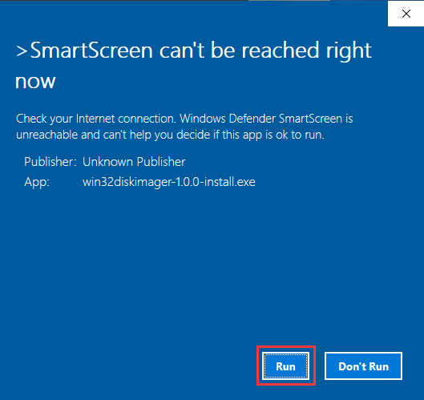

b. Choose and click“Next”.


c. Click“Browse...”and tap“Next”.


d. Choose , click“Next”and“Install”.


e. After a few seconds, click "Finish".


(5) WNetWatcher for scanning and searching IP addresses.  

Download Link：http://www.nirsoft.net/utils/wnetwatcher.zip

**1.2 Raspberry Pi Image**

Download link for the latest version:

[<span class="underline">https://www.raspberrypi.org/downloads/raspberry-pi-os/</span>](https://www.raspberrypi.org/downloads/raspberry-pi-os/)

Old Version:

Raspbian：https://downloads.raspberrypi.org/raspbian/images/

Raspbian full：<span class="underline">https://downloads.raspberrypi.org/raspbian\_full/images/</span>

Raspbian lite：https://downloads.raspberrypi.org/raspbian\_lite/images/

We use the 2020.05.28 version in the tutorial and recommend you to use this version(Please download this version as shown in the picture below.)

<https://downloads.raspberrypi.org/raspios_full_armhf/images/raspios_full_armhf-2021-05-28/>

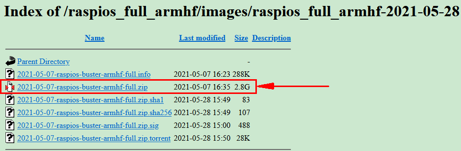

## 2. Install Raspberry Pi OS on Raspberry Pi 4B

Interface the TFT memory card with a card reader, then plug the card reader into a computer’s USB port.

Use the SD Card Formatter to format a TFT memory card, as illustrated below.


**1. Burn system**

Burn the Raspberry Pi OS to the TFT memory card using Win32DiskImager software.


Don’t eject card reader after burning mirror system, build a file named SSH, then delete .txt.

The SSH login function can be activated by copying SSH file to boot category, as shown below.


Eject card reader.

**2. Log in system**

(Raspberry and PC should be in the same local area network.)

Insert TFT memory card into Raspberry Pi, connect internet cable and plug in power. If you have screen and HDMI cable of Raspberry Pi, you could view Raspberry Pi OS activating. If not, you can enter the desktop of Raspberry Pi via SSH remote login software---WinSCP and xrdp.

**3. Remote login**

**Enter default user name, password and host name on WinSCP to log in. Only a Raspberry Pi is connected in the same network.**


**4.  Check IP and mac address**


Click to open terminal and input the password: raspberry, and press“Enter”on keyboard.


Logging in successfully, open the terminal, input **ip a** and tap“Enter”to check IP and mac address.


From the above figure, mac address of this Raspberry Pi is a6:32:17:61:9c, and IP address is 192.168.1.128(use IP address to finish xrdp remote login).

Since mac address never changes, you could confirm IP via mac address when not sure which IP it is.

**5.  Fix IP address of Raspberry Pi**

IP address is changeable, therefore, we need to make IP address fixed for convenient use.

Follow the below steps:

Switch to root user

If without root user’s password

① Set root password

Input password in the terminal: sudo passwd root to set password.

② Switch to root user

su root

③ Fix the configuration file of IP address

Firstly change IP address of the following configuration file.

（\#New IP address:：address 192.168.1.99）

Copy the above new address to terminal and press“Enter”.

Configuration File**:**

echo -e '

auto eth0

iface eth0 inet static

\#Change IP address

address 192.168.1.99

netmask 255.255.255.0

gateway 192.168.1.1

network 192.168.1.0

broadcast 192.168.1.255

dns-domain 119.29.29.29

dns-nameservers 119.29.29.29

metric 0

mtu 1492

'\>/etc/network/interfaces.d/eth0

As shown below:


④ Reboot the system to activate the configuration file.

Input the restart command in the terminal: sudo reboot

You could log in via fixed IP afterwards.

⑤ Check IP and insure IP address fixed well.


(6) Log in desktop on Raspberry Pi wirelessly

In fact, we can log in desktop on Raspberry Pi wirelessly even without screen and HDMI cable.

VNC and Xrdp are commonly used to log in desktop of Raspberry Pi wirelessly. Let’s take an example of Xrdp.

Install Xrdp Service in the terminal

Installation commands:

Switch to Root User: su root

Installation: apt-get install xrdp

Enter y and press“Enter”.

As shown below:


Open the remote desktop connection on Windows

Press WIN+R on keyboard and enter mstsc.exe.

As shown below:


Input IP address of Raspberry Pi, as shown below.

Click“Connect”and tap it again.

192.168.1.99 is the IP address we use, you could change into your IP address.


Click“Yes”.


Input user name: pi, default password: raspberry, as shown below.


Click“OK”or“Enter”, you will view the desktop of Raspberry Pi OS, as shown below.


Now, we finish the basic configuration of the Raspberry Pi OS.

## 3. Preparations for C language

C language is a programming language with a considerably fast running speed. There are numerous software and system core code written in it, such as Linux system. Notably, hardware MCU and embedded class are not exception. Thereby, it makes sense to learn the  C language to control hardware.

**Hardware：**

**Raspberry Pi 4B：**

<table class="colwidths-auto docutils align-default">
<tbody>
<tr class="odd">
<td><strong>Raspberry Pi 4B</strong></td>
<td><strong>Raspberry Pi 4B Model</strong></td>
</tr>
<tr class="even">
<td></td>
<td></td>
</tr>
</tbody>
</table>

**Hardware Interfaces：**


## 4. ESP32 Expansion Board

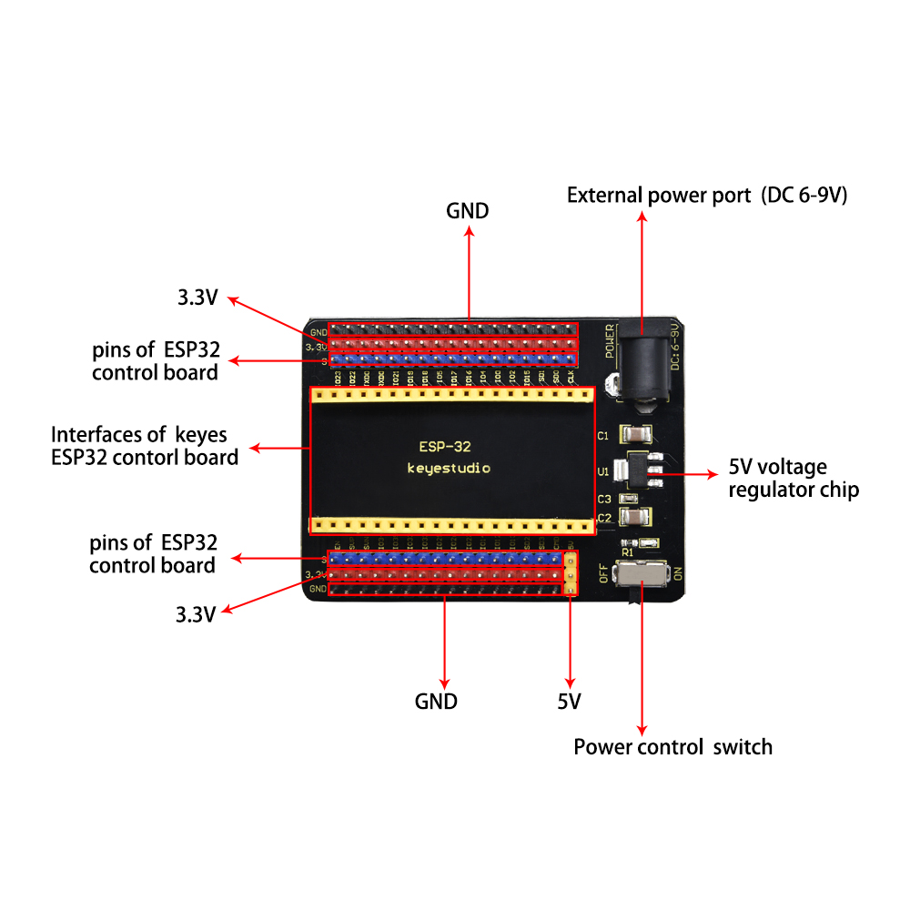

Raspberry Pi+ESP32 mainboard+ESP32 Expansion Board+USB Cableare as follows：

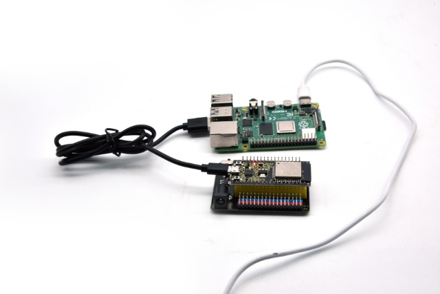

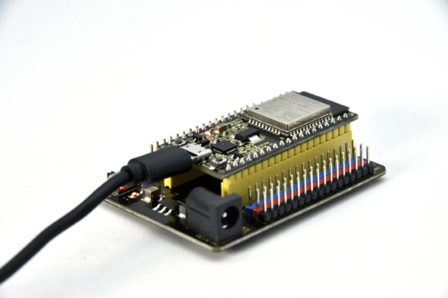

**Copy Example Code Folder to Raspberry Pi**

Place example code folder to the pi folder of Raspberry Pi. and extract the example code from **2. ESP32\_C\_code.zip** file(the default is ZIP file), as shown below:


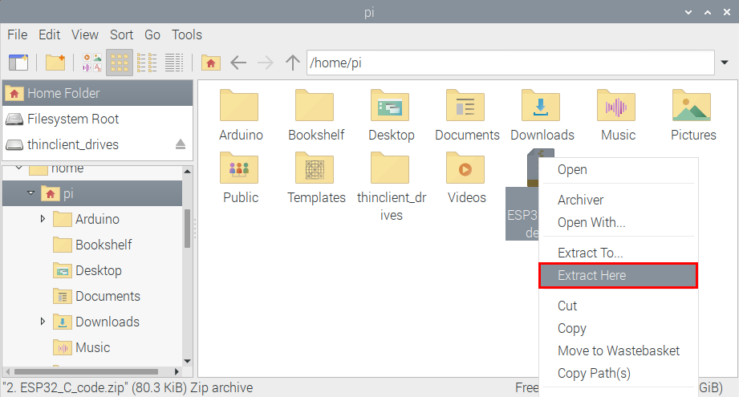

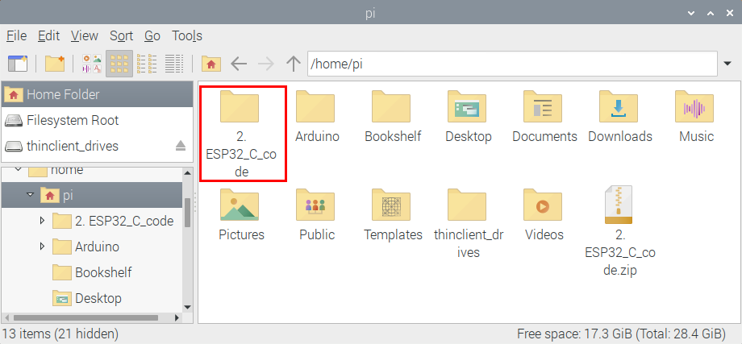

Double-click **2.ESP32\_C\_code,**  as shown below.  

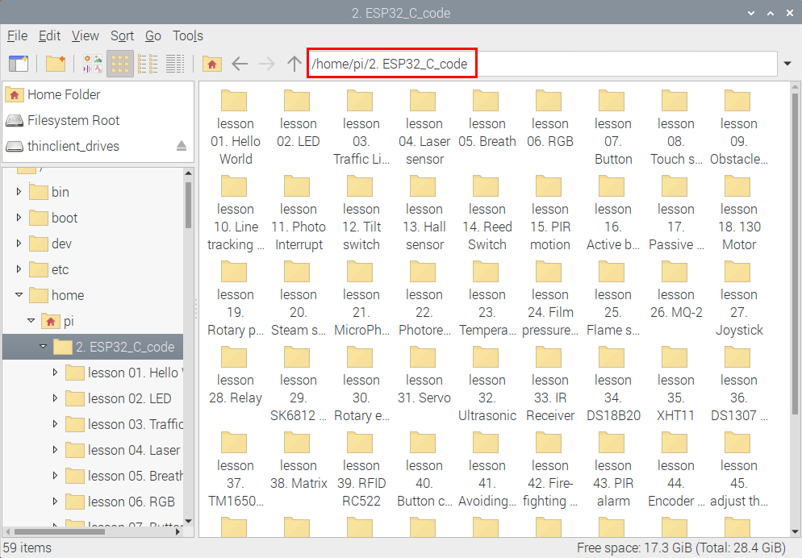

## Linux System（Raspberry Pi） 

**5.1 Download and install Arduino IDE**

（1）First, click on Raspberry Pi's browser.


（2）Download Arduino IDE from the Arduino official website：[www.arduino.cc/en/software](http://www.arduino.cc/en/software), as shown below:

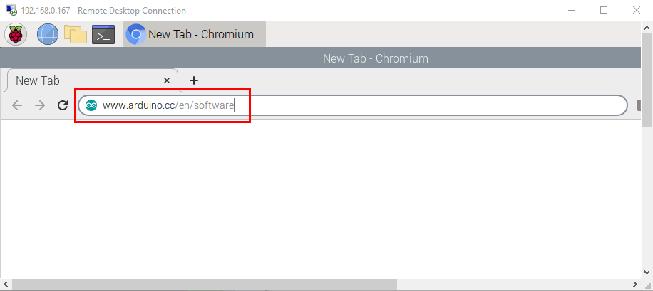

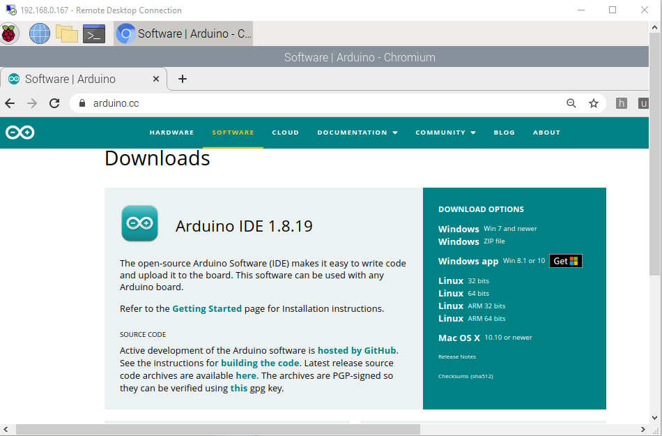

(3) There are various versions of IDE for Arduino. Just download a version compatible with your system. (install the lasted Arduino IDE) and click “Linux ARM 32 bits”.


You just need to click JUST DOWNLOAD.


After a few seconds, the lasted Arduino IDE（Arduino 1.8.19 version）zip file can be directly downloaded

(4) Click , then find the Downloads file from the pi and tap it. Then we can see the downloaded package“arduino-1.8.19-linuxarm.tar.xz”and unzip it.


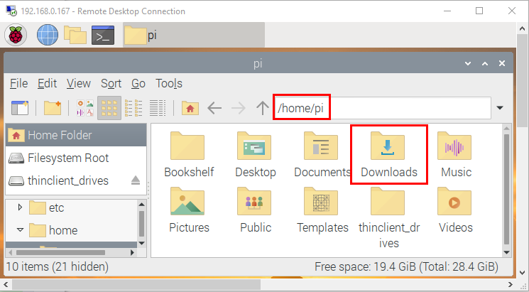


（5）Clickfile and tap it，click“Execute” to install the Arduino IDE.

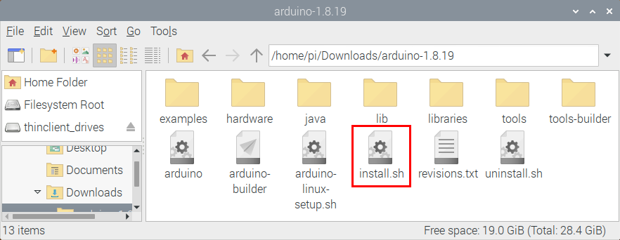


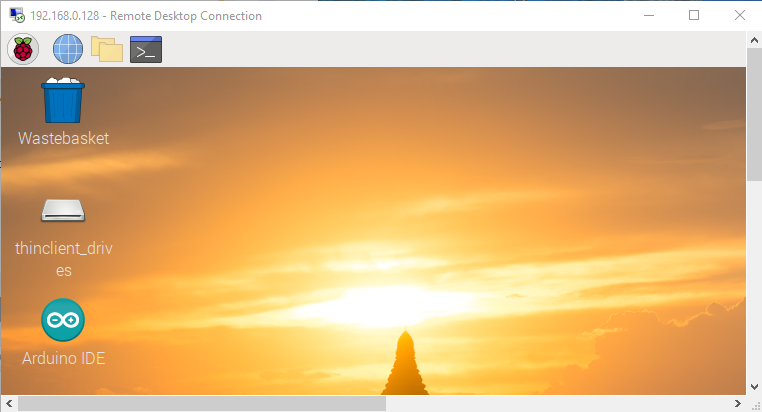

（6）Click and click to open the Arduino IDE.


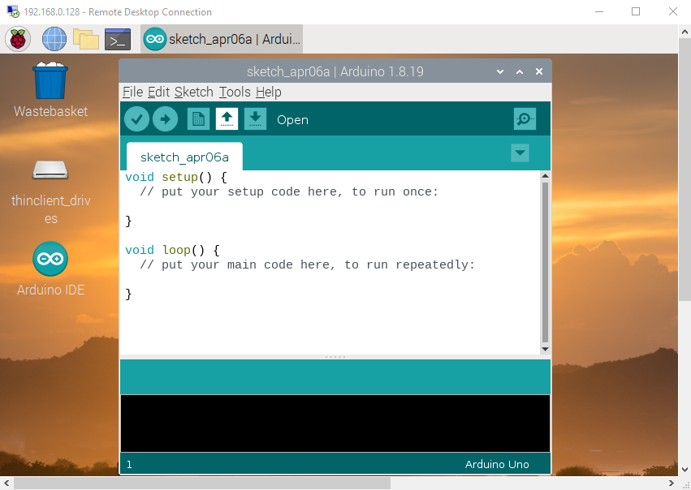

**5.2 Install the ESP32 on Arduino IDE**

Note：you need to download Arduino IDE 1.8.5 or advanced version to install the ESP32.

1.  > Click and
> click  to open the Arduino IDE.


(2） Click **“ File**” →**“Preferences”**，copy the website address<https://dl.espressif.com/dl/package_esp32_index.json> in the“**Additional Boards Manager URLs:**”and click“**OK**”.


（3） Click“**Tools**”→“**Board:**”then click “**Boards Manager...**”to enter“**Boards Manager**”. Enter **ESP32**”as follows, then click
**Install .**

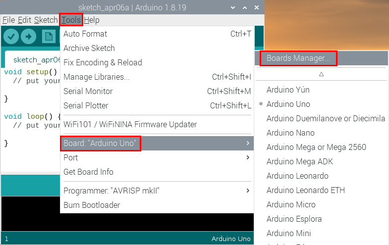


(4) After installing, click“Close”


**5.3. Arduino IDE Setting**

Click and click to open the Arduino IDE.


When downloading the sketch to the board, you must select the correct name of Arduino board that matches the board connected to your computer. As shown below;

(Note: we use the ESP32 board in this tutorial; therefore, we select ESP32**)**

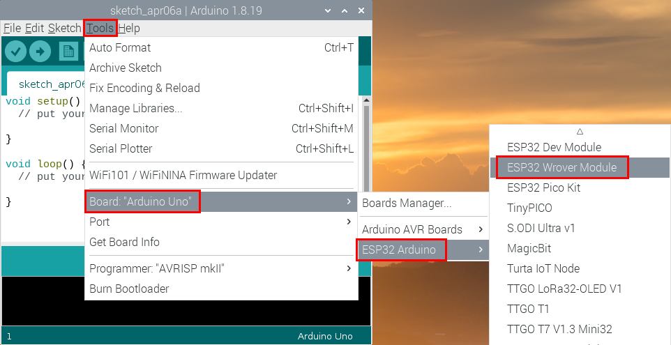


Then select the correct COM port (you can see the corresponding COM port after the ESP32 is connected to the Raspberry Pi via a USB cable.).


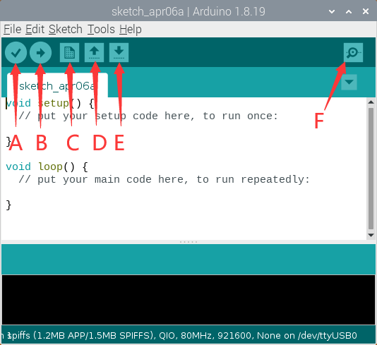

A- Used to verify whether there is any compiling mistakes or not.

B- Used to upload the sketch to your Arduino board.

C- Used to create shortcut window of a new sketch.

D- Used to directly open an example sketch.

E- Used to save the sketch.

F- Used to send the serial data received from board to the serial
monitor.

**6. How to Add Libraries?**

**(1) What are Libraries ?**

[Libraries ](https://www.arduino.cc/en/Reference/Libraries)are a collection of code that make it easy for you to connect sensors,displays, modules, etc.

For example, the built-in LiquidCrystal library helps talk to LCD displays. There are hundreds of additional libraries available on the Internet for download.

The built-in libraries and some of these additional libraries are listed in the reference. (https://www.arduino.cc/en/Reference/Libraries)

**(2) How to Install a Library ?**

Here we will introduce the most simple way to add libraries .

**Step 1:** Click ，tap“Downloads”file ，and click“arduino-1.8.19”file，then find and
click“libraries” file from the “arduino-1.8.19”file.


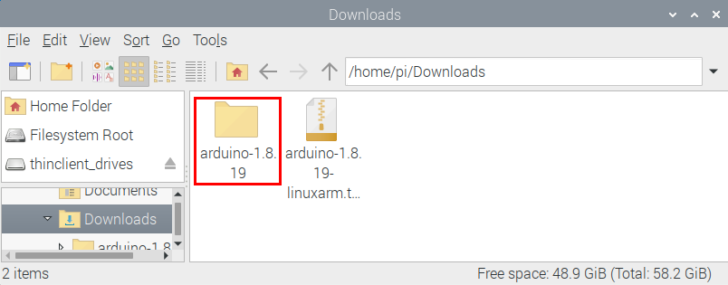


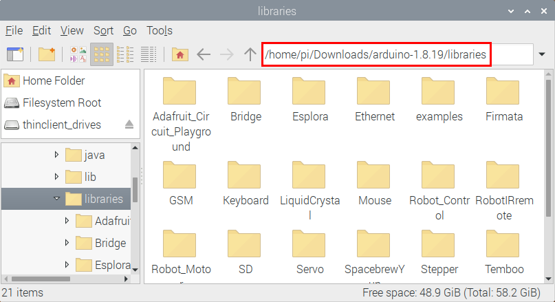

**Step 2:** Copy and paste the Arduino C library ZIP file (default ZIP file) from the provided Arduino Libraries folder into the Libraries file opened in the first step（the route is：/home/pi/Downloads/arduino-1.8.19/libraries）.

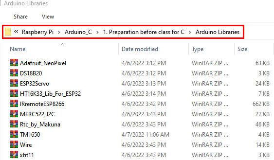

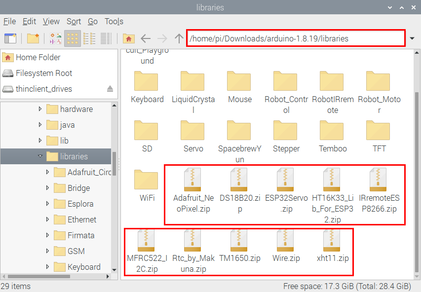

**Step 3:** Unzip the Arduino C package in the libraries folder（for example：click “Adafruit\_NeoPixel.zip”file
，select and tap“Extract Here”to unzip the “Adafruit\_NeoPixel.zip”file.

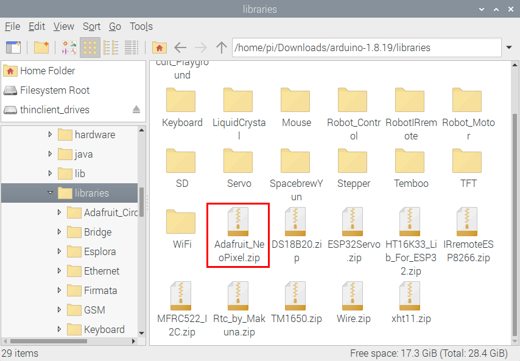

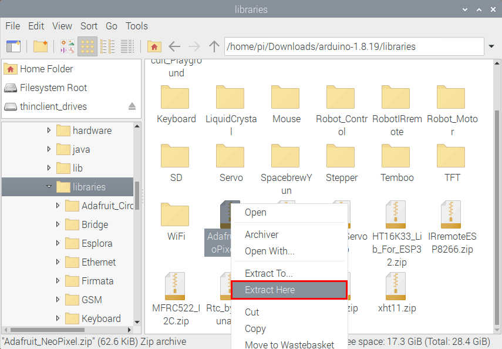

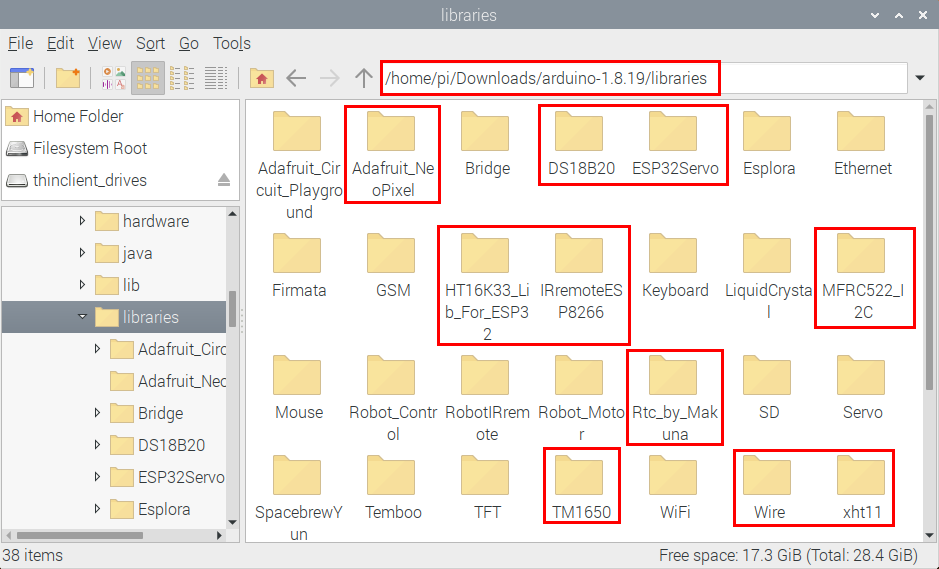

---

# Raspberry pi Projects

There are 37 sensors and modules in this kit. Next, we will analyze and introduce how they work step by step. Interface sensors with the ESP32 board and its expansion board, run test codes and observe experimental phenomenon.

**Note: please wire up components according to the given connection diagrams.**

**What’s more, wire up the power and signals correctly, otherwise, sensors or modules will get damaged or no test results will be shown.**

### Project 1: Hello World

**Overview**

In this project, we will make an experiment to light up the white LED module. The high and low levels can be controlled by programming, then the state of the LED can be controlled.


**Wire Up：**

Connect the ESP32 to Raspberry Pi


**Test Code**

```c
//*************************************************************************************
/*
 * Filename    : Hello World
 * Description : Enter the letter R,and the serial port displays"Hello World".
 * Auther      :http//www.Keyestudio.com
*/
char val;// defines variable "val"
void setup()
{
Serial.begin(9600);// sets baudrate to 9600
}
void loop()
{
  if (Serial.available() > 0) {
    val=Serial.read();// reads symbols assigns to "val"
    if(val=='R')// checks input for the letter "R"
    {  // if so,    
     Serial.println("Hello World!");// shows “Hello World !”.
    }
  }
}
//*************************************************************************************
```


Before uploading the test code to the ESP32，click“Tools”→“Board”, select“ESP32 Wrover Module”.

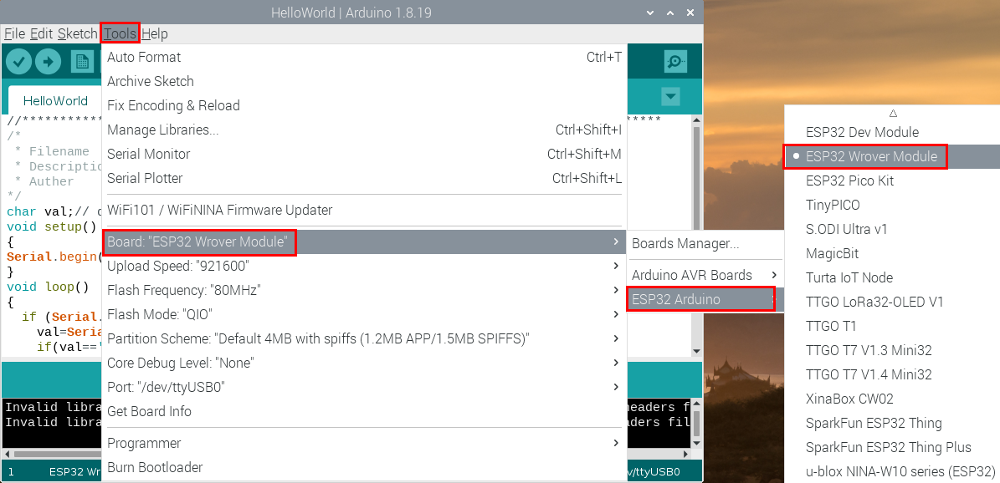

Select the correct serial port

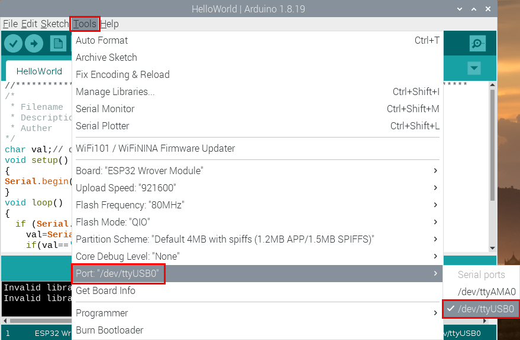


Click  to upload the test code to the ESP32.


Note: If uploading code fails, you can press and hold the Boot button on the ESP32 after clickingand release the Boot
button after the percentage of uploading progress appears., as shown below:  


The code is uploaded successfully


**Test Result**

After uploading successfully，we will use a USB cable to power on，click, set the baud rate to 9600，we need to
press the reset button on the ESP32 motherboard and enter the letter“R”，click“Send”，then the serial monitor prints“Hello
World\!”.

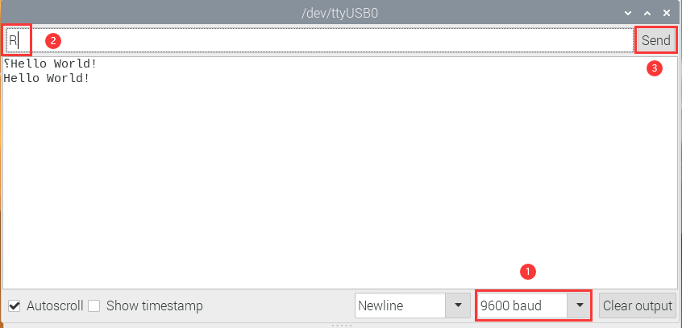

### Project 2: Lighting up LED


**Overview**

In this kit, we have a Keyestudio Purple Module, which is very simple to control. If you want to light up the LED, you just need to make a certain voltage across it.

In the project, we will control the high and low level of the signal end S through programming, so as to control the LED on and off. 

**Working Principle**

The two circuit diagrams are given.

The left one is wrong wiring-up diagram. Why? Theoretically, when the S terminal outputs high levels, the LED will receive the voltage and light up.

Due to limitation of IO ports of ESP32 board, weak current can’t make LED brighten.

The right one is correct wiring-up diagram. GND and VCC are powered up. When the S terminal is a high level, the triode Q1 will be connected and LED will light up(note: current passes through LED and R3 to reach GND by VCC not IO ports). Conversely, when the S terminal is a low level, the triode Q1 will be disconnected and LED will go off.


**Wiring Diagram：**


**Test Code ：**


```c
//*************************************************************************************
/*
 * Filename    : Blink
 * Description : led Flashing 1 s
 * Auther      : http://www.Keyestudio.com
*/
int ledPin = 0; //Define LED pin connection to GPIO0
void setup() {
  pinMode(ledPin, OUTPUT);//Set mode to output
}

void loop() {
  digitalWrite(ledPin, HIGH); //Output high level, turn on led
  delay(1000);//Delay 1000 ms
  digitalWrite(ledPin, LOW); //Output low level,turn off led
  delay(1000);//Delay 1000 ms
}
//*************************************************************************************
```

**Code Explanation**

1\. PinMode(pin,mode): Pin is the ESP32 GPIO pin number used to set the mode, here we set pin 0 as output mode.

2\. DigitalWrite(pin, value): Pin is the GPIO pin, which is defined GP0 here. Valueis the digital level that we will output（HIGH/LOW）. If the pin is configured to OUTPUT using pinMode(), its voltage is set to the corresponding value: 3.3V is HIGH,low level is 0V (ground). When connect the LEDs to the pins, using the digitalWrite（HIGH）, the LEDs will get dim.

3\. Setup() executes once, while loop() executes all the time. Delay(ms) is delay function, ms is the number of milliseconds to pause. Data type: unsigned long（range 0\~ 4,294,967,295 (2^32 - 1)）.

Firstly, we connect the module signal to ledPIN, namely GP0, and set it to a high level to light the LEDs on the module. Then delay 1000 ms, controlling the LEDs on the module light up for 1s and off for 1s to achieve the flashing effect. 

**Test Result**

Wire up, power on, compile and upload the code to the ESP32. After uploading successfully, we will use a USB cable to power on，we will see that the LED in the circuit will flash alternately.

### Project 3: Traffic Lights Module


**Overview**

In this lesson, we will learn how to control multiple LED lights and simulate the operation of traffic lights.

Traffic lights are signal devices positioned at road intersections, pedestrian crossings, and other locations to control flows of traffic.

In this kit, we will use the traffic light module to simulate the traffic light.

**Working Principle**

In previous lesson, we already know how to control an LED. In this part, we only need to control three separated LEDs. Output high levels to the signal R(3.3V), then the red LED will be on.


**Wiring Diagram：**

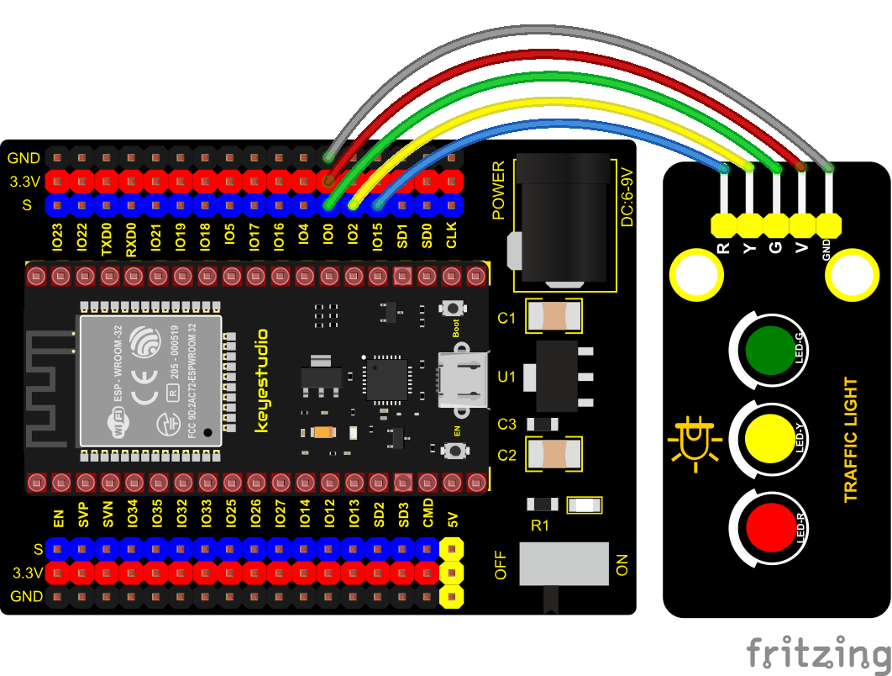

**Test Code ：**


```c
//*************************************************************************************
/*
 * Filename    : Traffic_Light
 * Description : Simulated traffic lights
 * Auther      : http://www.Keyestudio.com
*/
int redPin = 15;   //Red LED connected to GPIO15
int yellowPin = 2; //Yellow LED connected to GPIO2
int greenPin = 0;   //Green LED connected to GPIO0

void setup() {
  //LED interfaces are set to output mode
  pinMode(greenPin, OUTPUT);
  pinMode(yellowPin, OUTPUT);
  pinMode(redPin, OUTPUT);
}

void loop() {
  digitalWrite(greenPin, HIGH); //Lighting green LED
  delay(5000);  //Delay for 5 seconds
  digitalWrite(greenPin, LOW); //Turn off green LEDS
  for (int i = 1; i <= 3; i = i + 1) {  //run three times
    digitalWrite(yellowPin, HIGH); //Lighting yellow LED
    delay(500); //Delay for 0.5 seconds
    digitalWrite(yellowPin, LOW); //Turn off yellow LED
    delay(500); //Delay for 0.5 seconds
  }
  digitalWrite(redPin, HIGH); //Lighting red LED
  delay(5000);  //Delay5s
  digitalWrite(redPin, LOW); //Turn off red LED
}
//*************************************************************************************
```


**Code Explanation**

We use the function for(). for (int i = 1; i \<= 3; i = i + 1) represents the variable i adds 1 fir each time from 1 to 3.

The function for (int i = 255; i \>= 0; i = i - 1) indicates that i reduces by 1 each time. When i\<0, exit the for() loop and execute 256
times.

**Test Result**

Upload the code, the green LED will be on for 5s then off, the yellow LED will flash for 3s then go off and the red one will be on 5s then off.

### Project 4: Laser Sensor

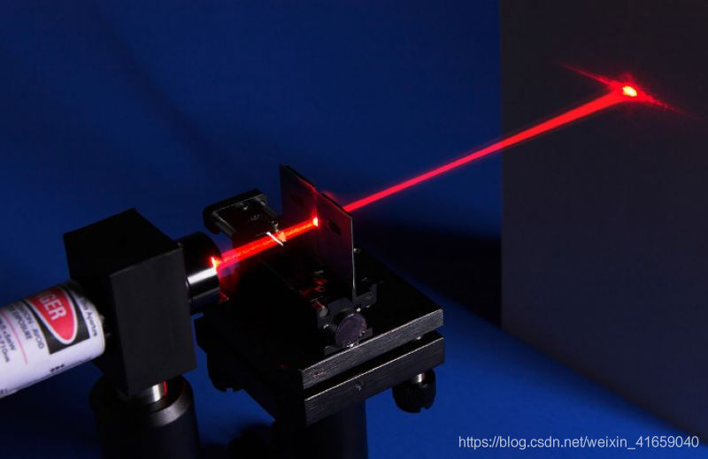

**Description**

Lasers are widely used to cut, weld, surface treat, and more on specific materials. The energy of the laser is very high. The toy laser pointer may cause glare to the human eye, and it may cause retinal damage for a long time. my country also prohibits the use of laser to illuminate the aircraft.

**Working Principle**

The laser head sensor module is mainly composed of a laser head with a light-emitting die, a condenser lens, and a copper adjustable sleeve.

We can see the circuit schematic diagram of this module which is very similar to the LED we have learned. They are all driven by triodes. A high-level digital signal is directly input at the signal end, then the sensor will start to work; if inputting low levels, the sensor won’t work.


**Wiring Diagram：**

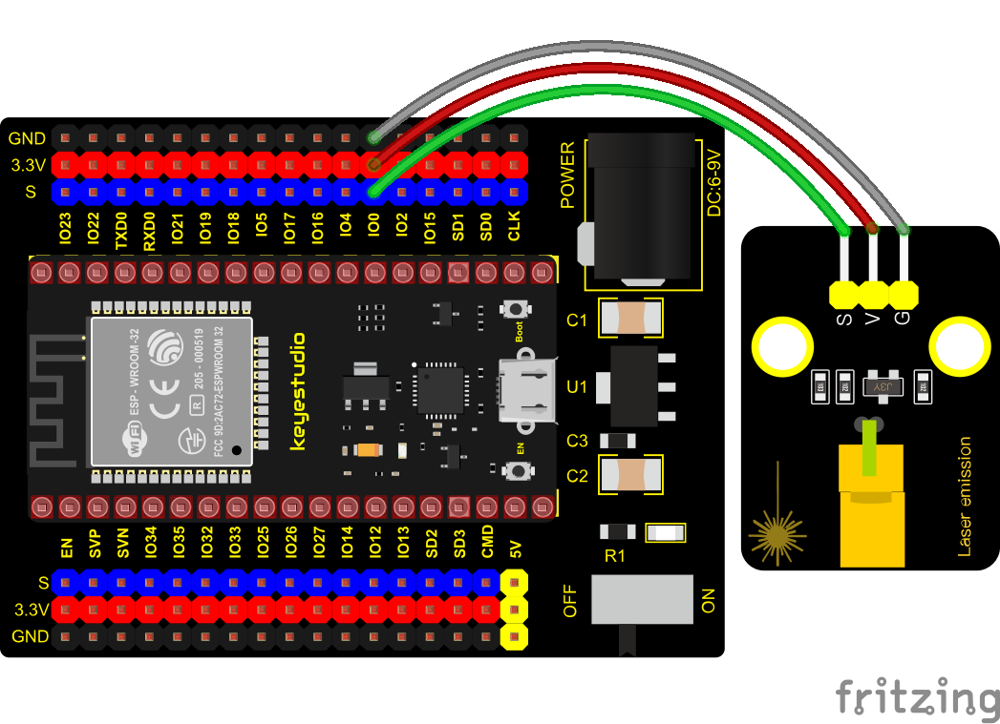

**Test Code ：**


```c
//*************************************************************************************
/*
 * Filename    : Laser sensor
 * Description : Laser light flashing
 * Auther      : http://www.Keyestudio.com
*/
int laserPin = 0; //Define the laser pin as GPIO 0
void setup() {
  pinMode(laserPin, OUTPUT);//Define laser pin as output mode
}

void loop() {
  digitalWrite(laserPin, HIGH); //Open the laser
  delay(2000);  //Delay 2 seconds
  digitalWrite(laserPin, LOW); //Shut down the laser
  delay(2000);  //Delay 2 seconds
}
//*************************************************************************************
```


**Test Results**

Upload the test code successfully and power on, the laser module will emit red laser signals for 2 seconds and stop emitting signals for 2 seconds.

### Project 5: Breathing LED


**Overview**

A“breathing LED”is a phenomenon where an LED's brightness smoothly changes from dark to bright and back to dark, continuing to do so and giving the illusion of an LED“breathing. This phenomenon is similar to a lung breathing in and out. So how to control LED’s brightness? We need to take advantage of PWM.

**Wiring Diagram：**


**Test Code ：**


```c
//**********************************************************************
/*
 * Filename    : Breathing Led
 * Description : Make led light fade in and out, just like breathing.
 * Auther      : http//www.Keyestudio.com
*/
#define PIN_LED   0   //define the led pin
#define CHN       0   //define the pwm channel
#define FRQ       1000  //define the pwm frequency
#define PWM_BIT   8     //define the pwm precision
void setup() {
  ledcSetup(CHN, FRQ, PWM_BIT); //setup pwm channel
  ledcAttachPin(PIN_LED, CHN);  //attach the led pin to pwm channel
}

void loop() {
  for (int i = 0; i < 255; i++) { //make light fade in
    ledcWrite(CHN, i);
    delay(10);
  }
  for (int i = 255; i > -1; i--) {  //make light fade out
    ledcWrite(CHN, i);
    delay(10);
  }
}
//*************************************************************************************
```

**Test Result**

Wire up, power on, compile and upload the code to the ESP32. After uploading successfully，we will use a USB cable to power on，we will see that the LED on the module gradually gets dimmer then brighter, cyclically, like human breathe.

### Project 6: RGB Module


**Overview**

Among these modules is a RGB module. It adopts a F10-full color RGB foggy common cathode LED. We connect the RGB module to the PWM port of MCU and the other pin to GND(for common anode RGB, the rest pin will be connected to VCC). So what is PWM?

PWM is a means of controlling the analog output via digital means. Digital control is used to generate square waves with different duty cycles (a signal that constantly switches between high and low levels) to control the analog output.In general, the input voltages of ports are 0V and 5V. What if the 3V is required? Or a switch among 1V, 3V and 3.5V? We cannot change resistors constantly. For this reason, we resort to PWM.


For Arduino digital port voltage outputs, there are only LOW and HIGH levels, which correspond to the voltage outputs of 0V and 5V respectively. You can define LOW as“0”and HIGH as“1’, and let the Arduino output five hundred‘0’or“1”within 1 second. If output five hundred‘1’, that is 5V; if all of which is‘0’,that is 0V; if output 25001 pattern, that is 2.5V.

This process can be likened to showing a movie. The movie we watch are not completely continuous. Actually, it generates 25 pictures per second, which cannot be told by human eyes. Therefore, we mistake it as a continuous process. PWM works in the same way. To output different voltages, we need to control the ratio of 0 and 1. The more ‘0’ or ‘1’ output per unit time, the more accurate the control.

**Working Principle**

For our experiment, we will control the RGB module to display different colors through three PWM values.


**Wiring Diagram：**


**Test Code ：**


```c
//**********************************************************************
/*
 * Filename    : RGB LED
 * Description : Use RGBLED to show random color.
 * Auther      : http//www.Keyestudio.com
*/
int ledPins[] = {0, 2, 15};    //define red, green, blue led pins
const byte chns[] = {0, 1, 2};        //define the pwm channels
int red, green, blue;
void setup() {
  for (int i = 0; i < 3; i++) {   //setup the pwm channels,1KHz,8bit
    ledcSetup(chns[i], 1000, 8);
    ledcAttachPin(ledPins[i], chns[i]);
  }
}

void loop() {
  red = random(0, 256);
  green = random(0, 256);
  blue = random(0, 256);
  setColor(red, green, blue);
  delay(200);
}

void setColor(byte r, byte g, byte b) {
  ledcWrite(chns[0], 255 - r); //Common anode LED, low level to turn on the led.
  ledcWrite(chns[1], 255 - g);
  ledcWrite(chns[2], 255 - b);
}
//*************************************************************************************
```


**Test Result**

Wire up, power on, compile and upload the code to the ESP32. After uploading successfully，we will use a USB cable to power on，we will see that the RGB LED on the module starts to display random colors.

### Project 7: Button Sensor


**Overview**

In this kit, there is a Keyestudio single-channel button module, which mainly uses a tact switch and comes with a yellow button cap.

In previous lessons, we learned how to make the pins of our single-chip microcomputer output a high level or low level. In this experiment, we will read the high level (3.3V) and low level (0V).

We can determine whether the button on the sensor is pressed by reading the high and low level of the S terminal on the sensor.

**Working Principle**

The button module has four pins. The pin 1 is connected to the pin 3 and the pin 2 is linked with the pin 4. When the button is not pressed, they are disconnected. Yet, when the button is pressed, they are connected. If the button is released, the signal end is high level.


**Wiring Diagram：**


**Test Code ：**


    //*************************************************************************************
    /*
     * Filename    : button
     * Description : Read key value
     * Auther      : http://www.Keyestudio.com
    */
    int val = 0;  //Useto store key values
    int button = 15; //The pin of the button is connected to GP15
    void setup() {
      Serial.begin(9600); //Start the serial port monitor and set baud rate to 9600
      pinMode(button, INPUT); //Set key pin to input mode
    }
    
    void loop() {
      val = digitalRead(button);  //Read the value of the key and assign it to the variable val
      Serial.print(val);  //Print it on the serial port
      if (val == 0) { //Press the key to read the low level and print the press related information
        Serial.print("        ");
        Serial.println("Press the botton");
        delay(100);
      }
    
      else {  //Print information about key release
        Serial.print("        ");
        Serial.println("Loosen the botton");
        delay(100);
      }
    }
    //*************************************************************************************


**Code Explanation**

**1. pinMode(button, INPUT)**; set the pin of the button module to GP15 and INPUT.

Configure INPUT through pinMode(). INPUT must use the pull-up or pull-down resistor(ours module has the pull-up resistor RI).

**2. Serial.begin(9600)**: Initialize serial communication and set the baud rate to 9600.

**3. digitalRead(button)**: read the digital level of the button(HIGH or LOW). If this pin is not connected to pins, the digitalRead() will
return HIGH or LOW.

**4. if..else..**：if the logic behind () is true, execute the code of(); otherwise execute the code of **else**.

5\. If the button is pressed, the signal end is low level, GP15 is low level and Val is 0. Then the monitor will show the corresponding value and characters; otherwise, the sensor is released, val is 1 and monitor will show 1 and other characters

**Test Result**

Upload the test code successfully. After powering on the USB cable, open the serial monitor and set the baud rate to 9600. Press the reset button on the ESP32 board. The serial monitor will display the corresponding data and characters. When the button is pressed, val is 0, the monitor will show“Press the button”；when the button is released, val is 1，the monitor will show“Loosen the button”; as shown below:

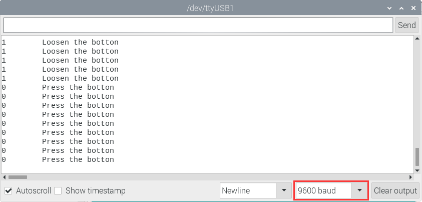

### Project 8: Capacitive Sensor


**Description**

In this kit, there is a capacitive touch module which mainly uses a TTP223-BA6 chip. It is a touch detection chip, which provides a touch button, and its function is to replace the traditional button with a variable area button. When we power on, the sensor needs about 0.5 seconds to stabilize. Do not touch the keys during this time period. At this time, all functions are disabled, and self-calibration is always performed. The calibration period is about 4 seconds. We display the test results in the shell.

**Working Principle**


When our fingers touch the module, the signal S outputs high levels, the red LED on the module flashes. We can determine if the button is pressed or not by reading high and low levels on the sensor.


**Wiring Diagram：**


**Test Code ：**


```c
//*************************************************************************************
/*
 * Filename    : Touch sensor
 * Description : Reading touch value
 * Auther      : http://www.Keyestudio.com
*/
int val = 0;
int touch = 15; //The key of PIN  
void setup() {
  Serial.begin(9600);//Baud rate is 9600
  pinMode(touch, INPUT);//Setting input mode
}

void loop() {
  val = digitalRead(touch);//Read the value of the key
  Serial.print(val);//Print out key values
  if (val == 1) {//Press for high level
    Serial.print("        ");
    Serial.println("Press the button");
    delay(100);
  }
  else {//Release to low level
    Serial.print("        ");
    Serial.println("Loosen the button");
    delay(100);
  }
}
//*************************************************************************************
```


**Code Explanation**

When we touch the sensor, the monitor will show“You pressed the button\!”, if not,“You loosen the button\!”will be shown on the
monitor.

**Test Result**

Wire up, upload the code, open the monitor and set baud rate to 9600. Press the reset button on the ESP32 board. The monitor shows corresponding data and characters. In the experiment, when the button is pressed, the red LED lights up and val is 1. Then the shell shows “You pressed the button\!”; if the button is released, the red LED is off and val is 0,“You loosen the button\!”will be displayed.

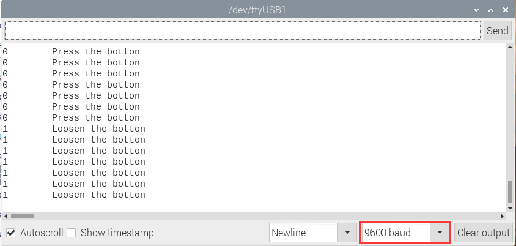

### Project 9: Obstacle Avoidance Sensor


**Overview**

In this kit, there is a Keyestudio obstacle avoidance sensor, which mainly uses an infrared emitting and a receiving tube. In the
experiment, we will determine whether there is an obstacle by reading the high and low level of the S terminal on the sensor.

**Working Principle**

NE555 circuit provides IR signals with frequency to the emitter TX, then the IR signals will fade with the increase of transmission distance. If encountering the obstacle, it will be reflected back.

When the receiver RX meets the weak signals reflected back, the receiving pin will output high levels, which indicates the obstacle is far away. On the contrary, it the reflected signals are stronger, low levels will be output, which represents the obstacle is close. There are two potentiometers on the module, and one is for adjusting emission power, another one is for receiving frequency.


**Wiring Diagram：**

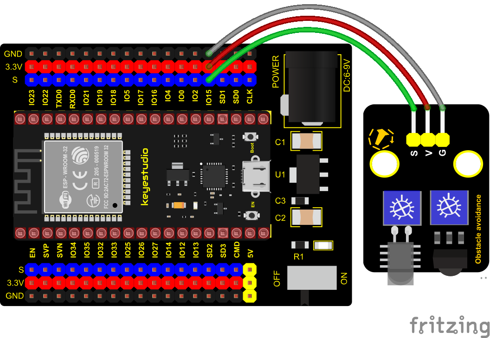

**Test Code ：**


```c
//*************************************************************************************
/*
 * Filename    : obstacle avoidance sensor
 * Description : Reading the obstacle avoidance value
 * Auther      : http://www.Keyestudio.com
*/
int val = 0;
void setup() {
  Serial.begin(9600);//Set baud rate to 9600
  pinMode(15, INPUT);//Set pin GP15 to input mode
}

void loop() {
  val = digitalRead(15);//Read digital level
  Serial.print(val);//Print the level signal read
  if (val == 0) {//Obstruction detected
    Serial.print("        ");
    Serial.println("There are obstacles");
    delay(100);
  }
  else {//No obstructions detected
    Serial.print("        ");
    Serial.println("All going well");
    delay(100);
  }
}
//*************************************************************************************
```

**Note:**

Upload the test code and wire up according to the connection diagram. After powering on, we start to adjust the two potentiometers to sense distance.

1. Adjust the potentiometer transmitting power. Make the P LED at the critical point of ON and OFF states.

2. Adjust the potentiometer receiving frequency. Rotate it clockwise, the frequency will increase. Make the S LED at the critical point of ON and OFF states, then the 38KHz square wave can be produced.

**Test Result**

Upload the code power up by a USB cable, open the serial monitor and set baud rate to 9600. Press the reset button on the ESP32 board. When the sensor detects the obstacle, the monitor will show“There are obstacles”; if the obstacle is not detected,“All going well”will be shown.

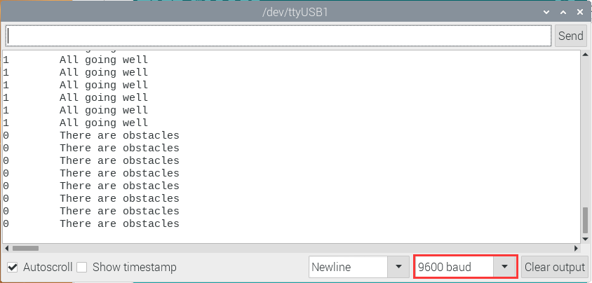

### Project 10: Line Tracking Sensor

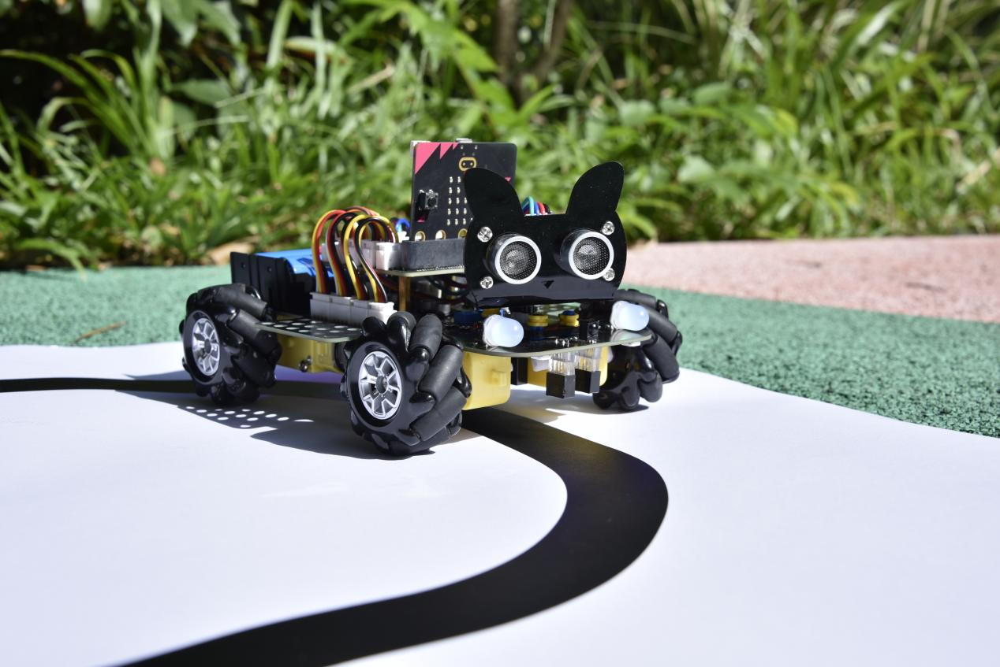

**Description**

In this kit, there is a DIY electronic building block single-channel line tracking sensor which mainly uses a TCRT5000 reflective black and white line recognition sensor element.

In the experiment, we judge the color (black and white) of the object detected by the sensor by reading the high and low levels of the S terminal on the module; and display the test results on the shell.

**Working Principle**


When a black or no object is detected, the signal terminal will output high levels; when white object is detected, the signal terminal is low level; its detection height is 0-3cm. We can adjust the sensitivity by rotating the potentiometer on the sensor. When the potentiometer is rotated, the sensitivity is best when the red LED on the sensor is at the critical point between off and on.


**Wiring Diagram：**


**Test Code ：**


```c
//*************************************************************************************
/*
 * Filename    : line tracking
 * Description : Reading the tracking sensor value
 * Auther      : http://www.Keyestudio.com
*/
int val = 0;
void setup() {
  Serial.begin(9600);//Set baud rate to 9600
  pinMode(15, INPUT);//Sets sensor pin to input mode
}

void loop() {
  val = digitalRead(15);//Read the digital level output by the patrol sensor
  Serial.print(val);//Serial port print value
  if (val == 0) {//White val is 0 detected
    Serial.print("        ");
    Serial.println("White");
    delay(100);
  }
  else {//Black val is 1 detected
    Serial.print("        ");
    Serial.println("Black");
    delay(100);
  }
}
//*************************************************************************************
```


**Test Result**

Upload test code, wire up, open the monitor and set baud rate to 9600. Press the reset button on the ESP32 board.

In the experiment, when the sensor doesn’t detect an object or detects a black object, the val is 1, and the monitor will display "Black" ; when a white object (can reflect light) is detected, the val is 0, and the monitor will display "White" ;

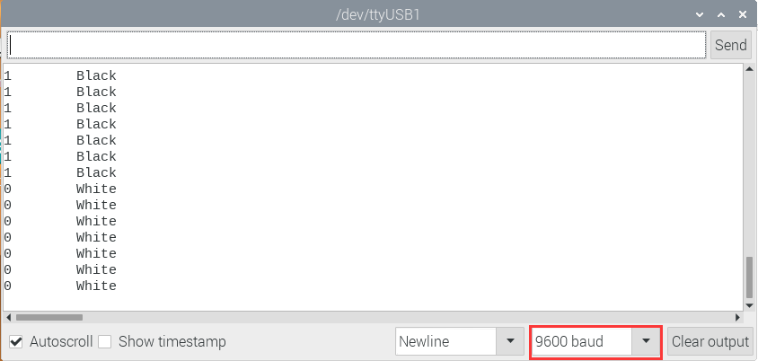

### Project 11: Photo Interrupter


**Description**

This kit contains a photo interrupter which mainly uses 1 ITR-9608 photoelectric switch. It is a photoelectric switch optical switch
sensor.

**Working Principle**

When the paper is put in the slot, C is connected with VCC and the signal end S of the sensor are high levels; then the red LED will be off. Otherwise, the red LED will be on.


**Wiring Diagram：**


**Test Code ：**

```c
//*************************************************************************************
/*
 * Filename    : Photo_Interrupt
 * Description : Light snap sensor counting
 * Auther      : http://www.Keyestudio.com
*/
int PushCounter = 0; //The count variable is assigned an initial value of 0
int State = 0; //Store the current state of the sensor output
int lastState = 0; //Stores the state of the last sensor output
void setup() {
  Serial.begin(9600);//Set the baud rate to 9600
  pinMode(15, INPUT);//Set the light snap sensor pin to input mode
}

void loop() {
  State = digitalRead(15);//Read current state
  if (State != lastState) {//If the state is different from the last read
    if (State == 1) {//block the light 
      PushCounter = PushCounter + 1;//Count + 1
      Serial.println(PushCounter);//Print count
    }
  }
  lastState = State;//Update state
}
//*************************************************************************************
```

**Code Explanation**

Logic setting:

<table class="colwidths-auto docutils align-default">
<tbody>
<tr class="odd">
<td>Initial Setting</td>
<td>Set PushCounter to 0</td>
<td></td>
</tr>
<tr class="even">
<td></td>
<td>Set State to 0 (value of the sensor)</td>
<td></td>
</tr>
<tr class="odd">
<td></td>
<td>Set lastState to 0</td>
<td></td>
</tr>
<tr class="even">
<td>when an object enters the slot</td>
<td>lastState is 0，State turns into 1; lastState turns into 1</td>
<td><p>Set PushCounter to PushCounter+1</p>
<p>print the value of PushCounter</p></td>
</tr>
<tr class="odd">
<td>when the object leaves the slot</td>
<td>lastState is 1，State becomes 0，two data are not equal，lastState turns into 0.</td>
<td><p>PushCounterdoesn’t change;</p>
<p>Don’t print the value of PushCounter</p></td>
</tr>
<tr class="even">
<td>When the object goes through this slot again</td>
<td>lastState is 0, State becomes 1，two data are not equal，lastState turns into 1.</td>
<td><p>Set PushCounter to PushCounter+1</p>
<p>And print the value of PushCounter</p></td>
</tr>
<tr class="odd">
<td>When the object leaves this slot again</td>
<td>lastState is 1，State turns into 0，two data are not equal lastState turns into 0</td>
<td><p>PushCounter doesn’t change;</p>
<p>Don’t print the PushCounter value</p></td>
</tr>
</tbody>
</table>

**Test Result**

Wire up, upload test code, open monitor and set baud rate to 9600. Press the reset button on ESP32 board. The shell displays the PushCounter data. Every time when the object passes through the slot of the sensor, the PushCounter data will increase by 1 continuously, as shown below:

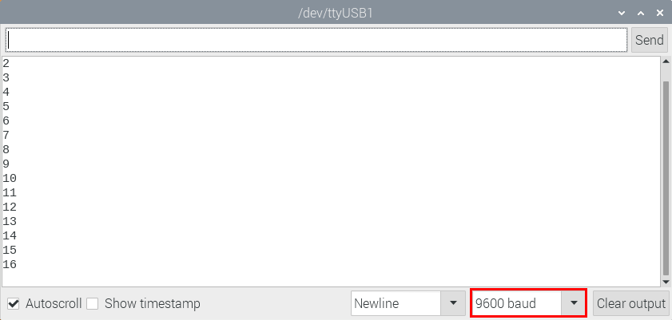

### Project 12: Tilt Module


**Overview**

In this kit, there is a Keyestudio tilt sensor. The tilt switch can output signals of different levels according to whether the module is tilted. There is a ball inside. When the switch is higher than the horizontal level, the switch is turned on, and when it is lower than the horizontal level, the switch is turned off. This tilt module can be used for tilt detection, alarm or other detection.

**Working Principle**

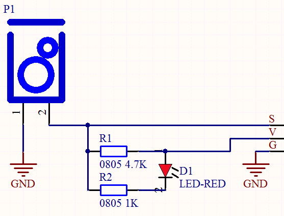

The working principle is pretty simple. When pin 1 and 2 of the ball switch P1 are connected, the signal S is low level and the red LED will light up; when they are disconnected, the pin will be pulled up by the 4.7K R1 and make S a high level, then LED will be off.


**Wiring Diagram：**


**Test Code ：**


```c
//*************************************************************************************
/*
 * Filename    : Tilt switch
 * Description : Reading the tilt sensor value
 * Auther      :http://www.Keyestudio.com
*/
int val; //Store the level value output by the tilt sensor

void setup() {
  Serial.begin(9600);
  pinMode(15, INPUT);  //Connect the pin of the tilt sensor to GP15 and set GP15 to the input mode
}

void loop() {
  val = digitalRead(15); //Read module level signal
  Serial.println(val);  //Newline print
  delay(100); //Delay for 100 ms
}
//*************************************************************************************
```


**Test Result**

Upload the code power up by a USB cable, open the serial monitor and set baud rate to 9600. Press the reset button on the ESP32 board.

Make the tilt module incline to one side, the red LED on the module will be off and the monitor will display“1”. In contrast, if you make it incline the other side, the red LED will light up and the monitor will display“0”.


### Project 13: Hall Sensor


**Description**

In this kit, there is a Hall sensor which mainly adopts a A3144 linear Hall element. The element P1 is composed of a voltage regulator, a Hall voltage generator, a differential amplifier, a Schmitt trigger, a temperature compensation circuit and an open-collector output stage. In the experiment, we use the Hall sensor to detect the magnetic field and display the test results on the shell.

**Working Principle**

When the sensor detects no magnetic field or a north pole magnetic field, the signal terminal will be high level; when it senses a south pole magnetic field, the signal terminal will be low levels.

The stronger the magnetic field strength is, induction distance is longer.

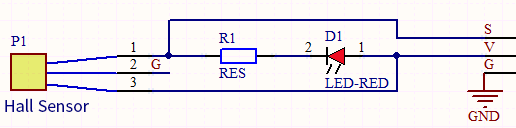

**Wiring Diagram：**


**Test Code ：**

```c
//*************************************************************************************
/*
 * Filename    : Hall magnetic
 * Description : Reading the value of hall magnetic sensor
 * Auther      : http://www.Keyestudio.com
*/
int val = 0;
int hallPin = 15;  //Hall sensor pin is connected to GPIO15
void setup() {
  Serial.begin(9600);//Set baud rate to 9600
  pinMode(hallPin, INPUT);//Set pin to input mode
}

void loop() {
  val = digitalRead(hallPin);//Read the level value of hall sensor
  Serial.print(val);//Print val
  if (val == 0) {//There is a South Pole magnetic field
    Serial.println("      The magnetic field at the South Pole!");
  }
  else {//If not
    Serial.println("      Just be all normal!");
  }
}
//*************************************************************************************
```


**Test Result**

Upload the test code, open the monitor and set baud rate to 9600. Press the reset button on the ESP32 board.

when the sensor detects no magnetic fields or the north pole magnetic field, the monitor l will show“1 Just be all normal\!”and the LED on the sensor will be off; When it detects the south pole magnetic field,“0 The magnetic field at the South Pole\!”and the LED on the sensor will be on.

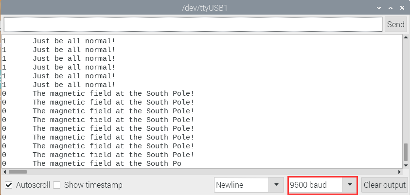

### Project 14: Reed Switch Module


**Overview**

In this kit, there is a Keyestudio reed switch module, which mainly uses a MKA10110 green reed component.

The reed switch is the abbreviation of the dry reed switch. It is a passive electronic switch element with contacts.

It has the advantages of simple structure, small size and easy control.

Its shell is a sealed glass tube with two iron elastic reed electric plates.

In the experiment, we will determine whether there is a magnetic field near the module by reading the high and low level of the S terminal on the module; and, we display the test result in the shell.


**Working Principle**

Reed switch is an abbreviation of the dry reed contacts a passive electronic switching elements, and has the advantages of simple structure, small size and ease of control, its shell is a sealed glass tube, the tubes are installed two iron elastic reed plate, but also filling called rhodium metal inert gas. In peacetime, the glass tube in the two reeds made of special materials are separated. When a magnetic substance close to the glass tube, in the role of the magnetic field lines, the pipe within the two reeds are magnetized to attract each other in contact, the reed will suck together, so that the junction point of the connected circuit communication.

 After the disappearance of the outer magnetic reed because of their flexibility and separate, the line is disconnected. Therefore, as a use of the magnetic field signals to control the line switching device, reed tube can be used as a sensor for counting the number, spacing, etc., and also are widely used in a variety of communication devices.


**Wiring Diagram：**


**Test Code ：**


```c
//*************************************************************************************
/*
 * Filename    : Reed Switch
 * Description : Read the value of the reed sensor
 * Auther      : http://www.Keyestudio.com
*/
int val = 0;
int reedPin = 15; //Define dry reed module signal pin connected to GPIO15
void setup() {
  Serial.begin(9600);//Set baud rate to 9600
  pinMode(reedPin, INPUT);//Set mode to input
}

void loop() {
  val = digitalRead(reedPin);//Read digital level
  Serial.print(val);//Serial port shows up

  if (val == 0) {//There's a magnetic field nearby
    Serial.print("        ");
    Serial.println("A magnetic  field");
    delay(100);
  }
  else {//There is no magnetic field
    Serial.print("        ");
    Serial.println("There is no magnetic field");
    delay(100);
  }
}
//*************************************************************************************
```


**Test Result**

Upload the code power up by a USB cable, open the serial monitor and set baud rate to 9600. Press the reset button on the ESP32 board. When the sensor detects a magnetic field, val is 0 and the red LED of the module lights up, "A magnetic field" will be displayed; when no magnetic field is detected, val is 1, and the LED on the module goes out, "There is no magnetic field" will be shown, as shown below.


### Project 15: PIR Motion Sensor


**Overview**

In this kit, there is a Keyestudio PIR motion sensor, which mainly uses an RE200B-P sensor elements. It is a human body pyroelectric motion sensor based on pyroelectric effect, which can detect infrared rays emitted by humans or animals, and the Fresnel lens can make the sensor's detection range farther and wider.

In the experiment, we determine if there is someone moving nearby by reading the high and low levels of the S terminal on the module. The detected results will be displayed on the Shell.

**Working Principle**

The upper left part is voltage conversion(VCC to 3.3V). The working voltage of sensors we use is 3.3V, therefore we can’t use 5V directly. The voltage conversion circuit is needed.

When no person is detected or no infrared signal is received, and pin 1 of the sensor outputs low level. At this time, the LED on the module will light up and the MOS tube Q1 will be connected and the signal terminal S will detect Low levels.

When one is detected or an infrared signal is received, and pin 1 of the sensor outputs a high level. Then LED on the module will go off, the MOS tube Q1 is disconnected and the signal terminal S will detect high levels.


**Wiring Diagram：**


**Test Code ：**


```c
//*************************************************************************************
/*
 * Filename    : PIR motion
 * Description : Reading the value of the human body infrared sensor
 * Auther      :  http://www.Keyestudio.com
*/
int val = 0;
int pirPin = 15; //The pin of PIR motion sensor is defined as GPIO15
void setup() {
  Serial.begin(9600); //Set baud rate to 9600
  pinMode(pirPin, INPUT);  //Set the sensor to input mode
}

void loop() {
  val = digitalRead(pirPin);  //Read the sensor value
  Serial.print(val);//Print val value
  if (val == 1) {//There is movement nearby, output high level
    Serial.print("        ");
    Serial.println("Some body is in this area!");
    delay(100);
  }
  else {//If no  movement nearby, output low level
    Serial.print("        ");
    Serial.println("No one!");
    delay(100);
  }
}
//*************************************************************************************
```

**Test Result**

Upload the code power up by a USB cable, open the serial monitor and set baud rate to 9600. Press the reset button on the ESP32 board. When the sensor detects someone nearby, value is 1, the LED will go off and the monitor will show“Somebody is in this area\!”. In contrast, the value is 0, the LED will go up and“0 No one\!”will be shown.


### Project 16: Active Buzzer


**Overview**

In this kit, it contains an active buzzer module and a power amplifier module (the principle is equivalent to a passive buzzer). In this experiment, we control the active buzzer to emit sounds. Since it has its own oscillating circuit, the buzzer will automatically sound if given large voltage.

**Working Principle**


From the schematic diagram, the pin of buzzer is connected to a resistor R2 and another port is linked with a NPN triode Q1. So, if this triode Q1 is powered, the buzzer will sound.

If the base electrode of the triode connected to the R1 resistor is a high level, the triode Q1 will be connected.If the base electrode is pulled down by the resistor R3, the triode is disconnected.

When we output a high level from the IO port to the triode, the buzzer will emit sounds; if outputting low levels, the buzzer won’t emit sounds.


**Wiring Diagram：**

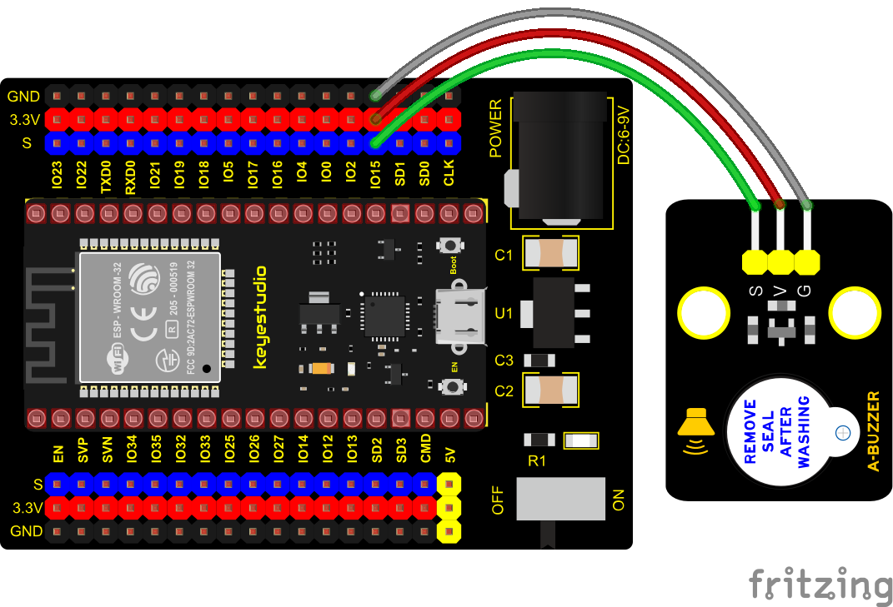

**Test Code ：**


```c
//*************************************************************************************
/*
 * Filename    : Active buzzer
 * Description : An active buzzer produces sound
 * Auther      : http://www.Keyestudio.com
*/
int buzzer = 15; //Define buzzer receiver pin GPIO15
void setup() {
  pinMode(buzzer, OUTPUT);//Set the output mode
}

void loop() {
  digitalWrite(buzzer, HIGH); //sound production
  delay(1000);
  digitalWrite(buzzer, LOW); //Stop the sound
  delay(1000);
}
//*************************************************************************************
```


**Code Explanation**

In the experiment, we set the pin number to GPIO15. When setting to high, the active buzzer will beep; when setting to low, the active buzzer will stop emitting sounds

**Test Result**

Upload the code and power on. The active buzzer will emit sound for 1 second, and stop for 1 second.

### Project 17: 8002b Audio Power Amplifier


**Overview**

In this kit, there is a Keyestudio 8002b audio power amplifier. The main components of this module are an adjustable potentiometer, a speaker, and an audio amplifier chip;

The main function of this module is: it can amplify the output audio signal, with a magnification of 8.5 times, and play sound or music through the built-in low-power speaker, as an external amplifying device for some music playing equipment.

In the experiment, we used the 8002b power amplifier speaker module to emit sounds of various frequencies.

**Working Principle**

In fact, it is similar to a passive buzzer. The active buzzer has its own oscillation source.Yet, the passive buzzer does not have internal oscillation. When controlling the circuit, we need to input square waves of different frequencies to the positive pole of the component and ground the negative pole to control the buzzer to chime sounds of different frequencies.


**Wiring Diagram：**


**Test Code ：**

```c
//**********************************************************************
/*
 * Filename    : Passive Buzzer
 * Description : Passive Buzzer sounds the alarm.
 * Auther      : http//www.Keyestudio.com
*/
#define LEDC_CHANNEL_0 0

// LEDC timer uses 13 bit accuracy

#define LEDC_TIMER_13_BIT  13

// Define tool I/O ports

#define BUZZER_PIN  15

//Create a musical melody list, Super Mario

int melody[] = {330, 330, 330, 262, 330, 392, 196, 262, 196, 165, 220, 247, 233, 220, 196, 330, 392, 440, 349, 392, 330, 262, 294, 247, 262, 196, 165, 220, 247, 233, 220, 196, 330, 392,440, 349, 392, 330, 262, 294, 247, 392, 370, 330, 311, 330, 208, 220, 262, 220, 262,

294, 392, 370, 330, 311, 330, 523, 523, 523, 392, 370, 330, 311, 330, 208, 220, 262,220, 262, 294, 311, 294, 262, 262, 262, 262, 262, 294, 330, 262, 220, 196, 262, 262,262, 262, 294, 330, 262, 262, 262, 262, 294, 330, 262, 220, 196};

//Create a list of tone durations

int noteDurations[] = {8,4,4,8,4,2,2,3,3,3,4,4,8,4,8,8,8,4,8,4,3,8,8,3,3,3,3,4,4,8,4,8,8,8,4,8,4,3,8,8,2,8,8,8,4,4,8,8,4,8,8,3,8,8,8,4,4,4,8,2,8,8,8,4,4,8,8,4,8,8,3,3,3,1,8,4,4,8,4,8,4,8,2,8,4,4,8,4,1,8,4,4,8,4,8,4,8,2};
void setup() {
pinMode(BUZZER_PIN, OUTPUT); // Set the buzzer to output mode
}

void loop() {

  int noteDuration; //Create a variable of noteDuration

  for (int i = 0; i < sizeof(noteDurations); ++i)

  {
      noteDuration = 800/noteDurations[i];

      ledcSetup(LEDC_CHANNEL_0, melody[i]*2, LEDC_TIMER_13_BIT);

      ledcAttachPin(BUZZER_PIN, LEDC_CHANNEL_0);

      ledcWrite(LEDC_CHANNEL_0, 50);

      delay(noteDuration * 1.30); //delay
  }
}
//**********************************************************************
```


**Test Result**

Upload the test code successfully and power on. The power amplifier module will play a song.

### Project 18: 130 Motor


**Description**

The 130 motor driver module is compatible with servo motors, which has high efficiency and good quality fans.

It adopts a HR1124S motor control chip. HR1124S is a single-channel H-bridge driver chip for DC motor solutions. In addition, this chip has low standby current and low quiescent current.

The module is compatible with various single-chip control boards. In the experiment, we can control the rotation direction of the motor by outputting the voltage directions of the two signal terminals IN+ and IN- to make the motor rotate.

**Working Principle**

The chip is used to help drive the motor.

We can’t drive it with a triode or an IO port due to its a large current of need. It is very simple to make the motor rotate. Just apply voltage to both ends of the motor. The direction of the motor is different in different voltage directions. Within the rated voltage, the higher the voltage, the faster the motor rotates; on the contrary, the lower the voltage, the slower the motor rotates, or even unable to rotate.

So we can use the PWM port to control the speed of the motor. We haven't learned PWM here, so we use the high and low levels to control the motor first.


Note: the motor is separated with its fan, you need to assemble them together first.

**Wiring Diagram：**

<table class="colwidths-auto docutils align-default">
<tbody>
<tr class="odd">
<td>130 Motor</td>
<td>ESP32 Expansion Board</td>
</tr>
<tr class="even">
<td>G</td>
<td>G</td>
</tr>
<tr class="odd">
<td>V</td>
<td>5V</td>
</tr>
<tr class="even">
<td>IN+</td>
<td>IO15</td>
</tr>
<tr class="odd">
<td>IN-</td>
<td>IO4</td>
</tr>
</tbody>
</table>

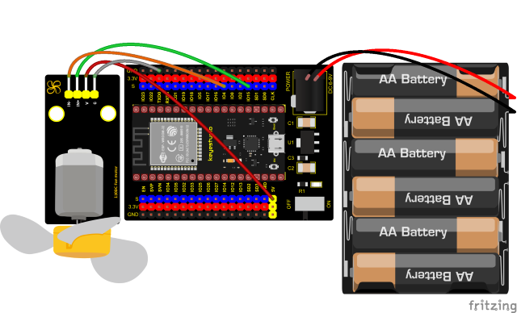

**Test Code ：**


```c
//*************************************************************************************
/*
 * Filename    : 130DC Fan motor
 * Description : Motor positive and negative rotation
 * Auther      : http://www.Keyestudio.com
*/
//Define two pins interfaces of the motor, respectively 15 and 4
int INA = 15; //INA corresponds to IN+
int INB = 4;  //INB corresponds to IN-
void setup() {
  //Set the motor pins as output
  pinMode(INA, OUTPUT);
  pinMode(INB, OUTPUT);
}

void loop() {
  //Turn counterclockwise
  digitalWrite(INA, HIGH);
  digitalWrite(INB, LOW);
  delay(2000);
  //stop
  digitalWrite(INA, LOW);
  digitalWrite(INB, LOW);
  delay(1000);
  //clockwise rotation
  digitalWrite(INA, LOW);
  digitalWrite(INB, HIGH);
  delay(2000);
  //stop
  digitalWrite(INA, LOW);
  digitalWrite(INB, LOW);
  delay(1000);
}
//*************************************************************************************
```


**Code Explanation**

Set pins to 14 and 15, when the pin 14 outputs high levels and the pin 15 outputs low levels, the motor will rotate counterclockwise; when both pins are set to low, the motor stops rotating.

**Test Result**

Wire up, upload test code, power up and turn the DIP switch to ON on the ESP32 board. The fan will rotate counterclockwise for 2 seconds, stop for 1 second; and rotate clockwise for 2 seconds and stop for 1 second; cycle alternately.

### Project 19: Potentiometer


**Overview**

The following we will introduce is the Keyestudio rotary potentiometer which is an analog sensor.

The digital IO ports can read the voltage value between 0 and 3.3V and the module only outputs high levels. However, the analog sensor can read the voltage value through 16 ADC analog ports on the ESP32 board. In the experiment, we will display the test results on the Shell.

It uses a 10K adjustable resistor. We can change the resistance by rotating the potentiometer. The signal S can detect the voltage
changes(0-3.3V) which are analog quantity.

**ADC:** The more bits an ADC has, the denser the partitioning of the simulation, the higher the accuracy of the final conversion.


The conversion formula is as follows:

**DAC：**The higher the precision of DAC, the higher the precision of the output voltage value.  

The conversion formula is as follows:  

**ADC on ESP32：**

The ESP32 has 16 pins that can be used to measure analog signals.  GPIO pin serial numbers and analog pin definitions are shown below:  

<table class="colwidths-auto docutils align-default">
<tbody>
<tr class="odd">
<td>ADC number in ESP32</td>
<td>ESP32 GPIO number</td>
</tr>
<tr class="even">
<td>ADC0</td>
<td>GPIO 36</td>
</tr>
<tr class="odd">
<td>ADC3</td>
<td>GPIO 39</td>
</tr>
<tr class="even">
<td>ADC4</td>
<td>GPIO 32</td>
</tr>
<tr class="odd">
<td>ADC5</td>
<td>GPIO33</td>
</tr>
<tr class="even">
<td>ADC6</td>
<td>GPIO34</td>
</tr>
<tr class="odd">
<td>ADC7</td>
<td>GPIO 35</td>
</tr>
<tr class="even">
<td>ADC10</td>
<td>GPIO 4</td>
</tr>
<tr class="odd">
<td>ADC11</td>
<td>GPIO0</td>
</tr>
<tr class="even">
<td>ADC12</td>
<td>GPIO2</td>
</tr>
<tr class="odd">
<td>ADC13</td>
<td>GPIO15</td>
</tr>
<tr class="even">
<td>ADC14</td>
<td>GPIO13</td>
</tr>
<tr class="odd">
<td>ADC15</td>
<td>GPIO12</td>
</tr>
<tr class="even">
<td>ADC16</td>
<td>GPIO14</td>
</tr>
<tr class="odd">
<td>ADC17</td>
<td>GPIO27</td>
</tr>
<tr class="even">
<td>ADC18</td>
<td>GPIO25</td>
</tr>
<tr class="odd">
<td>ADC19</td>
<td>GPIO26</td>
</tr>
</tbody>
</table>

**DAC on ESP32：**

The ESP32 has two 8-bit digital-to-analog converters connected to GPIO25 and GPIO26 pins, which are immutable, as shown below :

<table class="colwidths-auto docutils align-default">
<tbody>
<tr class="odd">
<td>Simulate pin number</td>
<td>GPIO number</td>
</tr>
<tr class="even">
<td>DAC1</td>
<td>GPIO25</td>
</tr>
<tr class="odd">
<td>DAC2</td>
<td>GPIO26</td>
</tr>
</tbody>
</table>


**Wiring Diagram：**


**Test Code ：**


```c
//**********************************************************************************
/*  
 * Filename    : Rotary_potentiometer
 * Description : Read the basic usage of ADC，DAC and Voltage
 * Auther      : http//www.Keyestudio.com
*/
#define PIN_ANALOG_IN  34  //the pin of the Potentiometer

void setup() {
  Serial.begin(9600);
}

//In loop()，the analogRead() function is used to obtain the ADC value, and then the map() function is used to convert the value into an 8-bit precision DAC value. The input and output voltage are calculated according to the previous formula, and the information is finally printed out.
void loop() {
  int adcVal = analogRead(PIN_ANALOG_IN);
  int dacVal = map(adcVal, 0, 4095, 0, 255);
  double voltage = adcVal / 4095.0 * 3.3;
  Serial.printf("ADC Val: %d, \t DAC Val: %d, \t Voltage: %.2fV\n", adcVal, dacVal, voltage);
  delay(200);
}
//**********************************************************************************
```

**Code Explanation**

1\. analogVal means analog value. The rotary potentiometer outputs analog values(0\~4095), therefore, we set pins to analog ports. For example, we connect to GPIO34.

2\. analogRead(pin): read the value of the specified analog pin. The ESP32 contains a multi-channel, 12-bit converter. This means that it will map the input voltage between 0 and the working voltage (5V or 3.3V) to an integer value between 0 and 4095. For example, this will produce a resolution among readings: 3.3V/4096 stands for 0.0008V per unit.

3\. The map() function converts this 12-bit DAC value to an 8-bit DAC value.  

4\. Pin: the name of analog input pin.

5\. The serial monitor displays the values of adcVal, dacVal, voltage, the baud rate must be set before display (we default to 9600,which can be changed).  

**Test Result**

Wire up, compile and upload the code to the ESP32. After uploading successfully，we will use a USB cable to power on, open the serial monitor and set the baud rate to 9600. We need to press the reset button on the ESP32, then the serial monitor will display the potentiometer's ADC value, DAC value and voltage value. Rotate the potentiometer handle, the analog values will change.

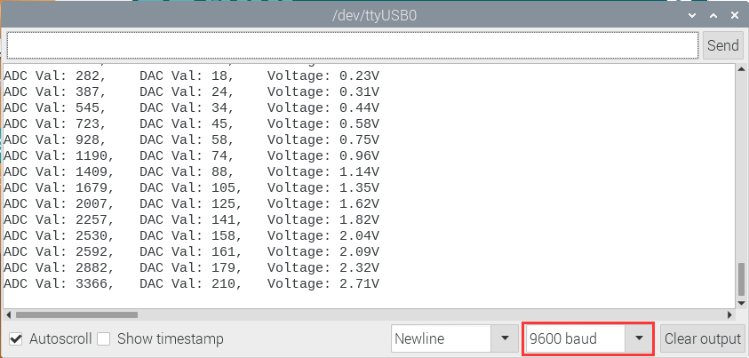

### Project 20: Steam Sensor


**Description**

This is a DIY electronic building block water drop sensor. It is an analog (digital) input module, also called rain, rain sensor. It can be used to monitor various weather conditions, detect whether it is raining and the amount of rain, convert it into digital signal (DO) and analog signal (AO) output, and is widely used in Arduino robot kits, raindrops, rain sensors, and can be used for various It can monitor various weather conditions, and convert it into digital signal and AO output, and can also be used for automobile automatic wiper system, intelligent lighting system and intelligent sunroof system.

In the experiment, we input the sensor signal terminal (S terminal) to the analog port of the ESP32 development board, sense the change of the analog value, and display the corresponding analog value on the shell.

**Working Principle**

Its principle is to detect the amount of water through the exposed printed parallel lines on the circuit board. The more water there is, the more wires will be connected, and the conductive contact area increases. The voltage output by pin 2 will gradually increase. The larger the analog value detected by the signal terminal S is.

It can also detect steam in the air. Two position holes are used to install on the other devices.


**Wiring Diagram：**


**Test Code ：**


```c
//**********************************************************************************
/*  
 * Filename    : Steam sensor
 * Description : Read the basic usage of ADC，DAC and Voltage
 * Auther      : http//www.Keyestudio.com
*/
#define PIN_ANALOG_IN  34  //the pin of the Steam sensor

void setup() {
  Serial.begin(9600);
}

//In loop()，the analogRead() function is used to obtain the ADC value, and then the map() function is used to convert the value into an 8-bit precision DAC value. The input and output voltage are calculated according to the previous formula, and the information is finally printed out.
void loop() {
  int adcVal = analogRead(PIN_ANALOG_IN);
  int dacVal = map(adcVal, 0, 4095, 0, 255);
  double voltage = adcVal / 4095.0 * 3.3;
  Serial.printf("ADC Val: %d, \t DAC Val: %d, \t Voltage: %.2fV\n", adcVal, dacVal, voltage);
  delay(200);
}
//**********************************************************************************
```


**Test Result**

Wire up, compile and upload the code to the ESP32. After uploading successfully，power on, open the serial monitor and set the baud rate to 9600. We need to press the reset button on the ESP32, then the serial monitor will display ADC value, DAC value and voltage value. When a few drops of water are placed in the sensing area, the values will change. The more water volume, the greater the output voltage value , ADC value and the DAC value .


### Project 21: Sound Sensor


**Overview**

In this kit, there is a Keyestudio DIY electronic block and a sound sensor. In the experiment, we test the analog value corresponding to the sound level in the current environment with it. The louder the sound, the larger the ADC, DAC and the voltage value, and the “shell”window will display the test results.

**Working Principle**

It uses a high-sensitive microphone component and an LM386 chip. We build the circuit with the LM386 chip and amplify the sound through the high-sensitive microphone. In addition, we can adjust the sound volume by the potentiometer. Rotate it clockwise, the sound will get louder.


**Wiring Diagram：**


**Test Code ：**


```c
//**********************************************************************************
/*  
 * Filename    : MicroPhone
 * Description : Read the basic usage of ADC，DAC and Voltage
 * Auther      : http//www.Keyestudio.com
*/
#define PIN_ANALOG_IN  34  //the pin of the Sound Sensor

void setup() {
  Serial.begin(9600);
}

//In loop()，the analogRead() function is used to obtain the ADC value, and then the map() function is used to convert the value into an 8-bit precision DAC value. The input and output voltage are calculated according to the previous formula, and the information is finally printed out.
void loop() {
  int adcVal = analogRead(PIN_ANALOG_IN);
  int dacVal = map(adcVal, 0, 4095, 0, 255);
  double voltage = adcVal / 4095.0 * 3.3;
  Serial.printf("ADC Val: %d, \t DAC Val: %d, \t Voltage: %.2fV\n", adcVal, dacVal, voltage);
  delay(200);
}
//**********************************************************************************
```


**Test Result**

Wire up, compile and upload the code to the ESP32. After uploading successfully, we will use a USB cable to power on, open the serial monitor and set the baud rate to 9600. We need to press the reset button on the ESP32, then the serial monitor will display the sound sensor’s ADC value, DAC value and voltage value. Rotate clockwise the potentiometer and speak at the MIC. Then you can see the analog value get larger, as shown below:

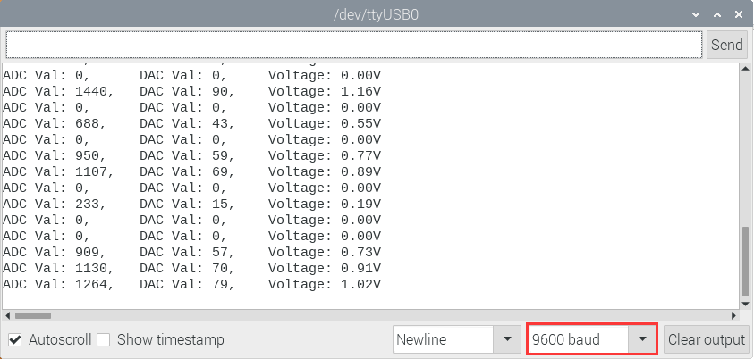

### Project 22: Photoresistor


**Description**

In this kit, there is a photoresistor which consists of photosensitive resistance elements. Its resistance changes with the light intensity. Also, it converts the resistance change into a voltage change through the characteristic of the photosensitive resistive element. When wiring it up, we interface its signal terminal (S terminal) with the analog port of ESP32 , so as to sense the change of the analog value, and display the corresponding analog value in the shell.

**Working Principle**

If there is no light, the resistance is 0.2MΩ and the detected voltage at the terminal 2 is close to 0. When the light intensity increases, the resistance of photoresistor and detected voltage will diminish.


**Wiring Diagram：**


**Test Code ：**


```c
//**********************************************************************************
/*  
 * Filename    : Photoresistance
 * Description : Read the basic usage of ADC，DAC and Voltage
 * Auther      : http//www.Keyestudio.com
*/
#define PIN_ANALOG_IN  34  //the pin of the Photoresistance

void setup() {
  Serial.begin(9600);
}

//In loop()，the analogRead() function is used to obtain the ADC value, and then the map() function is used to convert the value into an 8-bit precision DAC value. The input and output voltage are calculated according to the previous formula, and the information is finally printed out.
void loop() {
  int adcVal = analogRead(PIN_ANALOG_IN);
  int dacVal = map(adcVal, 0, 4095, 0, 255);
  double voltage = adcVal / 4095.0 * 3.3;
  Serial.printf("ADC Val: %d, \t DAC Val: %d, \t Voltage: %.2fV\n", adcVal, dacVal, voltage);
  delay(200);
}
//**********************************************************************************
```


**Test Result**

Connect the wires according to the experimental wiring diagram, compile and upload the code to the ESP32. After uploading successfully，we will use a USB cable to power on, open the serial monitor and set the baud rate to 9600. We need to press the reset button on the ESP32, then the serial monitor will display the photoresistor’s ADC value, DAC value and voltage value. When the light intensity gets stronger, the analog values will get larger, as shown below:


### Project 23: NTC-MF52AT Thermistor


**Overview**

In the experiment, there is a NTC-MF52AT analog thermistor. We connect its signal terminal to the analog port of the ESP32 mainboard and read the corresponding ADC value, voltage value and thermistor value.

We can use analog values to calculate the temperature of the current environment through specific formulas. Since the temperature calculation formula is more complicated, we only read the corresponding analog value.

**Working Principle**


NTC-MF52AT thermistor elements. The NTC-MF52AT thermistor element can sense the changes of the surrounding environment temperature. Resistance changes with the temperature, causing the voltage of the signal terminal S to change.

This sensor uses the characteristics of NTC-MF52AT thermistor element to convert resistance changes into voltage changes.

**Wiring Diagram：**


**Test Code ：**


```c
//**********************************************************************************
/*  
 * Filename    : Temperature sensor
 * Description : Making a thermometer by thermistor.
 * Auther      : http//www.Keyestudio.com
*/
#define PIN_ANALOG_IN   34
void setup() {
  Serial.begin(9600);
}

void loop() {
  int adcValue = analogRead(PIN_ANALOG_IN);                       //read ADC pin
  double voltage = (float)adcValue / 4095.0 * 3.3;                // calculate voltage
  double Rt = 10 * voltage / (3.3 - voltage);                     //calculate resistance value of thermistor
  double tempK = 1 / (1 / (273.15 + 25) + log(Rt / 4.7) / 3950.0); //calculate temperature (Kelvin)
  double tempC = tempK - 273.15;                                  //calculate temperature (Celsius)
  Serial.printf("ADC value : %d,\tVoltage : %.2fV, \tTemperature : %.2fC\n", adcValue, voltage, tempC);
  delay(1000);
}
//**********************************************************************************
```

**Test Result**

Connect the wires according to the experimental wiring diagram, compile and upload the code to the ESP32. After uploading successfully，we will use a USB cable to power on, open the serial monitor and set the baud rate to 9600. We need to press the reset button on the ESP32, then the serial monitor will display the thermistor’s ADC value, voltage value and temperature value, as shown below:

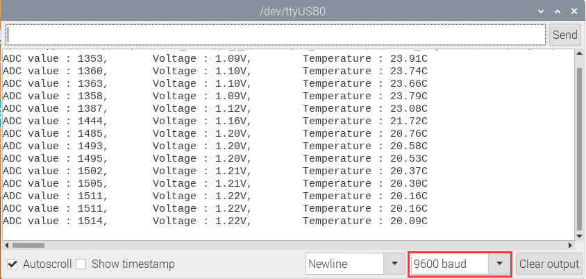

### Project 24: Thin-film Pressure Sensor


**Overview**

In this kit, there is a Keyestudio thin-film pressure sensor. The thin-film pressure sensor composed of a new type of nano pressure-sensitive material and a comfortable ultra-thin film substrate, has waterproof and pressure-sensitive functions.

In the experiment, we determine the pressure by collecting the analog signal on the S end of the module. The smaller the ADC value, DAC value and voltage value, the greater the pressure; and the displayed results will shown on the Shell.


**Working Principle**

When the sensor is pressed by external forces, the resistance value of sensor will vary. We convert the pressure signals detected by the sensor into the electric signals through a circuit. Then we can obtain the pressure changes by detecting voltage signal changes.


**Wiring Diagram：**


**Test Code ：**

```c
//**********************************************************************************
/*  
 * Filename    : Film pressure sensor
 * Description : Read the basic usage of ADC，DAC and Voltage
 * Auther      : http//www.Keyestudio.com
*/
#define PIN_ANALOG_IN  34  //the pin of the Film pressure sensor
void setup() {
  Serial.begin(9600);
}

//In loop()，the analogRead() function is used to obtain the ADC value, and then the map() function is used to convert the value into an 8-bit precision DAC value. The input and output voltage are calculated according to the previous formula, and the information is finally printed out.
void loop() {
  int adcVal = analogRead(PIN_ANALOG_IN);
  int dacVal = map(adcVal, 0, 4095, 0, 255);
  double voltage = adcVal / 4095.0 * 3.3;
  Serial.printf("ADC Val: %d, \t DAC Val: %d, \t Voltage: %.2fV\n", adcVal, dacVal, voltage);
  delay(200);
}
//**********************************************************************************
```

**Test Result**

Connect the wires according to the experimental wiring diagram, compile and upload the code to the ESP32. After uploading successfully，we will use a USB cable to power on, open the serial monitor and set baud rate to 9600. We need to press the reset button on the ESP32 board, then the serial monitor will display the thin-film’s ADC value, DAC value and voltage value, when the thin-film is pressed by fingers, the analog value will decrease, as shown below:


### Project 25: Flame Sensor


**Description**

In daily life, it is often seen that a fire broke out without any precaution. It will cause great economic and human loss. So how can we avoid this situation? Right, install a flame sensor and a speaker in those places that easily break out a fire. When the flame sensor detects a fire, the speaker will alarm people quickly to put out the fire.

So in this project, you will learn how to use a flame sensor and an active buzzer module to simulate the fire alarm system.

**Working Principle**

This flame sensor can be used to detect fire or other light sources with wavelength stands at 700nm \~ 1000nm. Its detection angle is about 60°. You can rotate the potentiometer on the sensor to control its sensitivity. Adjust the potentiometer to make the LED at the critical point between on and off state. The sensitivity is the best.

From the below figure, power up. When detecting fire, the digital pin outputs low levels, the red LED2 will light up first, the digital signal terminal D0 outputs a low level, and the red LED1 will light up. The stronger the external infrared light, the smaller the value; the weaker the infrared light, the larger the value.

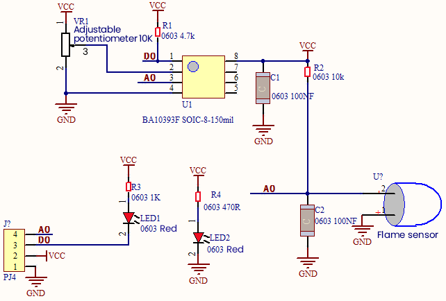


**Wiring Diagram：**


**Test Code ：**


```c
//**********************************************************************************
/*  
 * Filename    : Flame sensor
 * Description : Read the basic usage of Digital，ADC，DAC and Voltage
 * Auther      : http//www.Keyestudio.com
*/
//Flame sensor two pins 13, 34, respectively
#define PIN_ANALOG_IN  34 
int digitalPin = 13;

//The following two variables hold the digital signal and adc values respectively
int analogVal = 0;
int adcVal = 0;

void setup() {
  Serial.begin(9600);
  pinMode(digitalPin, INPUT); //Digital pin 13 is set to input mode
}

//In loop()，the digitalRead()function is used to obtain the digital value, the analogRead() function is used to obtain the ADC value. and then the map() function is used to convert the value into an 8-bit precision DAC value. 
//The input and output voltage are calculated according to the previous formula, and the information is finally printed out.
void loop() {
  int digitalVal = digitalRead(digitalPin);  //Read digital signal;
  int adcVal = analogRead(PIN_ANALOG_IN);
  int dacVal = map(adcVal, 0, 4095, 0, 255);
  double voltage = adcVal / 4095.0 * 3.3;
  Serial.printf("digitalVal: %d, \t ADC Val: %d, \t DAC Val: %d, \t Voltage: %.2fV\n",digitalVal, adcVal, dacVal, voltage);
  delay(200);
}
//**********************************************************************************
```


**Test Result**

Connect the wires according to the experimental wiring diagram, compile and upload the code to the ESP32. After uploading successfully，we will use a USB cable to power on. Rotating the potentiometer on the sensor, we can adjust the red LED bright and not bright critical point. The red LED2 on the sensor module is lit, while the red LED1 is not. Open the monitor and set baud rate to 9600.

We need to press the reset button on the ESP32, then the monitor will display the digital value, ADC value, DAC value and voltage value of the flame sensor. When fire is detected, the LED1 will be on and the digital value will change from 1 to 0, and the analog value will become smaller, as shown below.

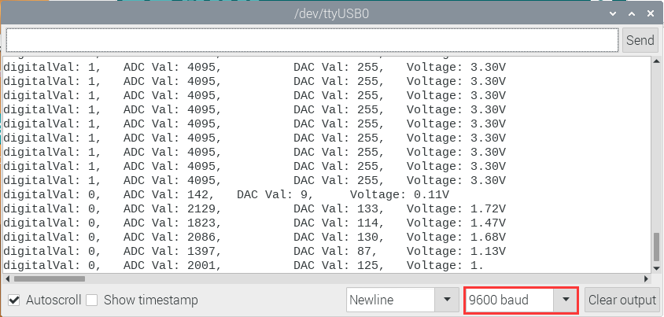

### Project 26: MQ-2 Gas Sensor


**Description**

This analog gas sensor - MQ2 is used in gas leakage detecting equipment in consumer electronics and industrial markets.

This sensor is suitable for detecting LPG, I-butane, propane, methane, alcohol, Hydrogen and smoke. It has high sensitivity and quick response.

In addition, the sensitivity can be adjusted by rotating the potentiometer.

In the experiment, we read the analog value at the A0 port and the D0 port to determine the content of gas.

**Working Principle**

The greater the concentration of smoke, the greater the conductivity, the lower the output resistance, the greater the output analog signal.

When in use, the A0 terminal reads the analog value of the corresponding gas; the D0 terminal is connected to an LM393 chip (voltage comparator), we can adjust the alarm threshold of the measured gas through the potentiometer, and output the digital value at D0. When the measured gas content exceeds the critical point, the D0 terminal outputs a low level; when the measured gas content does not exceed the critical point, the D0 terminal outputs a high level.


**Wiring Diagram：**


**Test Code ：**


```c
//**********************************************************************************
/*  
 * Filename    : MQ2
 * Description : Read the basic usage of Digital, ADC，DAC and Voltage
 * Auther      : http//www.Keyestudio.com
*/
//MQ_2 two pins 13, 34, respectively 
#define PIN_ANALOG_IN  34 
int digitalPin =  13;

//The following two variables hold the digital signal and adc values respectively
int analogVal = 0;
int adcVal = 0;

void setup() {
  Serial.begin(9600);
  pinMode(digitalPin, INPUT); //Digital pin 13 is set to input mode
}

//In loop()，the digitalRead()function is used to obtain the digital value, the analogRead() function is used to obtain the ADC value. and then the map() function is used to convert the value into an 8-bit precision DAC value. The input and output voltage are calculated according to the previous formula, and the information is finally printed out.
void loop() {
  int digitalVal = digitalRead(digitalPin);  //Read digital signal;
  int adcVal = analogRead(PIN_ANALOG_IN);
  int dacVal = map(adcVal, 0, 4095, 0, 255);
  double voltage = adcVal / 4095.0 * 3.3;
  Serial.printf("digitalVal: %d, \t ADC Val: %d, \t DAC Val: %d, \t Voltage: %.2fV\n",digitalVal, adcVal, dacVal, voltage);
  if (digitalVal == 1) {
    Serial.println(" Normal");
  }
  else {
    Serial.println(" Exceeding");
  }
  delay(100); //Delay time 100 ms
}
//**********************************************************************************
```

**Test Result**

Connect the wires according to the experimental wiring diagram, compile and upload the code to the ESP32. After uploading successfully，we will use a USB cable to power on. Rotating the potentiometer on the sensor, we can adjust the red LED bright and not bright critical point. Open the monitor , set baud rate to 9600.

We need to press the reset button on the ESP32, then the monitor displays the corresponding data and characters. When the sensor detects the smoke or combustible gas, the red LED lights up and the digital value changes from 1 to 0, the ADC value, DAC value and voltage value increase, as shown below.

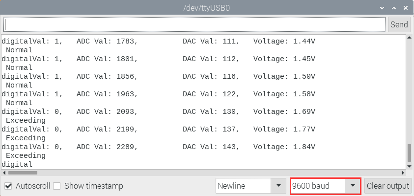

### Project 27: Joystick Module


**Overview**

Game handle controllers are ubiquitous.

It mainly uses PS2 joysticks. When controlling it, we need to connect the X and Y ports of the module to the analog port of the single-chip microcomputer, port B to the digital port of the single-chip microcomputer, VCC to the power output port(3.3-5V), and GND to the GND of the MCU. We can read the high and low levels of two analog values and one digital port) to determine the working status of the joystick on the module.

In the experiment, two analog values(x axis and y axis) will be shown on Shell.

**Working Principle**

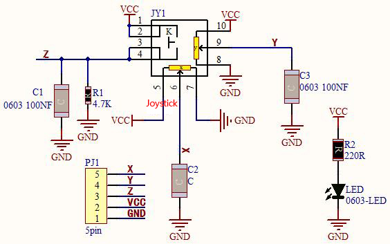

In fact, its working principle is very simple. Its inside structure is equivalent to two adjustable potentiometers and a button. When this button is not pressed and the module is pulled down by R1, low levels will be output ; on the contrary, when the button is pressed, VCC will be connected (high levels), When we move the joystick, the internal potentiometer will adjust to output different voltages, and we can read the analog value.


**Wiring Diagram：**


**Test Code ：**


```c
//**********************************************************************************
/*  
 * Filename    : Joystick
 * Description : Read data from Rocker.
 * Auther      : http//www.Keyestudio.com
*/
int xyzPins[] = {34, 35, 13};   //x,y,z pins
void setup() {
  Serial.begin(9600);
  pinMode(xyzPins[0], INPUT); //x axis. 
  pinMode(xyzPins[1], INPUT); //y axis. 
  pinMode(xyzPins[2], INPUT_PULLUP);   //z axis is a button.
}

// In loop(), use analogRead () to read the value of axes X and Y and use digitalRead () to read the value of axis Z, then display them.
void loop() {
  int xVal = analogRead(xyzPins[0]);
  int yVal = analogRead(xyzPins[1]);
  int zVal = digitalRead(xyzPins[2]);
  Serial.println("X,Y,Z: " + String(xVal) + ", " +  String(yVal) + ", " + String(zVal));
  delay(500);
}
//**********************************************************************************
```


**Code Explanation**

In the experiment, according to the wiring diagram, the x pin is set to GPIO34, the y pin is set to GPIO35 and the pin of the joystick is set to GPIO13.

**Test Result**

Connect the wires according to the experimental wiring diagram, compile and upload the code to the ESP32. After uploading successfully，we will use a USB cable to power on. Open the serial monitor and set baud rate to 9600.

We need to press the reset button on the ESP32, then the serial monitor will show the corresponding value. Moving the joystick or pressing it will change the analog and digital values in the serial monitor .


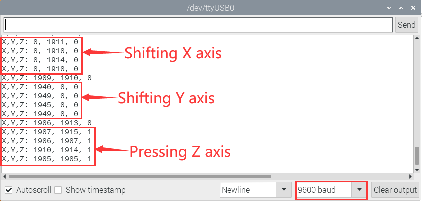

### Project 28: Relay Module

**Overview**

In our daily life, we usually use communication to drive electrical equipment, and sometimes we use switches to control electrical equipment. If the switch is connected directly to the ac circuit, leakage occurs and people are in danger. Therefore, from the perspective of safety, we specially designed this relay module with NO(normally open) end and NC(normally closed) end.  

**Working Principle**

Relay is compatible with a variety of microcontroller control board, such as Arduino series microcontroller, which is a small current to control the operation of large current "automatic switch".  

Input Voltage：3.3V-5V

It can let the MCU control board drive 3A load, such as an LED lamp belt, a DC motor, a micro water pump and a solenoid valve pluggable interface design, which is easy to use.  

**Wiring Diagram：**


**Test Code ：**

```c
//**********************************************************************************
/*
 * Filename    : Relay
 * Description : Relay turn on and off.
 * Auther      : http//www.Keyestudio.com
*/
#define  Relay  15 // defines digital 15
void setup()
{
pinMode(Relay, OUTPUT); // sets "Relay" to "output"
}
void loop()
{
digitalWrite(Relay, HIGH); // turns on the relay
delay(1000); //delays 1 seconds
digitalWrite(Relay, LOW); // turns off the relay
delay(1000); // delays 1 seconds
}
//**********************************************************************************
```

**Test Result**

Connect the wires according to the experimental wiring diagram, compile and upload the code to the ESP32. After uploading successfully，we will use a USB cable to power on. The relay will turn on 1 second, off for 1 second. At the same time, you can hear the sound of the relay on and off as well as see the change of the indicator light on the relay.

### Project 29: SK6812 RGB Module


**Overview**

In previous lessons, we learned about the plug-in RGB module and used PWM signals to color the three pins of the module.

There is a Keyestudio 6812 RGB module whose the driving principle is different from the plug-in RGB module. It can only control with one pin. This is a set. It is an intelligent externally controlled LED light source with the control circuit and the light-emitting circuit. Each LED element is the same as a 5050 LED lamp bead, and each component is a pixel. There are four lamp beads on the module, which indicates four pixels.

In the experiment, we make different lights show different colors.

**Working Principle**

From the schematic diagram, we can see that these four pixel lighting beads are all connected in series. In fact, no matter how many they are, we can use a pin to control a light and let it display any color. The pixel point contains a data latch signal shaping amplifier drive circuit, a high-precision internal oscillator and a 12V high-voltage programmable constant current control part, which effectively ensures the color of the pixel point light is highly consistent.

The data protocol adopts a single-wire zero-code communication method. After the pixel is powered up and reset, the S terminal receives the data transmitted from the controller. The first 24bit data sent is extracted by the first pixel and sent to the data latch of the pixel.


**Wiring Diagram：**


**Test Code ：**


```c
//**********************************************************************************
/*  
 * Filename    : sk6812 RGB LED
 * Description : turn on sk6812 RGB LED
 * Auther      : http//www.Keyestudio.com
*/
#include <Adafruit_NeoPixel.h>

#define PIN 15

// Parameter 1 = number of pixels in strip
// Parameter 2 = Arduino pin number (most are valid)
// Parameter 3 = pixel type flags, add together as needed:
//   NEO_KHZ800  800 KHz bitstream (most NeoPixel products w/WS2812 LEDs)
//   NEO_KHZ400  400 KHz (classic 'v1' (not v2) FLORA pixels, WS2811 drivers)
//   NEO_GRB     Pixels are wired for GRB bitstream (most NeoPixel products)
//   NEO_RGB     Pixels are wired for RGB bitstream (v1 FLORA pixels, not v2)
Adafruit_NeoPixel strip = Adafruit_NeoPixel(60, PIN, NEO_GRB + NEO_KHZ800);

// IMPORTANT: To reduce NeoPixel burnout risk, add 1000 uF capacitor across pixel power leads, add 300 - 500 Ohm resistor on first pixel's data input and minimize distance between Arduino and first pixel. Avoid connecting on a live circuit...if you must, connect GND first.

void setup() {
  strip.begin();
  strip.show(); // Initialize all pixels to 'off'
}

void loop() {
  // Some example procedures showing how to display to the pixels:
  colorWipe(strip.Color(255, 0, 0), 50); // Red
  colorWipe(strip.Color(0, 255, 0), 50); // Green
  colorWipe(strip.Color(0, 0, 255), 50); // Blue
  // Send a theater pixel chase in...
  theaterChase(strip.Color(127, 127, 127), 50); // White
  theaterChase(strip.Color(127,   0,   0), 50); // Red
  theaterChase(strip.Color(  0,   0, 127), 50); // Blue

  rainbow(20);
  rainbowCycle(20);
  theaterChaseRainbow(50);
}

// Fill the dots one after the other with a color
void colorWipe(uint32_t c, uint8_t wait) {
  for(uint16_t i=0; i<strip.numPixels(); i++) {
      strip.setPixelColor(i, c);
      strip.show();
      delay(wait);
  }
}

void rainbow(uint8_t wait) {
  uint16_t i, j;

  for(j=0; j<256; j++) {
    for(i=0; i<strip.numPixels(); i++) {
      strip.setPixelColor(i, Wheel((i+j) & 255));
    }
    strip.show();
    delay(wait);
  }
}

// Slightly different, this makes the rainbow equally distributed throughout
void rainbowCycle(uint8_t wait) {
  uint16_t i, j;

  for(j=0; j<256*5; j++) { // 5 cycles of all colors on wheel
    for(i=0; i< strip.numPixels(); i++) {
      strip.setPixelColor(i, Wheel(((i * 256 / strip.numPixels()) + j) & 255));
    }
    strip.show();
    delay(wait);
  }
}

//Theatre-style crawling lights.
void theaterChase(uint32_t c, uint8_t wait) {
  for (int j=0; j<10; j++) {  //do 10 cycles of chasing
    for (int q=0; q < 3; q++) {
      for (int i=0; i < strip.numPixels(); i=i+3) {
        strip.setPixelColor(i+q, c);    //turn every third pixel on
      }
      strip.show();
     
      delay(wait);
     
      for (int i=0; i < strip.numPixels(); i=i+3) {
        strip.setPixelColor(i+q, 0);        //turn every third pixel off
      }
    }
  }
}

//Theatre-style crawling lights with rainbow effect
void theaterChaseRainbow(uint8_t wait) {
  for (int j=0; j < 256; j++) {     // cycle all 256 colors in the wheel
    for (int q=0; q < 3; q++) {
        for (int i=0; i < strip.numPixels(); i=i+3) {
          strip.setPixelColor(i+q, Wheel( (i+j) % 255));    //turn every third pixel on
        }
        strip.show();
       
        delay(wait);
       
        for (int i=0; i < strip.numPixels(); i=i+3) {
          strip.setPixelColor(i+q, 0);        //turn every third pixel off
        }
    }
  }
}

// Input a value 0 to 255 to get a color value.
// The colours are a transition r - g - b - back to r.
uint32_t Wheel(byte WheelPos) {
  if(WheelPos < 85) {
   return strip.Color(WheelPos * 3, 255 - WheelPos * 3, 0);
  } else if(WheelPos < 170) {
   WheelPos -= 85;
   return strip.Color(255 - WheelPos * 3, 0, WheelPos * 3);
  } else {
   WheelPos -= 170;
   return strip.Color(0, WheelPos * 3, 255 - WheelPos * 3);
  }
}
//*************************************************************************************
```


**Test Code**

Connect the wires according to the experimental wiring diagram, compile and upload the code to the ESP32. After uploading successfully, we will use a USB cable to power on. Then we can see the four RGB LEDs show red, green, blue and white color ; as shown below;

### Project 30: Rotary Encoder


**Overview**

In this kit, there is a Keyestudio rotary encoder, dubbed as switch encoder. It is applied to automotive electronics, multimedia audio, instrumentation, household appliances, smart home, medical equipment and so on.

In the experiment, it it used for counting. When we rotate the rotary encoder clockwise, the set data falls by 1; if you rotate it anticlockwise, the set data is up 1; and when the middle button is pressed, the value will be show in the serial monitor.

**Working Principle**

  

The incremental encoder converts the displacement into a periodic electric signal, and then converts this signal into a counting pulse, and the number of pulses indicates the size of the displacement. 

This module mainly uses 20pulse rotary encoder components. It can calculate the number of pulses output during clockwise and reverse rotation. There is no limit to count rotation. It resets to the initial state, that is, starts counting from 0.


**Wiring Diagram：**


**Test Code ：**


```c
//**********************************************************************************
/*  
 * Filename    : Encoder
 * Description : Rotary encoder module counting.
 * Auther      : http//www.Keyestudio.com
*/
//Interfacing Rotary Encoder with Arduino
//Encoder Switch -> pin 27
//Encoder DT -> pin 14
//Encoder CLK -> pin 12

int Encoder_DT  = 14;
int Encoder_CLK  = 12;
int Encoder_Switch = 27;

int Previous_Output;
int Encoder_Count;

void setup() {
  Serial.begin(9600);

  //pin Mode declaration
  pinMode (Encoder_DT, INPUT);
  pinMode (Encoder_CLK, INPUT);
  pinMode (Encoder_Switch, INPUT);

  Previous_Output = digitalRead(Encoder_DT); //Read the inital value of Output A
}

void loop() {
  //aVal = digitalRead(pinA);

  if (digitalRead(Encoder_DT) != Previous_Output)
  {
    if (digitalRead(Encoder_CLK) != Previous_Output)
    {
      Encoder_Count ++;
      Serial.println(Encoder_Count);
    }
    else
    {
      Encoder_Count--;
      Serial.println(Encoder_Count);
    }
  }

  Previous_Output = digitalRead(Encoder_DT);

  if (digitalRead(Encoder_Switch) == 0)
  {
    delay(5);
    if (digitalRead(Encoder_Switch) == 0) {
      Serial.println("Switch pressed");
      while (digitalRead(Encoder_Switch) == 0);
    }
  }
}
//**********************************************************************************
```


**Code Explanation**

Set CLK to GPIO12 and DAT to GPIO14.

This code is set well in the library file. When CLK descends, read the voltage of DAT, when DAT is a HIGH level, the value of the rotary encoder is added by 1; when DAT is a LOW level, the value of the rotary encoder is cut down 1.

Set the pin of the button(GPIO27) to LOW ans print.

**Test Result**

Upload the code power up by a USB cable, open the serial monitor and set baud rate to 9600. Rotate the knob on the rotary encoder clockwise, the displayed data will decrease; on the contrary, in anticlockwise way, the data will rise. Equally, press the button on the rotary encoder,“Switch pressed”will be shown.


### Project 31: Servo Control


**Overview**

Servo motor is a position control rotary actuator. It mainly consists of a housing, a circuit board, a core-less motor, a gear and a position sensor. Its working principle is that the servo receives the signal sent by MCU or receiver and produces a reference signal with a period of 20ms and width of 1.5ms, then compares the acquired DC bias voltage to the voltage of the potentiometer and obtain the voltage difference output.

In general, servo has three lines in brown, red and orange. The brown wire is grounded, the red one is a positive pole line and the orange one is a signal line.

**Working Principle**

When the motor speed is constant, the potentiometer is driven to rotate through the cascade reduction gear, which leads that the voltage difference is 0, and the motor stops rotating. Generally, the angle range of servo rotation is 0° --180 °

The rotation angle of servo motor is controlled by regulating the duty cycle of PWM (Pulse-Width Modulation) signal. The standard cycle of PWM signal is 20ms (50Hz). Theoretically, the width is distributed between 1ms-2ms, but in fact, it's between 0.5ms-2.5ms. The width corresponds the rotation angle from 0° to 180°. But note that for different brand motors, the same signal may have different rotation angles. 


**Wiring Diagram：**


**Test Code 1：**

```c
//**********************************************************************
/*
 * Filename    : Servo_1
 * Description : Steering gear rotation Angle 0-90-180, repeatly
 * Auther      : http//www.Keyestudio.com
*/
int servoPin = 4;//steering gear PIN

void setup() {
  pinMode(servoPin, OUTPUT);//steering pin is set to output
}
void loop() {
  servopulse(servoPin, 0);//Rotate it to zero degrees
  delay(1000);//delay 1S
  servopulse(servoPin, 90);//Rotate it to 90 degrees
  delay(1000);
  servopulse(servoPin, 180);//Rotate it to 180 degrees
  delay(1000);
}

void servopulse(int pin, int myangle) { //Impulse function
  int pulsewidth = map(myangle, 0, 180, 500, 2500); //Map Angle to pulse width
  for (int i = 0; i < 10; i++) { //Output a few more pulses
    digitalWrite(pin, HIGH);//Set the steering gear interface level to high
    delayMicroseconds(pulsewidth);//The number of microseconds of delayed pulse width value
    digitalWrite(pin, LOW);//Lower the level of steering gear interface
    delay(20 - pulsewidth / 1000);
  }
}
//**********************************************************************
```

**Code Explanation 1**

**1.** map(value, fromLow, fromHigh, toLow, toHigh)；

Value is the value we map. fromLow, fromHigh is the maximum and minimum value.

toLow, toHigh are the upper limit and lower limit we map. For example, map(myangle, 0, 180, 500, 2500) means that an angle value myangle(0°-180°）the mapping range is from 500us to 2500us.

We use the function servopulse() to make the servo move. We also make the servo rotate 0°, 90°and 180°cyclically.

**Test Result 1：**

Wire up, upload the code to the ESP32 and power up. The servo will
rotate 0°， 90° and 180°.

**Test Code 2：**


```c
//**********************************************************************
/*
 * Filename    : Servo Sweep
 * Description : Control the servo motor for sweeping
 * Auther      : http//www.Keyestudio.com
*/
#include <ESP32Servo.h>

Servo myservo;  // create servo object to control a servo

int posVal = 0;    // variable to store the servo position
int servoPin = 4; // Servo motor pin

void setup() {
  myservo.setPeriodHertz(50);           // standard 50 hz servo
  myservo.attach(servoPin, 500, 2500);  // attaches the servo on servoPin to the servo object
}
void loop() {

  for (posVal = 0; posVal <= 180; posVal += 1) { // goes from 0 degrees to 180 degrees
    // in steps of 1 degree
    myservo.write(posVal);       // tell servo to go to position in variable 'pos'
    delay(15);                   // waits 15ms for the servo to reach the position
  }
  for (posVal = 180; posVal >= 0; posVal -= 1) { // goes from 180 degrees to 0 degrees
    myservo.write(posVal);       // tell servo to go to position in variable 'pos'
    delay(15);                   // waits 15ms for the servo to reach the position
  }
}
//********************************************************************************
```

**Code Explanation 2**

myservo. write (pos) is the rotation angle to POS.  myservo. read () reads the current angle value of the servo.  

**Test Result 2**

Connect the wires according to the experimental wiring diagram, compile and upload the code to the ESP32. After uploading successfully，we will use a USB cable to power on, the servo will rotate from 0° to 180° by moving 1° for each 15ms.

### Project 32: Ultrasonic Sensor


Bats and some marine animals are able to use high frequencies of sound for echolocation or communication. They can emit ultrasonic waves from the larynx through the mouth or nose and use the sound waves that bounce back to orient and determine the position, size and whether nearby objects are moving. 

Ultrasonic is a frequency higher than 20000 Hz sound wave, which has a good direction, a strong penetration ability, and is easy to obtain more concentrated sound energy as well as spread far in the water. It can be used for ranging, speed measurement, cleaning, welding, gravel, sterilization and disinfection. What‘s more, it has many applications in medicine, military, industry and agriculture.

**Overview**

In this kit, there is a keyes HC-SR04 ultrasonic sensor, which can detect obstacles in front and the detailed distance between the sensor and the obstacle. Its principle is the same as that of bat flying. It can emit the ultrasonic signals that cannot be heard by humans. When these signals hit an obstacle and come back immediately. The distance between the sensor and the obstacle can be calculated by the time gap of emitting signals and receiving signals.

In the experiment, we use the sensor to detect the distance between the sensor and the obstacle, and print the test result.

**Working Principle**

The most common ultrasonic ranging method is the echo detection. As shown below; when the ultrasonic emitter emits the ultrasonic waves towards certain direction, the counter will count. The ultrasonic waves travel and reflect back once encountering the obstacle. Then the counter will stop counting when the receiver receives the ultrasonic waves coming back.

The ultrasonic wave is also sound wave, and its speed of sound V is related to temperature. Generally, it travels 340m/s in the air.
According to time t, we can calculate the distance s from the emitting spot to the obstacle.

s=340t/2.

The HC-SR04 ultrasonic ranging module can provide a non-contact distance sensing function of 2cm-400cm, and the ranging accuracy can reach as high as 3mm; the module includes an ultrasonic transmitter, receiver and control circuit. Basic working principle:

1\. First pull down the TRIG, and then trigger it with at least 10us high level signal;

2\. After triggering, the module will automatically transmit eight 40KHZ square waves, and automatically detect whether there is a signal to return.

3\. If there is a signal returned back, through the ECHO to output a high level, the duration time of high level is actually the time from emission to reception of ultrasonic.

Test distance = high level duration \* 340m/s \* 0.5.


**Wiring Diagram:**


**Test Code ：**


```c
//**********************************************************************************
/*  
 * Filename    : Ultrasonic
 * Description : Use the ultrasonic module to measure the distance.
 * Auther      : http//www.Keyestudio.com
*/
const int TrigPin = 13; // define TrigPin
const int EchoPin = 14; // define EchoPin.
int duration = 0; // Define the initial value of the duration to be 0
int distance = 0;//Define the initial value of the distance to be 0
void setup() 
{
  pinMode(TrigPin , OUTPUT); // set trigPin to output mode
  pinMode(EchoPin , INPUT); // set echoPin to input mode
  Serial.begin(9600);  // Open serial monitor at 9600 baud to see ping results.
}
void loop()
{
 // make trigPin output high level lasting for 10μs to triger HC_SR04 
  digitalWrite(TrigPin , HIGH);
  delayMicroseconds(10);
  digitalWrite(TrigPin , LOW);
  // Wait HC-SR04 returning to the high level and measure out this waitting time
  duration = pulseIn(EchoPin , HIGH);
  // calculate the distance according to the time
  distance = (duration/2) / 28.5 ;
  Serial.print("Distance: ");
  Serial.print(distance); //Serial port print distance value
  Serial.println("cm");
  delay(300); // Wait 100ms between pings (about 20 pings/sec).
}
//**********************************************************************************
```

**Test Result**

Wire up, compile and upload the code to the ESP32. After uploading successfully，we will use a USB cable to power on. Open the serial monitor and set baud rate to 9600.

We need to press the reset button on the ESP32, then the serial monitor will print the distance between the ultrasonic sensor and the object.


### Project 33: IR Receiver Module


**Overview**

There is no doubt that infrared remote control is ubiquitous in daily life. It is used to control various household appliances, such as TVs, stereos, video recorders and satellite signal receivers. Infrared remote control is composed of infrared transmitting and infrared receiving systems, that is, an infrared remote control and infrared receiving module and a single-chip microcomputer capable of decoding.    

In this experiment, we need to know how to use the infrared receiving sensor. The infrared receiving sensor mainly uses the VS1838B infrared receiving sensor element. It integrates receiving, amplifying, and demodulating. The internal IC has already completed the demodulation, and the output is a digital signal. It can receive 38KHz modulated remote control signal.

In the experiment, we use the IR receiver to receive the infrared signal emitted by the external infrared transmitting device, and display the received signal in the shell.

**Working Principle**

The main part of the IR remote control system is modulation, transmission and reception. The modulated carrier frequency is generally between 30khz and 60khz, and most of them use a square wave of 38kHz and a duty ratio of 1/3. A 4.7K pull-up resistor R3 is added to the signal end of the infrared receiver.

**Wiring Diagram：**


**Test Code ：**

```c
//**********************************************************************************
/*  
 * Filename    : IR Receiver
 * Description : Decode the infrared remote control and print it out through the serial port.
 * Auther      : http//www.Keyestudio.com
*/
#include <Arduino.h>
#include <IRremoteESP8266.h>
#include <IRrecv.h>
#include <IRutils.h>

const uint16_t recvPin = 15; // Infrared receiving pin
IRrecv irrecv(recvPin);      // Create a class object used to receive class
decode_results results;       // Create a decoding results class object

void setup() {
  Serial.begin(9600);       // Initialize the serial port and set the baud rate to 9600
  irrecv.enableIRIn();        // Start the receiver
  Serial.print("IRrecvDemo is now running and waiting for IR message on Pin ");
  Serial.println(recvPin);   //print the infrared receiving pin
}

void loop() {
  if (irrecv.decode(&results)) {          // Waiting for decoding
    serialPrintUint64(results.value, HEX);// Print out the decoded results
    Serial.println("");
    irrecv.resume();                      // Release the IRremote. Receive the next value
  }
  delay(1000);
}
//**********************************************************************************
```

**Test Result**

Wire up, compile and upload the code to the ESP32. After uploading successfully，we will use a USB cable to power on. Open the serial monitor and set baud rate to 9600.

We need to press the reset button on the ESP32, then find the infrared remote control, pull out the insulating sheet, and press the button at the receiving head of the infrared receiving sensor. After receiving the signal, the LED on the infrared receiving sensor also starts to flash, as shown in the figure below.

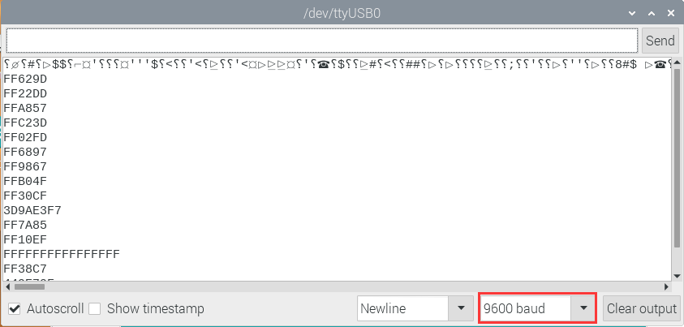

The key code value of each key is shown below:


### Project 34: DS18B20 Temperature Sensor


**Description**

In this kit, there is a DS18B20 temperature sensor, which is from maxim. The MCU can communicate with the DS18B20 through 1-Wire protocol, and finally read the temperature.  In this experiment, we will use this temperature sensor to measure the temperature in the current environment. The test result is ℃, ranging from -55 ℃ to +125 ℃. We will display the test result on shell.

**Working Principle**


The hardware interface of the 1-Wire bus is very simple, just connect the data pin of the DS18B20 to an IO port of the microcontroller. The timing of the 1-Wire bus is relatively complex. Many students can’t understand the timing diagram independently here. We have encapsulated the complex timing operations in the library, and you can use the library functions directly.

Schematic Diagram of DS18B20.

This can save up to 12-bit temperature vale. In the register, save in code complement. As shown below:


A total of 2 bytes, LSB is the low byte, MSB is the high byte, where MSb is the high byte of the byte, LSb is the low byte of the byte. As you can see, the binary number, the meaning of the temperature represented by each bit, is expressed. Among them, S represents the sign bit, and the lower 11 bits are all powers of 2, which are used to represent the final temperature. The temperature measurement range of DS18B20 is from-55 degrees to +125 degrees, and the expression form of temperature data, S represents positive and negative temperature, and the resolution is 2﹣⒋, which is 0.0625.

**Wiring Diagram：**


**Test Code ：**


```c
//**********************************************************************************
/*  
 * Filename    : ds18b20
 * Description : Read the temperature of ds18B20
 * Auther      : http//www.Keyestudio.com
*/
#include <DS18B20.h>

//ds18b20 pin to 15
DS18B20 ds18b20(15);

void setup() {
  Serial.begin(9600);
}

void loop() {
  double temp = ds18b20.GetTemp();//Read the temperature
  temp *= 0.0625;//The conversion accuracy is 0.0625/LSB
  Serial.print("Temperature: ");
  Serial.print(temp);
  Serial.println("C");
  delay(1000);
}
//**********************************************************************************
```

**Code Explanation**

1\. We set the pin to GPIO15 and obtain the temperature in the unit of ℃.  

2\. Set a double decimal variable to temp, and assign the measured result to temp.

3\. The serial monitor displays the temp value, and the baud rate needs to be set before displaying (our default setting is 9600, which can be changed).

4\. We add the unit behind the data. If the unit is directly set to °C, the test result will be garbled. So we directly replace ℃ with C.

**Test Result**

Wire up, compile and upload the code to the ESP32. After uploading successfully，we will use a USB cable to power on. Open the serial monitor and set baud rate to 9600. We need to press the reset button on the ESP32, then the monitor will display the temperature of the current environment, as shown below.

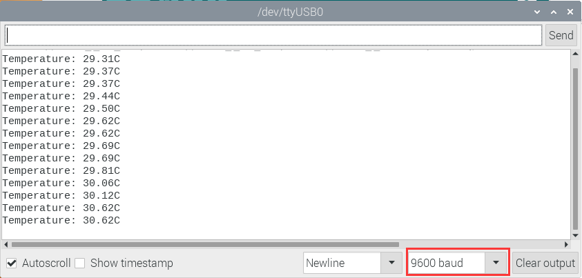

### Project 35: XHT11 Temperature and Humidity Sensor


**Description**

This DHT11 temperature and humidity sensor is a composite sensor which contains a calibrated digital signal output of the temperature and humidity.

DHT11 temperature and humidity sensor uses the acquisition technology of the digital module and temperature and humidity sensing technology, ensuring high reliability and excellent long-term stability.

It includes a resistive element and a NTC temperature measuring device.


**Working Principle**

The communication and synchronization between the single-chip microcomputer and XHT11 adopts the single bus data format. The communication time is about 4ms. The data is divided into fractional part and integer part.

Operation process: A complete data transmission is 40bit, high bit first out. Data format: 8bit humidity integer data + 8bit humidity decimal data + 8bit temperature integer data + 8bit temperature decimal data + 8bit checksum

8-bit checksum: 8-bit humidity integer data + 8-bit humidity decimal data + 8-bit temperature integer data + 8-bit temperature decimal data "Add the last 8 bits of the result.


**Wiring Diagram：**


**Test Code ：**

```c
//**********************************************************************************
/*  
 * Filename    : xht11
 * Description : Read the temperature and humidity values of XHT11.
 * Auther      : http//www.Keyestudio.com
*/
#include "xht11.h"
//gpio15
xht11 xht(15);

unsigned char dht[4] = {0, 0, 0, 0};//Only the first 32 bits of data are received, not the parity bits
void setup() {
  Serial.begin(9600);//Start the serial port monitor and set baud rate to 9600
}

void loop() {
  if (xht.receive(dht)) { //Returns true when checked correctly
    Serial.print("RH:");
    Serial.print(dht[0]); //The integral part of humidity, DHT [1] is the fractional part
    Serial.print("%  ");
    Serial.print("Temp:");
    Serial.print(dht[2]); //The integral part of temperature, DHT [3] is the fractional part
    Serial.println("C");
  } else {    //Read error
    Serial.println("sensor error");
  }
  delay(1000);  //It takes 1000ms to wait for the device to read
}
//**********************************************************************************
```

**Code Explanation**

We set the pin to GPIO15, and store the detected temperature and humidity data in the dht\[4\] array.

We add units behind the data. If the temperature unit is directly set to °C, the test results may be wrong, so we directly replace °C with C; the humidity unit is directly set to %.

**Test Result**

Wire up, compile and upload the code to the ESP32. After uploading successfully, we will use a USB cable to power on. Open the serial monitor and set baud rate to 9600. We need to press the reset button on the ESP32, then the monitor will display the temperature and humidity data of the current environment, as shown below.

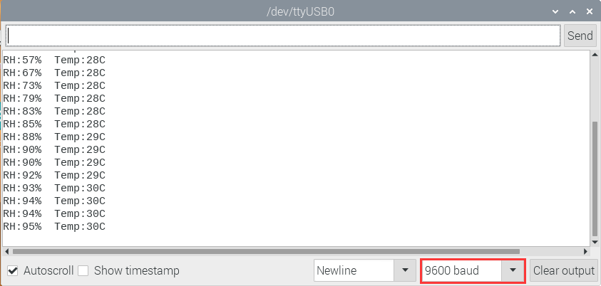

### Project 36: DS1307 Clock Module


**Overview**

This module mainly uses the real-time clock chip DS1307, which is the I2C bus interface chip that has second, minute, hour, day, month, year and other functions as well as leap year automatic adjustment function introduced by DALLAS. It can work independently of CPU, and won‘t’ affected by the CPU main crystal oscillator and capacitance as well as keep accurate time. What‘s more, monthly cumulative error is generally less than 10 seconds.The chip also has a clock protection circuit in case of main power failure and runs on a back-up battery that denies the CPU read and write access. 

At the same time, it contains automatic switching control circuit of standby power supply, so it can guarantee the accuracy of system clock in case of power failure of main power supply and other bad environment.

Going forward, the DS1307 chip internal integration has a certain capacity, with power failure protection characteristics of static RAM, which can be used to save some key data. 

In the experiment, we use the DS1307 clock module to obtain the system time and print the test results.  


**Working Principle**

Serial real-time clock records year, month, day, hour, minute, second and week; AM and PM indicate morning and afternoon respectively; 56 bytes of NVRAM store data; 2-wire serial port; programmable square wave output; power failure detection and automatic switching circuit; battery current is less than 500nA.

Pins description：X1, 32.768kHz crystal terminal ;

VBAT:X2：+3V input;

SDA：serial data;

SCL：serial clock;

SQW/OUT：square waves/output drivers

**Wiring Diagram：**


**Test Code ：**

```c
//**********************************************************************************
/*  
 * Filename    : DS1307 Real Time Clock
 * Description : Read the year/month/day/hour/minute/second/week of DS1307 clock module
 * Auther      : http//www.Keyestudio.com
*/
#include <Wire.h>
#include "RtcDS1307.h"  //DS1307 clock module library

RtcDS1307<TwoWire> Rtc(Wire);//i2cport

void setup(){
  Serial.begin(57600);//Set baud rate to 57600
  Rtc.Begin();
  Rtc.SetIsRunning(true);

  Rtc.SetDateTime(RtcDateTime(__DATE__, __TIME__));  
}

void loop(){
  // Print year/month/day/hour/minute/second/week
  Serial.print(Rtc.GetDateTime().Year());
  Serial.print("/");
  Serial.print(Rtc.GetDateTime().Month());
  Serial.print("/");
  Serial.print(Rtc.GetDateTime().Day());
  Serial.print("    ");
  Serial.print(Rtc.GetDateTime().Hour());
  Serial.print(":");
  Serial.print(Rtc.GetDateTime().Minute());
  Serial.print(":");
  Serial.print(Rtc.GetDateTime().Second());
  Serial.print("    ");
  Serial.println(Rtc.GetDateTime().DayOfWeek());
  delay(1000);//Delay 1 second
}
//**********************************************************************************
```


**Code Explanation**

**Rtc.GetDateTime()** the obtained current time and date.

**Rtc.Begin();**enable DS1307 real-time clock

**Rtc.SetIsRunning(true)** run the DS1307 real-time clock, if true changes into false, time will stop.

**Rtc.SetDateTime()**set time

**Rtc.GetDateTime().Year()** return year

**Rtc.GetDateTime().Month()** return month

**Rtc.GetDateTime().Day()**return date

**Rtc.GetDateTime().Hour()**return hour

**Rtc.GetDateTime().Minute()**return minute

**Rtc.GetDateTime().Second()**return second

**Rtc.GetDateTime().DayOfWeek()** return week

**Test Result**

Wire up, attach the DS1307 sensor to a battery, compile and upload the code to the ESP32. After uploading successfully，we will use a USB cable to power on. Open the serial monitor and set baud rate to 9600. We need to press the reset button on the ESP32, then we can see the displayed year, month, day, hour, minute, second and week on themonitor, and set the time and date to refresh every second, as shown below:

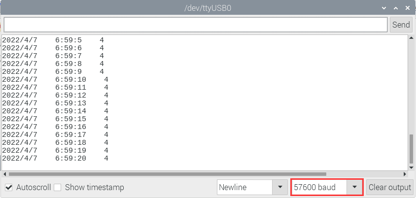

### Project 37: TM1650 4-Digit Tube Display


**Overview**

This module is mainly composed of a 0.36 inch red common anode 4-digit digital tube, and its driver chip is TM1650. When using it, we only need two signal lines to make the single-chip microcomputer control a 4-bitdigit tube, which greatly saves the IO port resources of the control board.

TM1650 is a special circuit for LED (light emitting diode display) drive control. It integrates MCU input and output control digital interface, data latch, LED drivers, keyboard scanning, brightness adjustment and other circuits.

TM1650 has stable performance, reliable quality and strong anti-interference ability.

It can be applied to the application of long-term continuous working for 24 hours.

TM1650 uses 2-wire serial transmission protocol for communication (note that this data transmission protocol is not a standard I2C protocol). The chip can drive the digital tube and save MCU pin resources through two pins and MCU communication.

**Working Principle**

TM1650 adopts IIC treaty, which uses DIO and CLK buses.


**Data command setting**: 0x48 means that we light up the digital tube, instead of enable the function of key scanning


**Command display setting:**

bit\[6:4\]: set the brightness of tube display, and 000 is brightest

bit\[3\]: set to show decimal points

bit\[0\]: start the display of the tube display


**Wiring Diagram：**


**Test Code ：**

```c
//**********************************************************************************
/*  
 * Filename    : TM1650 Four digital tube
 * Description : TM1650 Four Digital Tube shows 0-9999
 * Auther      : http//www.Keyestudio.com
*/
#include "TM1650.h"
#define CLK 22    //pins definitions for TM1650 and can be changed to other ports       
#define DIO 21
TM1650 DigitalTube(CLK,DIO);

void setup(){
  DigitalTube.setBrightness();  //set brightness, 0---7, default : 2
  DigitalTube.displayOnOFF();   //display on or off, 0=display off, 1=display on, default : 1
  for(char b=1;b<5;b++){
    DigitalTube.clearBit(b);      //DigitalTube.clearBit(0 to 3); Clear bit display.
  }
  // DigitalTube.displayDot(1,true); //Bit0 display dot. Use before displayBit().
  DigitalTube.displayBit(1,0);    //DigitalTube.Display(bit,number); bit=0---3  number=0---9
}

void loop(){
  for(int num=0; num<10000; num++){
    displayFloatNum(num);
    delay(100);
  }
}

void displayFloatNum(float num){
  if(num > 9999)
    return;
  int dat = num*10;
   //DigitalTube.displayDot(2,true); //Bit0 display dot. Use before displayBit().
  if(dat/10000 != 0){
    DigitalTube.displayBit(1, dat%100000/10000);  
    DigitalTube.displayBit(2, dat%10000/1000);
    DigitalTube.displayBit(3, dat%1000/100);
    DigitalTube.displayBit(4, dat%100/10);
    return;
  }
  if(dat%10000/1000 != 0){
    DigitalTube.clearBit(1); 
    DigitalTube.displayBit(2, dat%10000/1000); 
    DigitalTube.displayBit(3, dat%1000/100);
    DigitalTube.displayBit(4, dat%100/10);
    return;
  }
  if(dat%1000/100 != 0){
  DigitalTube.clearBit(1); 
  DigitalTube.clearBit(2);
  DigitalTube.displayBit(3, dat%1000/100);
  DigitalTube.displayBit(4, dat%100/10);  
  return;
}
  DigitalTube.clearBit(1); 
  DigitalTube.clearBit(2);
  DigitalTube.clearBit(3);
  DigitalTube.displayBit(4, dat%100/10);
}
//**********************************************************************************
```

**Code Explanation**

Similarly, we need to import the library file of the TM1650 module first. Here are some commonly used function interfaces:

**.init()** Initialize TM1650

**.clear() **clear up the tube display

**.displayString(char \*aString) **Display character string，

**.displayString(String sString)** Display string ，sString is character string

**.displayString(float value)** Display decimal, the content is float type

**.displayString(double value)** Display decimal, the content is double type

**.displayString(int value)** Display integer, the content is int type

**.displayOn()** open the tube display

**.displayOff()** turn off the tube display，in comparison with .clear，once turning off, the function .displayOn() must be used

**.setDot(unsigned int aPos, bool aState)** display decimal point, aPos is the location of decimal point (0\~3) corresponds to (1\~4)，aState is the display status:1（true）lights up，2（false）goes off.

**.setBrightness(unsigned int iBrightness)** set the brightness of the tube display iBrightness: the brightness value（1\~8, type is unsigned int，

**Test Result**

Run the test code, wire up and power on. 4-digit tube display will show integer from 0 to 99999, add 1 for each 10ms. Increase to 9999 then start from 0.

### Project 38: HT16K33\_8X8 Dot Matrix Module


**Overview**

What is the dot matrix display?

The 8X8 dot matrix is composed of 64 light-emitting diodes, and each light-emitting diode is placed at the intersection of the row line and the column line. When the corresponding row is set to 1 level, and a certain column is set to 0 level, the corresponding diode will light up.

**Working Principle**

As the schematic diagram shown, to light up the LED at the first row and column, we only need to set C1 to high level and R1 to low level. To turn on LEDs at the first row, we set R1 to low level and C1-C8 to high level.

16 IO ports are needed, which will highly waste the MCU resources.

Therefore, we designed this module, using the HT16K33 chip to drive an 8\*8 dot matrix, which greatly saves the resources of the single-chip microcomputer.


There are three DIP switches on the module, all of which are set to I2C communication address. The setting method is shown below. A0，A1 and A2 are grounded, that is, the address is 0x70.

<table class="colwidths-auto docutils align-default">
<tbody>
<tr class="odd">
<td>A0（1）</td>
<td>A1（2）</td>
<td>A2（3）</td>
<td>A0（1）</td>
<td>A1（2）</td>
<td>A2（3）</td>
<td>A0（1）</td>
<td>A1（2）</td>
<td>A2（3）</td>
</tr>
<tr class="even">
<td>0（OFF）</td>
<td>0（OFF）</td>
<td>0（OFF）</td>
<td>1（ON）</td>
<td>0（OFF）</td>
<td>0（OFF）</td>
<td>0（OFF）</td>
<td>1（ON）</td>
<td>0（OFF）</td>
</tr>
<tr class="odd">
<td>OX70</td>
<td>OX71</td>
<td>OX72</td>
<td></td>
<td></td>
<td></td>
<td></td>
<td></td>
<td></td>
</tr>
<tr class="even">
<td>A0（1）</td>
<td>A1（2）</td>
<td>A2（3）</td>
<td>A0（1）</td>
<td>A1（2）</td>
<td>A2（3）</td>
<td>A0（1）</td>
<td>A1（2）</td>
<td>A2（3）</td>
</tr>
<tr class="odd">
<td>1（ON）</td>
<td>1（ON）</td>
<td>0（OFF）</td>
<td>0（OFF）</td>
<td>0（OFF）</td>
<td>1（ON）</td>
<td>1（ON）</td>
<td>0（OFF）</td>
<td>1（ON）</td>
</tr>
<tr class="even">
<td>OX73</td>
<td>OX74</td>
<td>OX75</td>
<td></td>
<td></td>
<td></td>
<td></td>
<td></td>
<td></td>
</tr>
<tr class="odd">
<td>A0（1）</td>
<td>A1（2）</td>
<td>A2（3）</td>
<td>A0（1）</td>
<td>A1（2）</td>
<td>A2（3）</td>
<td></td>
<td></td>
<td></td>
</tr>
<tr class="even">
<td>0（OFF）</td>
<td>1（ON）</td>
<td>1（ON）</td>
<td>1（ON）</td>
<td>1（ON）</td>
<td>1（ON）</td>
<td></td>
<td></td>
<td></td>
</tr>
<tr class="odd">
<td>OX76</td>
<td>OX77</td>
<td></td>
<td></td>
<td></td>
<td></td>
<td></td>
<td></td>
<td></td>
</tr>
</tbody>
</table>

<table class="colwidths-auto docutils align-default">
<tbody>
<tr class="odd">
<td>0（OFF）</td>
<td>1（ON）</td>
<td>1（ON）</td>
<td>1（ON）</td>
<td>1（ON）</td>
<td>1（ON）</td>
<td></td>
</tr>
<tr class="even">
<td>OX76</td>
<td>OX77</td>
<td></td>
<td></td>
<td></td>
<td></td>
<td></td>
</tr>
</tbody>
</table>
**Wiring Diagram：**


**Test Code ：**

```c
//**********************************************************************************
/*
 * Filename    : 8×8 Dot-matrix Display
 * Description : 8x8 LED dot matrix display“Heart” pattern.
 * Auther      : http//www.Keyestudio.com
*/
#include "HT16K33_Lib_For_ESP32.h"

#define SDA 21
#define SCL 22

ESP32_HT16K33 matrix = ESP32_HT16K33();

//The brightness values can be set from 1 to 15, with 1 darkest and 15 brightest
#define  A  15

byte result[8][8];
byte test1[8] = {0x00,0x42,0x41,0x09,0x09,0x41,0x42,0x00};

void setup()
{
  matrix.init(0x70, SDA, SCL);//Initialize matrix
  matrix.showLedMatrix(test1,0,0);
  matrix.show();
}

void loop()
{
  for (int i = 0; i <= 7; i++)
  {
    matrix.setBrightness(i);
    delay(100);
  }
  for (int i = 7; i > 0; i--)
  {
    matrix.setBrightness(i);
    delay(100);
  }
}
//**********************************************************************************
```


**Code Explanation**

First we need to import the library file.

The pattern in our code is an array of byte data type, which is shown in the table below. We convert into binary, and fill in the 8\*8 form below to make it clear. 1 means on, 0 means off. Then we can see that it is a smile shape.

<table class="colwidths-auto docutils align-default">
<tbody>
<tr class="odd">
<td>0</td>
<td>0</td>
<td>0</td>
<td>0</td>
<td>0</td>
<td>0</td>
<td>0</td>
<td>0</td>
</tr>
<tr class="even">
<td>0</td>
<td>1</td>
<td>1</td>
<td>0</td>
<td>0</td>
<td>1</td>
<td>1</td>
<td>0</td>
</tr>
<tr class="odd">
<td>0</td>
<td>0</td>
<td>0</td>
<td>0</td>
<td>0</td>
<td>0</td>
<td>0</td>
<td>0</td>
</tr>
<tr class="even">
<td>0</td>
<td>0</td>
<td>0</td>
<td>0</td>
<td>0</td>
<td>0</td>
<td>0</td>
<td>0</td>
</tr>
<tr class="odd">
<td>0</td>
<td>0</td>
<td>0</td>
<td>1</td>
<td>1</td>
<td>0</td>
<td>0</td>
<td>0</td>
</tr>
<tr class="even">
<td>0</td>
<td>0</td>
<td>0</td>
<td>0</td>
<td>0</td>
<td>0</td>
<td>0</td>
<td>0</td>
</tr>
<tr class="odd">
<td>0</td>
<td>1</td>
<td>0</td>
<td>0</td>
<td>0</td>
<td>0</td>
<td>1</td>
<td>0</td>
</tr>
<tr class="even">
<td>0</td>
<td>0</td>
<td>1</td>
<td>1</td>
<td>1</td>
<td>1</td>
<td>0</td>
<td>0</td>
</tr>
</tbody>
</table>

**Test Result**

Connect the wires according to the experimental wiring diagram, compile and upload the code to the ESP32. After uploading successfully，we will use a USB cable to power on. Then the dot matrix displays a “ smile ”pattern.

### Project 39: RFID Module


**Description**

RFIDRFID-RC522 radio frequency module adopts a Philips MFRC522 original chip to design card reading circuit, easy to use and low cost, suitable for equipment development and card reader development and so on.

RFID or Radio Frequency Identification system consists of two main components, a transponder/tag attached to an object to be identified, and a transceiver also known as interrogator/Reader.

In the experiment, the data read by the card swipe module is 4 hexadecimal numbers, and we print these four hexadecimal numbers as strings. For example, we read the data of the IC card below: 0xED、0xF7、0x94、0x5A and the information string displayed in the serial monitor is ED F7 94 5A ; the data read from the keychain is: 0x4C、0x09、0x6B、0x6E . Different IC cards and different key chains have diverse data.

**Working Principle**

Radio frequency identification, the card reader is composed of a radio frequency module and a high-level magnetic field. The Tag transponder is a sensing device, and this device does not contain a battery. It only contains tiny integrated circuit chips and media for storing data and antennas for receiving and transmitting signals. To read the data in the tag, first put it into the reading range of the card reader. The reader will generate a magnetic field, and because the magnetic energy generates electricity according to Lenz's law, the RFID tag will supply power, thereby activating the device.


**Wiring Diagram：**


**Test Code ：**


```c
//**********************************************************************************
/*  
 * Filename    : RFID
 * Description : RFID reader UID
 * Auther      : http//www.Keyestudio.com
*/
#include <Wire.h>
#include "MFRC522_I2C.h"
// IIC pins default to GPIO21 and GPIO22 of ESP32
// 0x28 is the i2c address of SDA, if doesn't match，please check your address with i2c.
MFRC522 mfrc522(0x28);   // create MFRC522.

void setup() {
  Serial.begin(115200);           // initialize and PC's serial communication
  Wire.begin();                   // initialize I2C
  mfrc522.PCD_Init();             // initialize MFRC522
  ShowReaderDetails();            // dispaly PCD - MFRC522 read carder
  Serial.println(F("Scan PICC to see UID, type, and data blocks..."));
}

void loop() {
  // 
  if ( ! mfrc522.PICC_IsNewCardPresent() || ! mfrc522.PICC_ReadCardSerial() ) {
    delay(50);
    return;
  }
  
  // select one of door cards. UID and SAK are mfrc522.uid.
  // save UID
  Serial.print(F("Card UID:"));
  for (byte i = 0; i < mfrc522.uid.size; i++) {
    Serial.print(mfrc522.uid.uidByte[i] < 0x10 ? " 0" : " ");
    Serial.print(mfrc522.uid.uidByte[i], HEX);
  } 
  Serial.println();
}

void ShowReaderDetails() {
  //  attain the MFRC522 software
  byte v = mfrc522.PCD_ReadRegister(mfrc522.VersionReg);
  Serial.print(F("MFRC522 Software Version: 0x"));
  Serial.print(v, HEX);
  if (v == 0x91)
    Serial.print(F(" = v1.0"));
  else if (v == 0x92)
    Serial.print(F(" = v2.0"));
  else
    Serial.print(F(" (unknown)"));
  Serial.println("");
  // when returning to 0x00 or 0xFF, may fail to transmit communication signals
  if ((v == 0x00) || (v == 0xFF)) {
    Serial.println(F("WARNING: Communication failure, is the MFRC522 properly connected?"));
  }
}
//**********************************************************************************
```


**Code Explanation**

**Wire.begin()** The module we use is the IIC interface, so we first initialize the IIC

**mfrc522.PCD\_Init(); initialize** MFRC522

**String(mfrc522.uid.uidByte\[i\], HEX)** A string to convert the value read into hexadecimal format.

**Test Result**

Connect the wires according to the experimental wiring diagram, compile and upload the code to the ESP32. After uploading successfully，we will use a USB cable to power on. Open the serial monitor and set baud rate to 115200. We need to press the reset button on the ESP32, when we make the IC card close to the RFID module, the information will be printed out, as shown in the figure below.

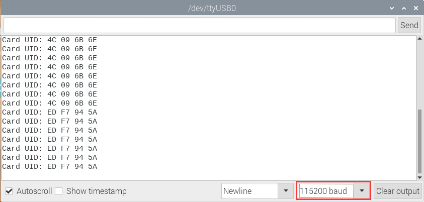

**Comprehensive Experiments**

The previous projects are related to single sensor or module. In the following part, we will combine various sensors and modules to create some comprehensive experiments to perform special functions.

### Project 40: Button-controlled LED


**Overview**

In this lesson, we will make an extension experiment with a button and an LED. When the button is pressed and low levels are output, the LED will light up; when the button is released, the LED will go off. Then we can control a module with another module.


**Wiring Diagram：**


**Test Code ：**


```c
//**********************************************************************
/* 
 * Filename    : button_control_LED
 * Description : Make a table lamp.
 * Auther      : http//www.Keyestudio.com
*/
#define PIN_LED    4
#define PIN_BUTTON 15
bool ledState = false;

void setup() {
  // initialize digital pin PIN_LED as an output.
  pinMode(PIN_LED, OUTPUT);
  pinMode(PIN_BUTTON, INPUT);
}

// the loop function runs over and over again forever
void loop() {
  if (digitalRead(PIN_BUTTON) == LOW) {
    delay(20);
    if (digitalRead(PIN_BUTTON) == LOW) {
      reverseGPIO(PIN_LED);
    }
    while (digitalRead(PIN_BUTTON) == LOW);
  }
}

void reverseGPIO(int pin) {
  ledState = !ledState;
  digitalWrite(pin, ledState);
}
//**********************************************************************
```

**Test Result**

Upload the code wire up and power up with a USB cable. When the button is pressed, the LED will light up; when pressed again, the LED will go off.

### Project 41: Alarm Experiment


**Overview**

In the previous experiment, we control an output module though an input module. In this lesson, we will make an experiment that the active buzzer will emit sounds once an obstacle appears.


**Wiring Diagram：**

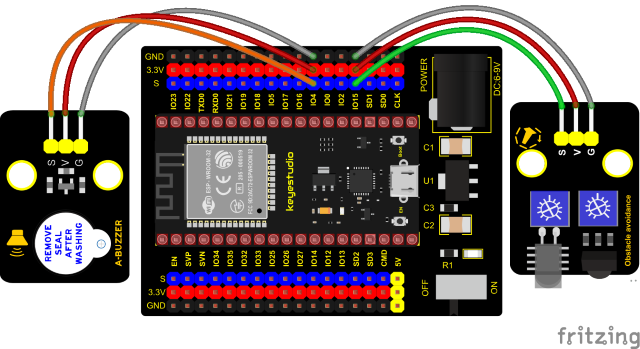

**Test Code ：**


```c
//**********************************************************************************
/*  
 * Filename    : Avoiding alarm
 * Description : Obstacle avoidance sensor controls the buzzer
 * Auther      : http//www.Keyestudio.com
*/
int item = 0;
void setup() {
  pinMode(15, INPUT);  //Obstacle avoidance sensor is connected to GPIO15 and set to input mode
  pinMode(4, OUTPUT); //The buzzer is connected to GPIO4 and set to output mode
}

void loop() {
  item = digitalRead(15);//Read the level value output by the obstacle avoidance sensor
  if (item == 0) {//Obstruction detected
    digitalWrite(4, HIGH);//The buzzer sounded
  } else {//No obstacles detected
    digitalWrite(4, LOW);//The buzzer is off
  }
  delay(100);//Delay 100ms
}
//**********************************************************************************
```

**Code Explanation**

Set IO ports according to connection diagram then configure pins mode.

The value is 0 when pressing the button, So, we can determine the key value(0）through if (item == 0) and make the buzzer beep digitalWrite(16,HIGH).

**Test Result**

Connect the wires according to the experimental wiring diagram, compile and upload the code to the ESP32. After uploading successfully，we will use a USB cable to power on. If the obstacle is detected, the active buzzer will chime; if not, it won’t beep.

### Project 42: Intrusion Detection


**Description**

In this experiment, we use a PIR motion sensor to control an active buzzer to emit sounds and the onboard LED to flash rapidly.


**Wiring Diagram：**


**Test Code ：**


```c
//**********************************************************************************
/*  
 * Filename    : PIR alarm
 * Description : PIR control buzzer
 * Auther      : http//www.Keyestudio.com
*/
int item = 0;
void setup() {
  pinMode(15, INPUT);  //PIR motion sensor is connected to GPIO15 and set as the input mode
  pinMode(4, OUTPUT);//The active buzzer is connected to GPIO4 and set to output mode
  pinMode(22, OUTPUT);//LED is connected to GPIO22 and set to output mode
}

void loop() {
  item = digitalRead(15);//Read digital level signal output by infrared pyrorelease sensor
  if (item == 1) {  //Movement detected
    digitalWrite(4, HIGH); //Turn on the buzzer
    digitalWrite(22, HIGH); //Turn on the LED
    delay(200);//Delay 200ms
    digitalWrite(4, LOW); //Turn off the buzzer
    digitalWrite(22, LOW); //Turn off the LED
    delay(200);//Delay 200ms
  } else {  //No detection
    digitalWrite(4, LOW); //Turn off the buzzer
    digitalWrite(22, LOW); //Turn off the LED
  }
}
//**********************************************************************************
```


**Test Result**

Wire up, compile and upload the code to the ESP32. After uploading successfully, we will use a USB cable to power on. If the sensor detects people moving, the buzzer will emit an alarm , and the LED will flash continuously.

### Project 43: Extinguishing Robot


**Description**

Today we will use Arduino simulation to build an extinguishing robot that will automatically sense the fire and start the fan. In this project we will learn how to build a very simple robot using ESP32,(detecting flames with a flame sensor, blowing out candles with a fan) can teach us basic concepts about robotics. Once you understand the basics below, you can build more complex robots.


**Wiring Diagram：**


**Test Code ：**


```c
//**********************************************************************************
/*  
 * Filename    : Fire-fighting robot
 * Description : Flame sensor controls the 130 fan module
 * Auther      : http//www.Keyestudio.com
*/
int item = 0;
void setup() {
  Serial.begin(9600);
  pinMode(15, OUTPUT);//INA corresponds to IN+, and sets GPIO15 to output mode
  pinMode(4, OUTPUT);//INB corresponds to IN-, and sets GPIO4 to output mode
}

void loop() {
  item = analogRead(34);//The flame sensor is connected to GPIO34, and read the simulated value to Item  
  Serial.println(item);//Serial port display analog value
  if (item < 3000) {//Less than 3000
    digitalWrite(15, LOW);//Turn on the fan
    digitalWrite(4, HIGH);
  } else {//Otherwise, turn off the fan.
    digitalWrite(15, LOW);
    digitalWrite(4, LOW);
  }
  delay(100);
}
//**********************************************************************************
```

**Code Explanation**

In the code, we set the threshold value to 30000. When the analog value detected by the flame sensor is lower than the threshold value, the fan will be automatically turned on; otherwise, it will be turned off. For the driving method of the fan, please refer to the 130 Motor.

**Test Result**

Wire up and upload the test code，power up and turn the DIP switch to ON on the ESP32 board and press the rest button. The monitor shows the flame value. When this value is less than 30000, the fan will blow out the fire. Basically, the flame value can be set by yourself.

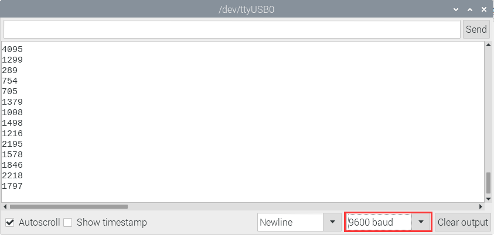

### Project 44: Rotary Encoder control RGB

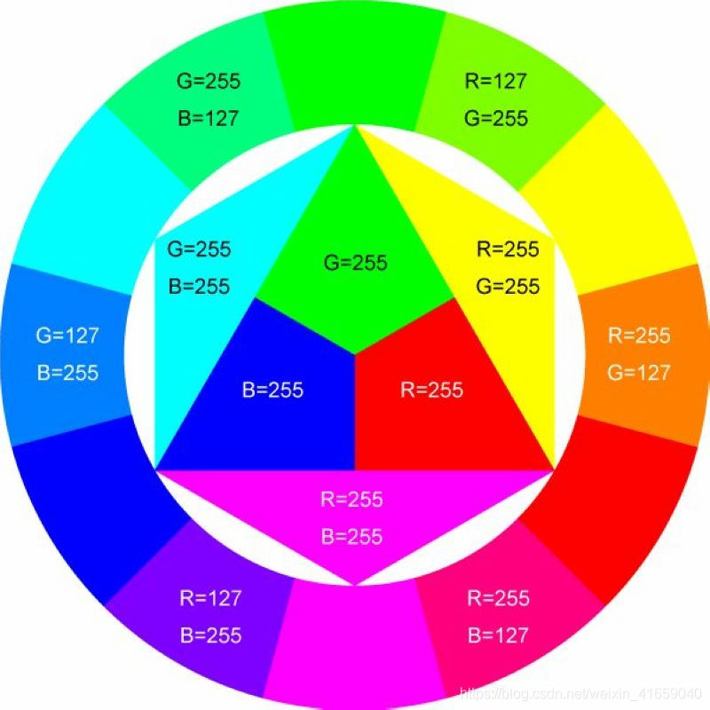

**Introduction**

In this lesson, we will control the LED on the RGB module to show different colors through a rotary encoder.

When designing the code, we need to divide the obtained values by 3 to get the remainders. The remainder is 0 and the LED will become red. The remainder is 1, the LED will become green. The remainder is 2, the LED will turn blue.

**Wiring Diagram：**


**Test Code ：**


```c
//**********************************************************************************
/*  
 * Filename    : Encoder control RGB
 * Description : Rotary encoder controls RGB to present different effects
 * Auther      : http//www.Keyestudio.com
*/
//Interfacing Rotary Encoder with Arduino
//Encoder Switch -> pin 27
//Encoder DT -> pin 14
//Encoder CLK -> pin 12
int Encoder_DT  = 14;
int Encoder_CLK  = 12;
int Encoder_Switch = 27;

int Previous_Output;
int Encoder_Count;

int ledPins[] = {0, 2, 15};    //define red, green, blue led pins
const byte chns[] = {0, 1, 2};        //define the pwm channels
int red, green, blue;

int val;
void setup() {
  Serial.begin(9600);

  //pin Mode declaration
  pinMode (Encoder_DT, INPUT);
  pinMode (Encoder_CLK, INPUT);
  pinMode (Encoder_Switch, INPUT);

  Previous_Output = digitalRead(Encoder_DT); //Read the inital value of Output A
  for (int i = 0; i < 3; i++) {   //setup the pwm channels,1KHz,8bit
    ledcSetup(chns[i], 1000, 8);
    ledcAttachPin(ledPins[i], chns[i]);
   }
}

void loop() {
  //aVal = digitalRead(pinA);

  if (digitalRead(Encoder_DT) != Previous_Output)
  {
    if (digitalRead(Encoder_CLK) != Previous_Output)
    {
      Encoder_Count ++;
      Serial.print(Encoder_Count);
      Serial.print("  ");
      val = Encoder_Count % 3;
      Serial.println(val);
    }
    else
    {
      Encoder_Count--;
      Serial.print(Encoder_Count);
      Serial.print("  ");
      val = Encoder_Count % 3;
      Serial.println(val);
    }
  }

  Previous_Output = digitalRead(Encoder_DT);

  if (digitalRead(Encoder_Switch) == 0)
  {
    delay(5);
    if (digitalRead(Encoder_Switch) == 0) {
      Serial.println("Switch pressed");
      while (digitalRead(Encoder_Switch) == 0);
    }
  }
  if (val == 0) {
    //red(255, 0, 0)
    ledcWrite(chns[0], 255 ); 
    ledcWrite(chns[1], 0);
    ledcWrite(chns[2], 0);
  } else if (val == 1) {
    //GREEN(0, 255, 0)
    ledcWrite(chns[0], 0); 
    ledcWrite(chns[1], 255);
    ledcWrite(chns[2], 0);
  } else {
    //blue(0, 0, 255)
    ledcWrite(chns[0], 0); 
    ledcWrite(chns[1], 0);
    ledcWrite(chns[2], 255);
  }
}
//**********************************************************************************
```


**Code Explanation**

1.In the experiment, we set the val to the remainder of Encoder\_Count divided by 3. Encoder\_Count is the value of the encoder. Then we can set pin GPIO0 (red), GPIO2 (green) and GPIO15 (blue) according to remainders.

2\. Referring to the control method learned in the previous experiment, use the LED on the remainder control module to display
the corresponding light color. The value obtained by taking the remainder of 3 for any number is 0 or 1 or 2. We use these three
values to judge, and display the corresponding color.

**Test Result**

Wire up, run the code and open the serial monitor. Power up, open the monitor and set baud rate to 9600. Press the reset button and rotate the knob of the rotary encoder to display the reminders, which can control colors of LED.

### Project 45: Rotary Potentiometer


**Introduction**

In the previous courses, we did experiments of breathing light and controlling LED with button. In this course, we do these two experiments by controlling the brightness of LED through an adjustable potentiometer. The brightness of LED is controlled by PWM values, and the range of analog values is 0 to 4095 and the PWM value range is 0-255.

After the code is set successfully, we can control the brightness of the LED on the module by rotating the potentiometer.

**Wiring Diagram：**


**Test Code ：**


```c
//**********************************************************************************
/*  
 * Filename    : adjust the light
 * Description : Controlling the brightness of LED by potentiometer.
 * Auther      : http//www.Keyestudio.com
*/
#define PIN_ANALOG_IN    34  //the pin of the potentiometer
#define PIN_LED     15  // the pin of the LED
#define CHAN            0
void setup() {
  ledcSetup(CHAN, 1000, 12);
  ledcAttachPin(PIN_LED, CHAN);
}

void loop() {
  int adcVal = analogRead(PIN_ANALOG_IN); //read adc
  int pwmVal = adcVal;        // adcVal re-map to pwmVal
  ledcWrite(CHAN, pwmVal);    // set the pulse width.
  delay(10);
}
//**********************************************************************************
```

**Code Explanation**

In the experiment, the mapping function maps adcVal from the range of 0-4095 to 0-255, and assigns it to pwmVal.

**Test Result**

Wire up, power up, compile and upload the code to the ESP32. After uploading successfully，we will use a USB cable to power on. Rotating the potentiometer on the module can adjust the brightness of the LED on the LED module.

### Project 46: Smart Windows


**Description**

In life, we can see all kinds of smart products, such as smart home. Smart homes include smart curtains, smart windows, smart TVs, smart lights, and more. In this experiment, we use a steam sensor to detect rainwater, and then achieve the effect of closing and opening the window by a servo.

**Components**

<table class="colwidths-auto docutils align-default">
<tbody>
<tr class="odd">
<td></td>
<td></td>
<td></td>
<td></td>
<td></td>
<td></td>
</tr>
<tr class="even">
<td>ESP32 Board*1</td>
<td>ESP32 Expansion Board*1</td>
<td>Keyestudio Steam Sensor*1</td>
<td>Servo*1</td>
<td>3P Dupont Wire*1</td>
<td>Micro USB*1</td>
</tr>
</tbody>
</table>

**Connection Diagram**

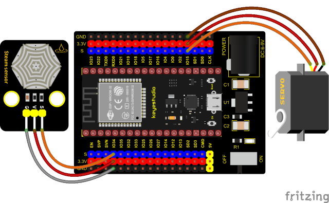

**Test Code**


```c
//**********************************************************************************
/*  
 * Filename    : smart window
 * Description : Water drop sensor controls steering gear rotation.
 * Auther      : http//www.keyestudio.com
*/
#include <ESP32Servo.h>//Import the steering gear library file
int adcVal = 0;//A variable that holds the ADC value output by the droplet sensor
int servoPin = 15;  // Define the servo pin
Servo myservo;//Defines an instance of the steering gear class

#define PIN_ADC    34  //the pin of the Water drop sensor

void setup(){
  Serial.begin(9600);
  pinMode(PIN_ADC, INPUT);
  myservo.setPeriodHertz(50);           // standard 50 hz servo
  myservo.attach(servoPin, 500, 2500);  // attaches the servo on servoPin to the servo object
}

void loop(){
  adcVal = analogRead(PIN_ADC);//The droplet sensor is connected to the analog port GP34
  Serial.println(adcVal);
  if (adcVal > 2000) {//The simulated value is greater than 2000
    myservo.write(0);//close the window
    delay(500);//Give the steering gear time to turn
  } else {// no rain
    myservo.write(180);//open the window 
    delay(500);//Delay 500ms
  }
}
//**********************************************************************************
```

**Code Explanation**

We can control a servo to rotate by a threshold.

**Test Result**

Wire up, power on and compile and upload the code to the ESP32. After uploading successfully，we will use a USB cable to power on. When the sensor detects a certain amount of water, the servo rotates to achieve the effect of closing or opening windows.

### Project 47: Sound Activated Light


**Introduction**

In this lesson, we will make a smart sound activated light using a sound sensor and an LED module. When we make a sound, the light will automatically turn on; when there is no sound, the lights will automatically turn off. How it works? Because the sound-controlled light is equipped with a sound sensor, and this sensor converts the intensity of external sound into a corresponding value. Then set a threshold, when the threshold is exceeded, the light will turn on, and when it is not exceeded, the light will go out.

**Components**

|          | 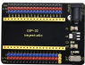 |     |
| ------------------------------- | ----------------------- | -------------------------- |
| ESP32 Board*1                   | ESP32 Expansion Board*1 | Keyestudio  Sound Sensor*1 |
|          |  |     |
| Keyestudio  Purple LED Module*1 | 3P Dupont Wire*2        | Micro USB Cable*1          |

**Connection Diagram**

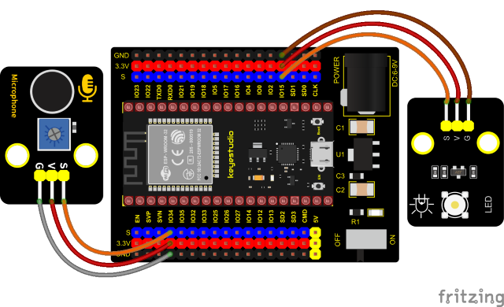

**Test Code**


```c
//**********************************************************************************
/*  
 * Filename    : sound-controlled lights
 * Description : Sound sensor controls LED on and off
 * Auther      : http//www.keyestudio.com
*/
int ledPin = 15;//LED is connected to GP15
int microPin = 34;//Sound sensor is connected to GPIO34
void setup() {
  Serial.begin(9600);//Set baud rate to 9600
  pinMode(ledPin, OUTPUT);//LED is the output mode
}

void loop() {
  int val = analogRead(microPin);//Read analog value
  Serial.print(val);// Serial port print
  if(val > 600){//exceed the threshold value
    digitalWrite(ledPin, HIGH);//Lighting LED 3s，and print the corresponding information
    Serial.println("  led on");
    delay(3000);
  }else{//otherwise
    digitalWrite(ledPin, LOW);//Turn off the LED and print the corresponding information
    Serial.println("  led off");
  }
  delay(100);
}
//**********************************************************************************
```


**Test Result**

Wire up, power on and compile and upload the code to the ESP32. After uploading successfully, we will use a USB cable to power on. Open the serial monitor and set the baud rate to 9600.

We need to press the reset button on the ESP32, then the corresponding volume ADC value will be displayed. When the analog value of sound is greater than 600, the LED on the LED module will light up, otherwise it will go off.


### Project 48: Fire Alarm


**Description**

In this experiment, we will make a fire alarm system. Just use a flame sensor to control an active buzzer to emit sounds.

**Components**

|    |  |     |
| ------------------------- | ----------------------- | -------------------------- |
| ESP32 Board*1             | ESP32 Expansion Board*1 | Keyestudio Active Buzzer*1 |
|    |  |     |
| keyestudio Flame Sensor*1 | Micro USB Cable*1       | 3P Dupont Wire*2           |


**Connection Diagram**


**Test Code**


```c
//**********************************************************************************
/*  
 * Filename    : Flame Alarm
 * Description : Controlling the buzzer by flame sensor.
 * Auther      : http//www.keyestudio.com
*/
int item = 0;
void setup() {
  Serial.begin(9600);
  pinMode(4, INPUT);//Flame sensor digital pin is connected to GPIO4
  pinMode(15, OUTPUT);//Buzzer pin is connected to GPIO15
}

void loop() {
  item = digitalRead(4);//Read the digital level output by the flame sensor
  Serial.println(item);//Newline print level signal
  if (item == 0) {//Flame detected
    digitalWrite(15, HIGH);//Turn on the buzzer
  } else {//Otherwise, turn off the buzzer
    digitalWrite(15, LOW);
  }
  delay(100);//Delay 100ms
}
//**********************************************************************************
```

**Code Explanation**

This flame sensor uses an analog pin and a digital pin. When a flame is detected, the digital pin outputs a low level. In this experiment we will use the digital port.

**Test Result**

Connect the wires according to the experimental wiring diagram, compile and upload the code to the ESP32. After uploading successfully，we will use a USB cable to power on. When the sensor detects the flame, the external active buzzer will emit sounds, otherwise the active buzzer will not emit sounds.

### Project 49: Smoke Alarm


**Description**

In this experiment, we will make a smoke alarm by a TM16504-Digit segment module, a gas sensor and an active buzzer.

**Components**

|         |  |     |                    |
| ------------------------------ | ----------------------- | -------------------------- | ----------------------------------------- |
| ESP32 Board*1                  | ESP32 Expansion Board*1 | Keyestudio Active Buzzer*1 | Keyestudio TM16504-Digit Segment Module*1 |
|         |  |     |                    |
| keyestudio Analog Gas Sensor*1 | 3P Dupont Wire*2        | 4P Dupont Wire1            | Micro USB Cable*1                         |


**Connection Diagram**

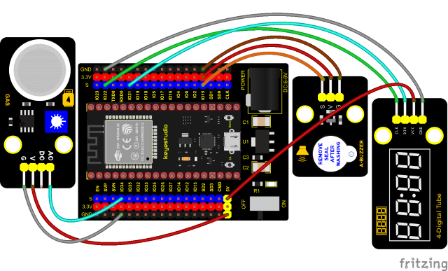

**Test Code**


```c
//**********************************************************************************
/*  
 * Filename    : smoke alarm
 * Description : MQ2 controls a buzzer and a four-digit analog smoke tester
 * Auther      : http//www.keyestudio.com
*/
#include "TM1650.h" //Import the TM1650 library file
int adcVal = 0; //display ADC value
//the interfaces are GPIO21 and GPIO22
#define DIO 21
#define CLK 22
TM1650 DigitalTube(CLK,DIO);

void setup() {
  DigitalTube.setBrightness();  //set brightness, 0---7, default : 2
  DigitalTube.displayOnOFF();   //display on or off, 0=display off, 1=display on, default : 1
  for(char b=1;b<5;b++){
    DigitalTube.clearBit(b);      //DigitalTube.clearBit(0 to 3); Clear bit display.
  }
  // DigitalTube.displayDot(1,true); //Bit0 display dot. Use before displayBit().
  DigitalTube.displayBit(1,0);    //DigitalTube.Display(bit,number); bit=0---3  number=0---9
  pinMode(15, OUTPUT);//the buzzer is connected to GPIO15
}

void loop() {
  adcVal = analogRead(34);//Read the ADC values of MQ2
  displayFloatNum(adcVal);;//Four digit tube display adcVal values
  if (adcVal > 1000) {//ADC value is greater than 1000
    digitalWrite(15, HIGH); // buzzer alarming
  } else {//or else
    digitalWrite(15, LOW); //Turn off the buzzer
  }
  delay(100);//delay 100ms
}

void displayFloatNum(float adcVal){
  if(adcVal > 9999)
    return;
  int dat = adcVal*10;
   //DigitalTube.displayDot(2,true); //Bit0 display dot. Use before displayBit().
  if(dat/10000 != 0){
    DigitalTube.displayBit(1, dat%100000/10000);  
    DigitalTube.displayBit(2, dat%10000/1000);
    DigitalTube.displayBit(3, dat%1000/100);
    DigitalTube.displayBit(4, dat%100/10);
    return;
  }
  if(dat%10000/1000 != 0){
    DigitalTube.clearBit(1); 
    DigitalTube.displayBit(2, dat%10000/1000); 
    DigitalTube.displayBit(3, dat%1000/100);
    DigitalTube.displayBit(4, dat%100/10);
    return;
  }
  if(dat%1000/100 != 0){
  DigitalTube.clearBit(1); 
  DigitalTube.clearBit(2);
  DigitalTube.displayBit(3, dat%1000/100);
  DigitalTube.displayBit(4, dat%100/10);  
  return;
}
  DigitalTube.clearBit(1); 
  DigitalTube.clearBit(2);
  DigitalTube.clearBit(3);
  DigitalTube.displayBit(4, dat%100/10);
}
//**********************************************************************************
```


**Code Explanation**

Define an integer variable val to store the analog value of the smoke sensor, and then we display the analog value in the four-digit digital tube, and then set a threshold, and when the threshold is reached, the buzzer will sound.

**Test Result**

Wire up, power on, compile and upload the code to the ESP32. After uploading successfully，we will use a USB cable to power on. When the concentration of combustible gas exceeds the standard, the active buzzer module will give an alarm, and the four-digit digital tube will display the concentration value.

### Project 50: Ultrasonic Radar


**Description**


We know that bats use echoes to determine the direction and the location of their preys. In real life, sonar is used to detect sounds in the water. Since the attenuation rate of electromagnetic waves in water is very high, it cannot be used to detect signals, however, the attenuation rate of sound waves in the water is much smaller, so sound waves are most commonly used underwater for observation and measurement.In this experiment, we will use a speaker module, an RGB module and a 4-digit tube display to make a device for detection through ultrasonic.

**Connection Diagram**


**Test Code**

```c
//**********************************************************************************
/*  
 * Filename    : Ultrasonic radar
 * Description : Ultrasonic control four digit tube, buzzer and RGB analog ultrasonic radar.
 * Auther      : http//www.keyestudio.com
*/
#include "TM1650.h" //Import the TM1650 library file
//the interfaces are GPIO21 and GPIO22
#define DIO 21
#define CLK 22
TM1650 DigitalTube(CLK,DIO);

int beeppin = 18; //Define the horn pin as GPIO18

int TrigPin = 13; //Set the Trig pin to GPIO13
int EchoPin = 14; //Set the Echo pin to GPIO14
int distance;//Distance measured by ultrasound

int ledPins[] = {0, 2, 15};    //define red, green, blue led pins
const byte chns[] = {0, 1, 2};        //define the pwm channels

float checkdistance() { //get distance
  // A short low level is given beforehand to ensure a clean high pulse:
  digitalWrite(TrigPin, LOW);
  delayMicroseconds(2);
  // The sensor is triggered by a high pulse of 10 microseconds or more
  digitalWrite(TrigPin, HIGH);
  delayMicroseconds(10);
  digitalWrite(TrigPin, LOW);
  // Read the signal from the sensor: a high level pulse，
  //Its duration is the time (in microseconds) from sending the ping command to receiving the echo from the object。
  float distance = pulseIn(EchoPin, HIGH) / 58.00;  //Convert to distance
  delay(10);
  return distance;
}

void setup() {
  DigitalTube.setBrightness();  //set brightness, 0---7, default : 2
  DigitalTube.displayOnOFF();   //display on or off, 0=display off, 1=display on, default : 1
  for(char b=1;b<5;b++){
    DigitalTube.clearBit(b);      //DigitalTube.clearBit(0 to 3); Clear bit display.
  }
  // DigitalTube.displayDot(1,true); //Bit0 display dot. Use before displayBit().
  DigitalTube.displayBit(1,0);    //DigitalTube.Display(bit,number); bit=0---3  number=0---9
  pinMode(TrigPin, OUTPUT);//Sets the Trig pin as output
  pinMode(EchoPin, INPUT);  //Set the Echo pin as input
  ledcSetup(3, 1000, 8);//setup the pwm channels,1KHz,8bit
  ledcAttachPin(18, 3);
  for (int i = 0; i < 3; i++) {   //setup the pwm channels,1KHz,8bit
    ledcSetup(chns[i], 1000, 8);
    ledcAttachPin(ledPins[i], chns[i]);
  }
}

void loop() {
  distance = checkdistance(); //Ultrasonic ranging
  displayFloatNum(distance);  //Nixie tube shows distance
  if (distance <= 10) {
    ledcWrite(3, 100);
    delay(100);
    ledcWrite(3, 0);
    ledcWrite(chns[0], 255); //Common cathode LED, high level to turn on the led.
    ledcWrite(chns[1], 0);
    ledcWrite(chns[2], 0);

  } else if (distance > 10 && distance <= 20) {
    ledcWrite(3, 200);
    delay(200);
    ledcWrite(3, 150);
    ledcWrite(chns[0], 0); 
    ledcWrite(chns[1], 255);
    ledcWrite(chns[2], 0);
  } else {
    ledcWrite(3, 0);
    ledcWrite(chns[0], 0);
    ledcWrite(chns[1], 0);
    ledcWrite(chns[2], 255);
  }
}

void displayFloatNum(float distance){
  if(distance > 9999)
    return;
  int dat = distance*10;
   //DigitalTube.displayDot(2,true); //Bit0 display dot. Use before displayBit().
  if(dat/10000 != 0){
    DigitalTube.displayBit(1, dat%100000/10000);  
    DigitalTube.displayBit(2, dat%10000/1000);
    DigitalTube.displayBit(3, dat%1000/100);
    DigitalTube.displayBit(4, dat%100/10);
    return;
  }
  if(dat%10000/1000 != 0){
    DigitalTube.clearBit(1); 
    DigitalTube.displayBit(2, dat%10000/1000); 
    DigitalTube.displayBit(3, dat%1000/100);
    DigitalTube.displayBit(4, dat%100/10);
    return;
  }
  if(dat%1000/100 != 0){
  DigitalTube.clearBit(1); 
  DigitalTube.clearBit(2);
  DigitalTube.displayBit(3, dat%1000/100);
  DigitalTube.displayBit(4, dat%100/10);  
  return;
}
  DigitalTube.clearBit(1); 
  DigitalTube.clearBit(2);
  DigitalTube.clearBit(3);
  DigitalTube.displayBit(4, dat%100/10);
}
//**********************************************************************************
```

**Code Explanation**

We set sound frequency and light color by adjusting different distance range.

We can adjust the distance range in the code.

**Test Result**

Connect the wires according to the experimental wiring diagram, compile and upload the code to the ESP32. After uploading successfully，we will use a USB cable to power on. When the ultrasonic sensor detects different distances, the buzzer will produce different frequencies of sound, the RGB will show different colors, and the measured distances are displayed on the 4-digit tube display.

### Project 51: IR Remote Control


**Introduction**

In the previous experiments, we learned to turn on or turn off the LED, adjust the brightness of a light through PWM, and how to use the infrared receiver module. So in this experiment, we use an infrared remote control to control an LED module.

When we receive a value, we set the PWM value by the corresponding button value, thus you can adjust the brightness. Control the LED to turn on or turn off is in the same way. If we want to use the same button to control the LED to turn on or turn off, we can achieve it through the code.

**Components**

|  |  |         | 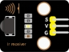  |
| ----------------------- | ----------------------- | ------------------------------ | ------------------------ |
| ESP32 Board*1           | ESP32 Expansion Board*1 | Keyestudio Purple LED Module*1 | Keyestudio IR Receiver*1 |
|  |  |         |                          |
| Micro USB Cable*1       | Remote Control*1        | 3P Dupont Wire*2               |                          |


**Connection Diagram**

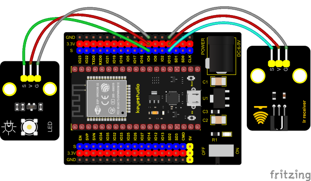

**Test Code**

```c
//**********************************************************************************
/*  
 * Filename    : IR Control LED
 * Description : Remote controls LED on and off
 * Auther      : http//www.keyestudio.com
*/
#include <Arduino.h>
#include <IRremoteESP8266.h>
#include <IRrecv.h>
#include <IRutils.h>

const uint16_t recvPin = 15; // Infrared receiving pin 15
IRrecv irrecv(recvPin);      // Create a class object used to receive class
decode_results results;       // Create a decoding results class object
int led = 4;//LED connect to GP4

void setup() {
  Serial.begin(9600);
  irrecv.enableIRIn();                  // Start the receiver
  pinMode(led, OUTPUT);
}
////////////////////
void loop() {
  if(irrecv.decode(&results)) {        // Waiting for decoding
    serialPrintUint64(results.value, HEX);// Print out the decoded results
    Serial.print("");
    handleControl(results.value);       // Handle the commands from remote control
    irrecv.resume();                    // Receive the next value
  }
}
  void handleControl(unsigned long value) {
    if (value == 0xFF6897) // Receive the number '1'
     {
       digitalWrite(led, HIGH);//turn on LED
       Serial.println("  led on");
     } 
    else if (value == 0xFF9867) // Receive the number '2'
     {
        digitalWrite(led, LOW);//turn off LED
       Serial.println("  led off"); 
    }
}
//**********************************************************************************
```


**Code Explanation**

Connect the wires according to the experimental wiring diagram, compile and upload the code to the ESP32. After uploading successfully, we will use a USB cable to power on. Open the serial monitor and set the baud rate to 9600. We need to press the reset button on the ESP32, then press the button 1 of the remote, which will be displayed on the monitor, and the LED will be on. Similarly, press the button 2 , the LED will be off.


### Project 52: Heat Dissipation Device


**Description**

We will use a temperature sensor and some modules to make a smart cooling device in this experiment. When the ambient temperature is higher than a certain value, the motor is turned on, thereby reducing the ambient temperature and achieving the heat dissipation effect. Then display the temperature value in the four-digit segment display.

**Components**

|                 |  | 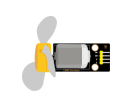 |                      |
| -------------------------------------- | ----------------------- | ------------------------------------------------------------ | ------------------------------------------- |
| ESP32 Board*1                          | ESP32 Expansion Board*1 | Keyestudio 130 Motor*1                                       | Keyestudio TM1650 4-Digit Segment Display*1 |
|                 |  |                                       |                      |
| Keyestudio  18B20 Temperature Sensor*1 | 3P Dupont Wire*1        | 4P Dupont Wire2                                              | Micro USB Cable*1                           |
| 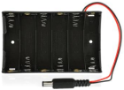                |  |                                                              |                                             |
| 6 AA Battery Holder*1                  | AA Battery*6            |                                                              |                                             |


**Connection Diagram**

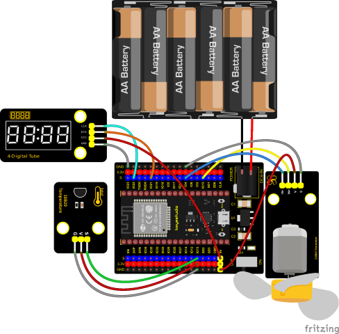

**Test Code**

```c
//**********************************************************************************
/*  
 * Filename    : heat abstractor
 * Description : DS18B20 controls a four digit tube and a motor that simulates Heat Abstractor
 * Auther      : http//www.keyestudio.com
*/
#include <DS18B20.h>
#include "TM1650.h" //Import the TM1650 library file
//The two ports are GP21 and GP22
#define DIO 21
#define CLK 22
TM1650 DigitalTube(CLK,DIO);

//ds18b20 pin to 13
DS18B20 ds18b20(13);
void setup() {
  Serial.begin(9600);
  DigitalTube.setBrightness();  //set brightness, 0---7, default : 2
  DigitalTube.displayOnOFF();   //display on or off, 0=display off, 1=display on, default : 1
  for(char b=1;b<5;b++){
    DigitalTube.clearBit(b);      //DigitalTube.clearBit(0 to 3); Clear bit display.
  }
  // DigitalTube.displayDot(1,true); //Bit0 display dot. Use before displayBit().
  DigitalTube.displayBit(1,0);    //DigitalTube.Display(bit,number); bit=0---3  number=0---9
  //Motor is connected to 15 4
  pinMode(15, OUTPUT);
  pinMode(4, OUTPUT);
}

void loop() {
  double temp = ds18b20.GetTemp();//Read the temperature
  temp *= 0.0625;//The conversion accuracy is 0.0625/LSB
  Serial.println(temp);
  displayFloatNum(temp);//4- digit tube display temperature value
  if (temp > 25) {//When the temperature exceeds 25 degrees Celsius, turn on the fan
    digitalWrite(15, LOW);
    digitalWrite(4, HIGH);
  } else {//Otherwise, turn off the fan.
    digitalWrite(15, LOW);
    digitalWrite(4, LOW);
  }
  delay(100);
}

void displayFloatNum(float temp){
  if(temp > 9999)
    return;
  int dat = temp*10;
   //DigitalTube.displayDot(2,true); //Bit0 display dot. Use before displayBit().
  if(dat/10000 != 0){
    DigitalTube.displayBit(1, dat%100000/10000);  
    DigitalTube.displayBit(2, dat%10000/1000);
    DigitalTube.displayBit(3, dat%1000/100);
    DigitalTube.displayBit(4, dat%100/10);
    return;
  }
  if(dat%10000/1000 != 0){
    DigitalTube.clearBit(1); 
    DigitalTube.displayBit(2, dat%10000/1000); 
    DigitalTube.displayBit(3, dat%1000/100);
    DigitalTube.displayBit(4, dat%100/10);
    return;
  }
  if(dat%1000/100 != 0){
  DigitalTube.clearBit(1); 
  DigitalTube.clearBit(2);
  DigitalTube.displayBit(3, dat%1000/100);
  DigitalTube.displayBit(4, dat%100/10);  
  return;
}
  DigitalTube.clearBit(1); 
  DigitalTube.clearBit(2);
  DigitalTube.clearBit(3);
  DigitalTube.displayBit(4, dat%100/10);
}
//**********************************************************************************
```


**Code Explanation**

The setting of variables and the storage of detection values are the same as what we learned earlier. We also set a temperature threshold and control the rotation of the motor when the threshold is exceeded, and then we use the digital tube to display the temperature value.

**Test Result**

Connect the wires according to the experimental wiring diagram and power on. Switch the DIP switch on the ESP32 expansion board to the ON end, compile and upload the code to the ESP32. After uploading successfully, we can see the temperature of the current environment (unit is Celsius) on the four-digit segment display, as shown in the figure below. If this value exceeds the value we set, the fan will rotate to dissipate heat.

### Project 53: Intelligent Entrance Guard System


**Description**

In this project, we use the RFID522 card swiping module and the servo to set up an intelligent access control system. The principle is very simple. We use RFID522 swipe card module, an IC card or key card to unlock.

**Components**

|   |  |  |  |
| ------------------------ | ----------------------- | ----------------------- | ----------------------- |
| ESP32 Board*1            | ESP32 Expansion Board*1 | Key*1                   | IC Card*1               |
| 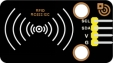  |  |  |  |
| Keyestudio RFID Module*1 | Servo*1                 | 4P Dupont Wire1         | Micro USB Cable*1       |


**Connection Diagram**


**Test Code**

**Note: Different RFID-MFRC522 IC cards and keys have diverse values. You can substitute your own IC cards and keys values for the corresponding values read by the RFID-MFRC522 module in the program, otherwise the servo can’t be controlled when uploading the test code to the ESP32.**

**For example: You can replace the rfid\_str of the**
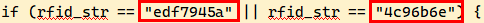 **in the program code with your own IC cards and keys values read by the RFID-MFRC522 module.**


```c
//*************************************************************************************
/* 
 * Filename    : Intelligent_access_control
 * Description : RFID controlled steering gear simulated door opening
 * Auther      : http//www.keyestudio.com
*/
#include <Wire.h>
#include "MFRC522_I2C.h"
// IIC pins default to GPIO21 and GPIO22 of ESP32
// 0x28 is the i2c address of SDA, if doesn't match，please check your address with i2c.
MFRC522 mfrc522(0x28);   // create MFRC522.

#include <ESP32Servo.h>
Servo myservo;  // create servo object to control a servo
int servoPin = 15; // Servo motor pin

String rfid_str = "";

void setup() {
  Serial.begin(9600);
  Wire.begin();
  mfrc522.PCD_Init();
  ShowReaderDetails();            // dispaly PCD - MFRC522 read carder
  Serial.println(F("Scan PICC to see UID, type, and data blocks..."));
  
  myservo.setPeriodHertz(50);           // standard 50 hz servo
  myservo.attach(servoPin, 500, 2500);  // attaches the servo on servoPin to the servo object
  myservo.write(0); 
  delay(500);
}

void loop() {
   if ( ! mfrc522.PICC_IsNewCardPresent() || ! mfrc522.PICC_ReadCardSerial() ) {
    delay(50);
    return;
  }
  
  // select one of door cards. UID and SAK are mfrc522.uid.
  
  // save UID
  rfid_str = ""; //String emptying
  Serial.print(F("Card UID:"));
  for (byte i = 0; i < mfrc522.uid.size; i++) {
    rfid_str = rfid_str + String(mfrc522.uid.uidByte[i], HEX);  //Convert to string
    //Serial.print(mfrc522.uid.uidByte[i] < 0x10 ? " 0" : " ");
    //Serial.print(mfrc522.uid.uidByte[i], HEX);
  } 
  Serial.println(rfid_str);
  
  if (rfid_str == "edf7945a" || rfid_str == "4c96b6e") {
    myservo.write(180);
    delay(500);
    Serial.println("  open the door!");
    }
}

void ShowReaderDetails() {
  //  attain the MFRC522 software
  byte v = mfrc522.PCD_ReadRegister(mfrc522.VersionReg);
  Serial.print(F("MFRC522 Software Version: 0x"));
  Serial.print(v, HEX);
  if (v == 0x91)
    Serial.print(F(" = v1.0"));
  else if (v == 0x92)
    Serial.print(F(" = v2.0"));
  else
    Serial.print(F(" (unknown)"));
  Serial.println("");
  // when returning to 0x00 or 0xFF, may fail to transmit communication signals
  if ((v == 0x00) || (v == 0xFF)) {
    Serial.println(F("WARNING: Communication failure, is the MFRC522 properly connected?"));
  }
}
//*************************************************************************************
```

**Code Explanation**

In the previous experiment, our card swipe module has tested the information of IC card and key. Then we use this corresponding information to control the door.

**Test Result**

Connect the wires according to the experimental wiring diagram, compile and upload the code to the ESP32. After uploading successfully，we will use a USB cable to power on. Open the serial monitor and set the baud rate to 9600.

We need to press the reset button on the ESP32, when we use the IC card or blue key to swipe the card, the monitor displays the card and the key information and “open the door”, at the same time, the servo rotates to the corresponding angle to simulate opening the door.

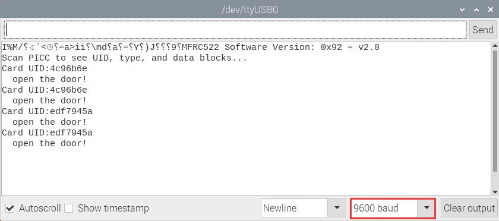

### Project 54：Bluetooth

This chapter mainly introduces how to use the bluetooth of ESP32 for simple data transmission with mobile phone. Project 60.1 is conventional bluetooth, and Project 60.2 is bluetooth control LED.

### Project 54.1：Classic Bluetooth

**Components**

|  |  |
| ----------------------- | ----------------------- |
| Micro USB Cable*1       | ESP32*1                 |


In this experiment, we need to use a BT dobbed serial terminal to make an experiment. If you haven’t install it, please click the installation:<https://www.appsapk.com/serial-bluetooth-terminal/> .


**Component Knowledge**

Bluetooth is a short-distance communication system that can be divided into two types, namely low power bluetooth (BLE) and classic bluetooth. There are two modes for simple data transfer: master mode and slave mode. 

**Master Mode**: In this mode, work is done on the master device and can be connected to the slave device. When the device initiates a connection request in the main mode, information such as the address and pairing password of other bluetooth devices are required.  Once paired, you can connect directly to them.  

**Slave Mode**: A bluetooth module in the slave mode can only accept connection requests from the host, but cannot initiate connection requests. After being connected to a host device, it can send and receive data through the host device . Bluetooth devices can interact with each other, when they interact, the bluetooth device in the main mode searches for nearby devices. While a connection is established, they can exchange data. For example, when a mobile phone exchanges data with ESP32, the mobile phone is usually in master mode and the ESP32 is in slave mode.  

            

master mode                     slave mode

**Wiring Diagram**

We can use a USB cable to connect ESP32 mainboard to the USB port on the Raspberry Pi.

         

**Test Code**


```c
//**********************************************************************************
/*
 * Filename    : Classic Bluetooth--SerialToSerialBT
 * Description : ESP32 communicates with the phone by bluetooth and print phone's data via a serial port
 * Auther      : http//www.keyestudio.com
*/
#include "BluetoothSerial.h"

BluetoothSerial SerialBT;
String buffer;
void setup() {
  Serial.begin(115200);
  SerialBT.begin("ESP32test"); //Bluetooth device name
  Serial.println("\nThe device started, now you can pair it with bluetooth!");
}

void loop() {
  if (Serial.available()) {
    SerialBT.write(Serial.read());
  }
  if (SerialBT.available()) {
    Serial.write(SerialBT.read());
  }
  delay(20);
}
//**********************************************************************************
```

**Test Result**

Compile and upload the code to the ESP32. After uploading successfully，we will use a USB cable to power on. Open the serial monitor and set the baud rate to 115200. We need to press the reset button on the ESP32, when you see the serial prints the character, as shown below, it means that the ESP32's bluetooth is waiting for connection with a phone. (If open the serial monitor and set the baud rate to 115200, the information is not displayed, please press the button RESET of the ESP32.)


Ensure that your mobile phone bluetooth is enabled and the bluetooth application of "Serial Bluetooth Terminal" is installed.  


Click“Search”，search for the nearby bluetooth and select to connect the“ESP32 test”.


Open the software APP and click the left side of the terminal, select "Devices".


If you select ESP32test in classic Bluetooth mode, a successful connection message will appear as shown below.  


Data can be transferred between your phone and Raspberry Pi via ESP32 now.  

Send “Hello！”, When the Raspberry Pi receives it, which will reply with "Hi\!".


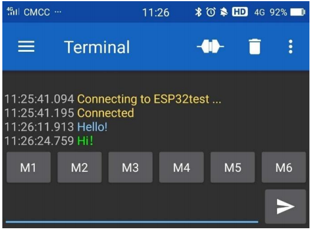

### Project 54.2：Bluetooth Control LED

**Components**

|         |  |                         |
| ------------------------------ | ----------------------- | ----------------------- |
| ESP32*1                        | ESP32 Expansion Board*1 |                         |
| 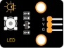        |  |  |
| Keyestudio Purple LED Module*1 | 3P Dupont Wire*1        | Micro USB Cable*1       |


**Connection Diagram**


**Test Code**


```c
//**********************************************************************************
/*
 * Filename    : Bluetooth Control LED
 * Description : The phone controls esp32's led via bluetooth.
                When the phone sends "LED_on," ESP32's LED lights turn on.
                When the phone sends "LED_off," ESP32's LED lights turn off.
 * Auther      : http//www.keyestudio.com
*/
#include "BluetoothSerial.h"
#include "string.h"
#define LED 15
BluetoothSerial SerialBT;
char buffer[20];
static int count = 0;
void setup() {
  pinMode(LED, OUTPUT);
  SerialBT.begin("ESP32test"); //Bluetooth device name
  Serial.begin(115200);
  Serial.println("\nThe device started, now you can pair it with bluetooth!");
}

void loop() {
  while(SerialBT.available())
  {
    buffer[count] = SerialBT.read();
    count++;
  }
  if(count>0){
    Serial.print(buffer);
    if(strncmp(buffer,"led_on",6)==0){
      digitalWrite(LED,HIGH);
    }
    if(strncmp(buffer,"led_off",7)==0){
      digitalWrite(LED,LOW);
    }
    count=0;
    memset(buffer,0,20);
  }
}
//**********************************************************************************
```

**Test Result**

Connect the wires according to the experimental wiring diagram, compile and upload the code to the ESP32. After uploading successfully，we will use a USB cable to power on. The APP operation is the same as the project 54.1 We need to press the reset button on the ESP32, if you want to make the external LED on and off, simply change the sending content to "LED\_on" and "LED\_OFF". Moving the APP to send data:


The serial monitor will display as follows:

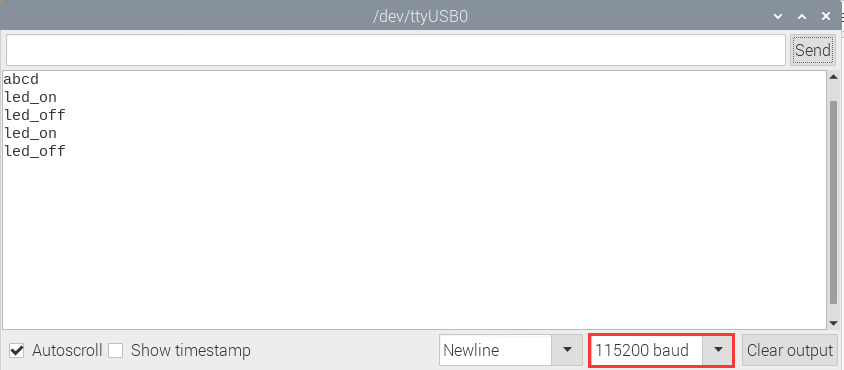

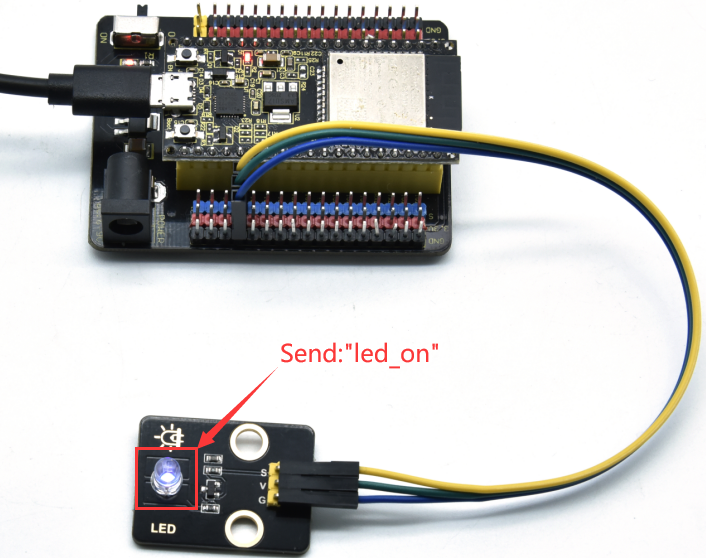


**Note:** If the sent content is not "LED-on 'or" LED-off ", the status of the LED will not change. If the LED is on, it remains on when
irrelevant content is received;Conversely, if the LED is off, it continues to be off when irrelevant content is received.   

### Project 55：WiFi Station Mode

**Description**

ESP32 has three different WiFi modes: Station mode, AP mode and AP+Station mode. All WiFi programming projects must be configured with WiFi running mode before using, otherwise the WiFi cannot be used. In this project, we are going to learn the WiFi Station mode of the ESP32.

**Components**

| 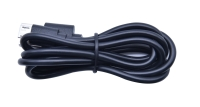 |  |
| ----------------------- | ------------------------ |
| Micro USB*1             | ESP32*1                  |


**Wiring Diagram**

Plug the ESP32 to the USB port of your Raspberry Pi.


**Component Knowledge**

**Station mode：**

When setting Station mode, the ESP32 is taken as a WiFi client. It can connect to the router network and communicate with other devices on the router via a WiFi connection. As shown in the figure below, the PC and the router have been connected. If the ESP32 wants to communicate with the PC, the PC and the router need to be connected.


**Test Code**

Since WiFi names and passwords vary from place to place, thereby users need to enter the correct WiFi names and passwords in the box shown below before the program code runs.  


```c
//**********************************************************************************
/*
 * Filename    : WiFi Station
 * Description : Connect to your router using ESP32
 * Auther      : http//www.keyestudio.com
*/
#include <WiFi.h> //Include the WiFi Library header file of ESP32.

//Enter correct router name and password.
const char *ssid_Router     = "ChinaNet-2.4G-0DF0"; //Enter the router name
const char *password_Router = "ChinaNet@233"; //Enter the router password

void setup(){
  Serial.begin(115200);
  delay(2000);
  Serial.println("Setup start");
  WiFi.begin(ssid_Router, password_Router);//Set ESP32 in Station mode and connect it to your router.
  Serial.println(String("Connecting to ")+ssid_Router);
//Check whether ESP32 has connected to router successfully every 0.5s.  
  while (WiFi.status() != WL_CONNECTED){
    delay(500);
    Serial.print(".");
  }
  Serial.println("\nConnected, IP address: ");
  Serial.println(WiFi.localIP());//Serial monitor prints out the IP address assigned to ESP32.
  Serial.println("Setup End");
}
 
void loop() {
}
//**********************************************************************************
```

**Test Result**

After entering the correct WiFi names and passwords, compile and upload the code to the ESP32. After uploading successfully，we will use a USB cable to power on. Open the serial monitor and set the baud rate to 115200. When the ESP32 successfully connects to ssid\_WiFi, the serial monitor prints out the IP address, then monitor will display as follows:(If open the serial monitor and set the baud rate to 115200, the information is not displayed, please press the button RESET of the ESP32).


### Project 56：WIFI AP Mode

**Description**

ESP32 has three different WiFi modes: Station mode, AP mode and AP+Station mode. All WiFi programming projects must be configured with WiFi running mode before using, otherwise the WiFi cannot be used. In this project, we are going to learn the WiFi AP mode of the ESP32.

**Components**

|  |  |
| ----------------------- | ------------------------ |
| Micro USB*1             | ESP32*1                  |


**Wiring Diagram**

Plug the ESP32 mainboard to the USB port of your Raspberry Pi.


**Component Knowledge**

**AP Mode:**

When setting AP mode, a hotspot network will be created, waiting for other WiFi devices to connect. As shown below:

Take the ESP32 as the hotspot, if a phone or PC needs to communicate with the ESP32, it must be connected to the ESP32's hotspot. Communication is only possible after a connection is established via the ESP32.


**Test Code**

Before the program code runs, you can make any changes to the ESP32 AP name and password in the box as shown below, but in a default circumstance, it doesn’t need to modify.

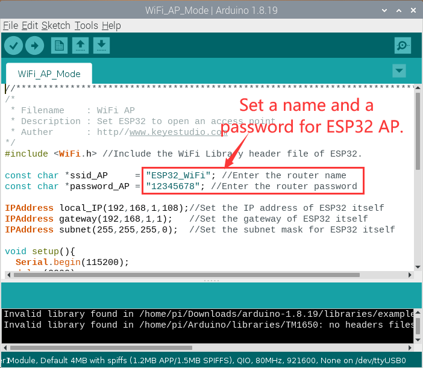


```c
//**********************************************************************************
/*
 * Filename    : WiFi AP
 * Description : Set ESP32 to open an access point
 * Auther      : http//www.keyestudio.com
*/
#include <WiFi.h> //Include the WiFi Library header file of ESP32.

const char *ssid_AP     = "ESP32_WiFi"; //Enter the router name
const char *password_AP = "12345678"; //Enter the router password

IPAddress local_IP(192,168,1,108);//Set the IP address of ESP32 itself
IPAddress gateway(192,168,1,1);   //Set the gateway of ESP32 itself
IPAddress subnet(255,255,255,0);  //Set the subnet mask for ESP32 itself

void setup(){
  Serial.begin(115200);
  delay(2000);
  Serial.println("Setting soft-AP configuration ... ");
  WiFi.disconnect();
  WiFi.mode(WIFI_AP);
  Serial.println(WiFi.softAPConfig(local_IP, gateway, subnet) ? "Ready" : "Failed!");
  Serial.println("Setting soft-AP ... ");
  boolean result = WiFi.softAP(ssid_AP, password_AP);
  if(result){
    Serial.println("Ready");
    Serial.println(String("Soft-AP IP address = ") + WiFi.softAPIP().toString());
    Serial.println(String("MAC address = ") + WiFi.softAPmacAddress().c_str());
  }else{
    Serial.println("Failed!");
  }
  Serial.println("Setup End");
}
 
void loop() {
}
//**********************************************************************************
```


**Test Result**

Compile and upload the code to the ESP32. After uploading successfully，we will use a USB cable to power on. Open the serial monitor and set the baud rate to 115200, then monitor will display as follows: (If open the serial monitor and set the baud rate to 115200, the information is not displayed, please press the button RESET of the ESP32).


When observing the printed information of the serial port monitor, turn on the WiFi scanning function of the mobile phone, you can see the ssid\_AP on ESP32, which is dubbed "ESP32\_Wifi" in this program code. You can connect to it either by typing the password "12345678" or by modifying the program code to change its AP name and password.  


### Project 57：WIFI AP+Station Mode

**Description**

In this project, we are going to learn the AP+Station mode of the ESP32.

**Components**

|  |  |
| ----------------------- | ------------------------ |
| Micro USB*1             | ESP32*1                  |


**Wiring Diagram**

Plug the ESP32 mainboard to the USB port of your Raspberry Pi.


**Component Knowledge**

**AP+Station mode**

In addition to the AP mode and the Station mode, **AP+Station mode** can be used at the same time. Turn on the Station mode of the ESP32, connect it to the router network, and it can communicate with the Internet through the router. Then turn on the AP mode to create a hotspot network. Other WiFi devices can be connected to the router network or the hotspot network to communicate with the ESP32.

**Test Code：**

Before the program code runs, you need to modify the ssid\_Router, password\_Router, ssid\_AP and password\_AP, as shown in the box below:

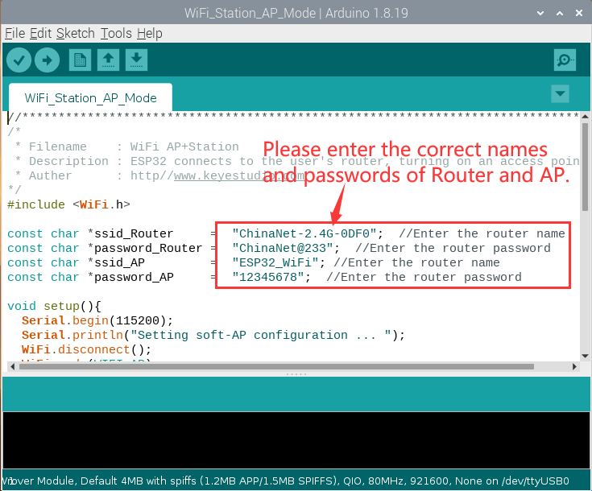


```c
//**********************************************************************************
/*
 * Filename    : WiFi AP+Station
 * Description : ESP32 connects to the user's router, turning on an access point
 * Auther      : http//www.keyestudio.com
*/
#include <WiFi.h>
 
const char *ssid_Router     =  "ChinaNet-2.4G-0DF0";  //Enter the router name
const char *password_Router =  "ChinaNet@233";  //Enter the router password
const char *ssid_AP         =  "ESP32_WiFi"; //Enter the router name
const char *password_AP     =  "12345678";  //Enter the router password

void setup(){
  Serial.begin(115200);
  Serial.println("Setting soft-AP configuration ... ");
  WiFi.disconnect();
  WiFi.mode(WIFI_AP);
  Serial.println("Setting soft-AP ... ");
  boolean result = WiFi.softAP(ssid_AP, password_AP);
  if(result){
    Serial.println("Ready");
    Serial.println(String("Soft-AP IP address = ") + WiFi.softAPIP().toString());
    Serial.println(String("MAC address = ") + WiFi.softAPmacAddress().c_str());
  }else{
    Serial.println("Failed!");
  }
  
  Serial.println("\nSetting Station configuration ... ");
  WiFi.begin(ssid_Router, password_Router);
  Serial.println(String("Connecting to ")+ ssid_Router);
  while (WiFi.status() != WL_CONNECTED){
    delay(500);
    Serial.print(".");
  }
  Serial.println("\nConnected, IP address: ");
  Serial.println(WiFi.localIP());
  Serial.println("Setup End");
}

void loop() {
}
//**********************************************************************************
```

**6. Test Result**

Ensure that the code in the program has been modified correctly, compile and upload the code to the ESP32. After uploading successfully，we will use a USB cable to power on. Open the serial monitor and set the baud rate to 115200, then monitor will display as follows: (If open the serial monitor and set the baud rate to 115200, the information is not displayed, please press the button RESET of the ESP32.)


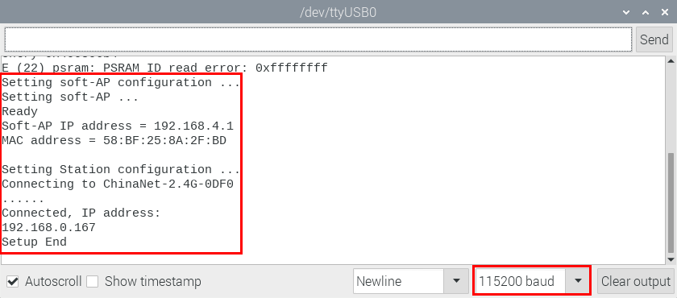

Open the WiFi scanning function of the mobile phone, you can see the ssid\_AP.


### Project 58: Comprehensive Experiment


**Introduction**

We did a lot of experiments, and for each one we needed to re-upload the code, so can we achieve different functions through an experiment? In this experiment, we will use an external button module to achieve different functions.

**Wiring Diagram：**

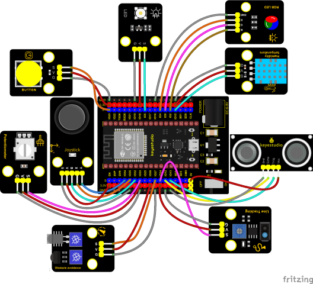

**Test Code ：**


```c
//**********************************************************************
/*
 * Filename    : Comprehensive experiment
 * Description : Multiple sensors/modules work together
 * Auther      : http//www.Keyestudio.com
*/
#include "xht11.h"

//xht11 to gpio15
xht11 xht(15);

//rgb is connected to 4,0,2
int ledPins[] = {4, 0, 2};    //define red, green, blue led pins
const byte chns[] = {0, 1, 2};        //define the pwm channels
int red, green, blue;

//Rocker module port
int X = 35;
int Y = 34;
int KEY = 32;

//Potentiometer pin is connected to analog port 33
int resPin = 33;

//Trace sensor pin connected to IO port 14
int TrackingPin = 14;

//LED is Connected to GP5
#define PIN_LED   5  // the pin of the LED
#define CHAN    3

//Obstacle avoidance sensor is connected to GP27
int Avoid = 27;

//Ultrasonic sensor port
int Trig = 13;
int Echo = 12;

//Key module port
int button = 23;

int PushCounter = 0;//Store the number of times a key is pressed
int yushu = 0;
unsigned char dht[4] = {0, 0, 0, 0};//Only the first 32 bits of data are received, not the parity bits
bool ir_flag = 1;
float out_X, out_Y, out_Z;

void counter() {
  delay(10);
  ir_flag = 0;
  if (!digitalRead(button)) {
    PushCounter++;
  }
}

void setup() {
  Serial.begin(9600);//Set baud rate to 9600
  pinMode(KEY, INPUT);//Button of remote sensing module
  ledcSetup(CHAN, 1000, 12);
  ledcAttachPin(PIN_LED, CHAN);
  pinMode(button, INPUT);//The key module
  attachInterrupt(digitalPinToInterrupt(button), counter, FALLING);  //External interrupt 0, falling edge fired
  pinMode(Avoid, INPUT);//Obstacle avoidance sensor
  pinMode(Trig, OUTPUT);//Ultrasonic module
  pinMode(Echo, INPUT);
  for (int i = 0; i < 3; i++) {   //setup the pwm channels,1KHz,8bit
    ledcSetup(chns[i], 1000, 8);
    ledcAttachPin(ledPins[i], chns[i]);
  delay(1000);
 }
}

void loop() {
  yushu = PushCounter % 7;
  if (yushu == 0) {  //The remainder is 0
    yushu_0();  //rgb displays
  } else if (yushu == 1) {  //The remainder is 1
    yushu_1();  //Displays the high and low levels read by the tracking sensor
  } else if (yushu == 2) {  //The remainder is 2
    yushu_2();  //Display temperature and humidity value
  } else if (yushu == 3) {  //The remainder is 3
    yushu_3();  //Displays the rocker value
  }else if (yushu == 4) {  //The remainder is 4
    yushu_4();  //Display potentiometer ADC value and potentiometer control LED
  } else if (yushu == 5) {  //The remainder is 5
    yushu_5();  //Obstacle avoidance sensor detects obstacles
  } else if (yushu == 6) {  //The remainder is 6
    yushu_6();  //Shows the distance detected by ultrasound
  } 
}

//RGB
void yushu_0() {
  red = random(0, 256);
  green = random(0, 256);
  blue = random(0, 256);
  setColor(red, green, blue);
  delay(200);
}
void setColor(byte r, byte g, byte b) {
  ledcWrite(chns[0], 255 - r); //Common anode LED, low level to turn on the led.
  ledcWrite(chns[1], 255 - g);
  ledcWrite(chns[2], 255 - b);
}

void yushu_1() {
  int val = digitalRead(TrackingPin);//Read the digital level output by the tracking sensor
  Serial.print(val);//Serial port print value
  if (val == 0) {//White val is 0 detected
    Serial.print("        ");
    Serial.println("White");
    delay(100);
  }
  else {//Black val is 1 detected
    Serial.print("        ");
    Serial.println("Black");
    delay(100);
  } 
}

void yushu_2() {
  if (xht.receive(dht)) { //Returns true when checked correctly
    Serial.print("RH:");
    Serial.print(dht[0]); //The integral part of humidity, DHT [1] is the fractional part
    Serial.print("%  ");
    Serial.print("Temp:");
    Serial.print(dht[2]); //The integral part of temperature, DHT [3] is the fractional part
    Serial.println("C");
  } else {    //read error
    Serial.println("sensor error");
  }
  delay(1200);
}

void yushu_3() {
  int x = analogRead(X);
  int y = analogRead(Y);
  int key = digitalRead(KEY);
  Serial.print("X:");
  Serial.print(x);
  Serial.print("    Y:");
  Serial.print(y);
  Serial.print("    KEY:");
  Serial.println(key);
  delay(100);
}

void yushu_4() {
  int adcVal = analogRead(resPin); //read adc
  Serial.println(adcVal);
  int pwmVal = adcVal;        // adcVal re-map to pwmVal
  ledcWrite(CHAN, pwmVal);    // set the pulse width.
  delay(10);
}

void yushu_5() {
  int val = digitalRead(Avoid);
  if (val == 0) {//Obstruction detected
    Serial.println("There are obstacles");
  }
  else {//No obstructions detected
    Serial.println("All going well");
  }
  delay(100);
}

void yushu_6() {
  float distance = checkdistance();
  Serial.print("distance:");
  Serial.print(distance);
  Serial.println("cm");
  delay(100);
}

float checkdistance() {
  digitalWrite(Trig, LOW);
  delayMicroseconds(2);
  digitalWrite(Trig, HIGH);
  delayMicroseconds(10);
  digitalWrite(Trig, LOW);
  float distance = pulseIn(Echo, HIGH) / 58.00;
  delay(10);
  return distance;
}
//*************************************************************************************
```

**Code Explanation**

Calculate how many times the button is pressed, divide it by 7, and get the remainder which is 0, 1 2, 3, 4, 5 , 6. According to different remainders, construct seven unique functions to realize different functions.

We can add or reduce sensors or modules.

**Test Result：**

Wire up, upload the code, power on, open the monitor and set baud rate to 9600. At the beginning, the time of pressing buttons is 0 and remainder is 0. Then RGB will flash.

Press the button, the RGB stops flashing, press once, the remainder is:

If the tracking sensor doesn’t detect objects or only detect black ones, val is 1 and monitor shows **1 Black**; if white objects are
detected, val is 0 and **0 White** is shown. As shown below:

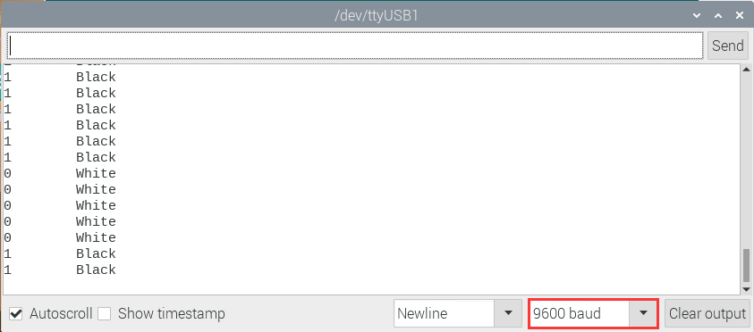

Note: if a key is pressed, the time of pressing turns out to be 1. Open the monitor, the program will reset, the time of pressing becomes into 0. You need to press keys to reset times of pressing keys.

Press a key twice, the time of pressing buttons is 2 and the remainder is 2. Read temperature and humidity values. As shown below;

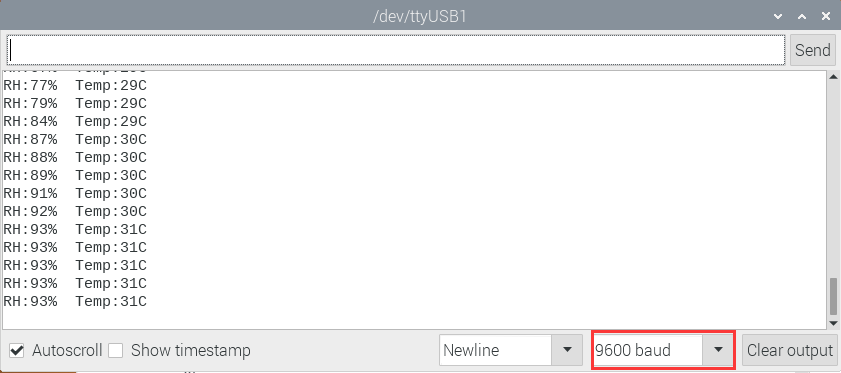

Press this key again, the time of pressing buttons is 3 and the remainder is 3. Read digital values at x, y and z axis of the joystick
module. As shown below;


Press the key for the fourth time, the remainder is 4. Then the potentiometer can adjust the PWM value at the GPI05 port to control LED brightness of the purple LED.


Press the key for the fifth time, the remainder is 5. Then the ultrasonic sensor can detect obstacles, as shown below;

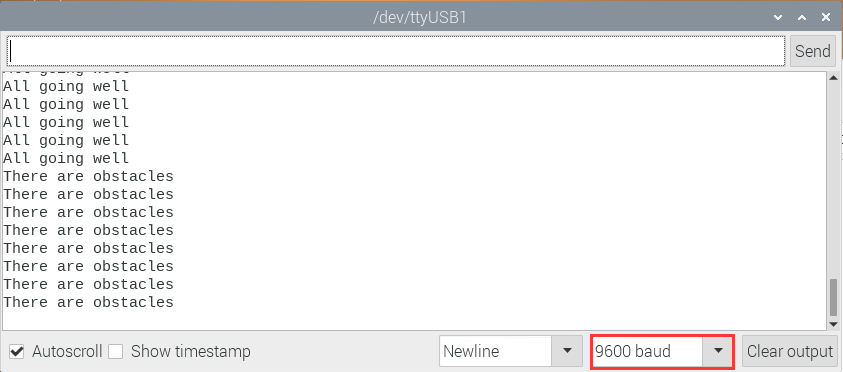

Press the key for the sixth time, the remainder is 6. Then the distance away from obstacles will be shown, as shown below;


Press the key for seventh time and the remainder is 0. The RGB will flash. If pressing keys continuously, remainders also change.

### Project 59: WiFi

**Description**

In the previous experiment, we have learned the WiFi Station mode, WiFi AP mode and WiFi AP+Station mode of the ESP32. In this project, We will use ESP32's WiFi Station mode to control the work of multiple sensors/modules through APP connection with WiFi to achieve the effect of WiFi smart home.


**Wiring Diagram：**

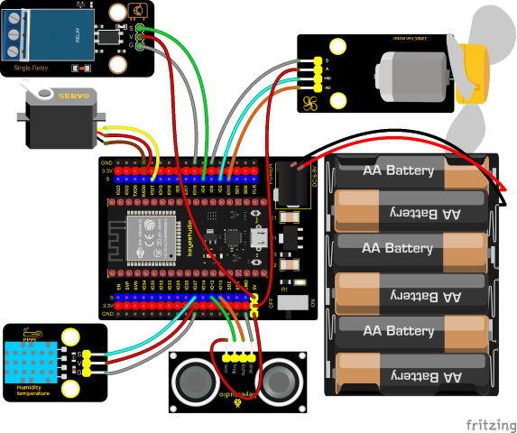

**Install APP**

Android device (mobile phone/PC) APP:

We provide the Android APP installation package

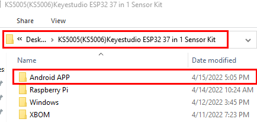

Now transfer the keyes wifi.apk file in the Android APP installation package to the Android phone or PC, click the keyes wifi.apk file to enter the installation page, click "ALLOW" key, and then click "INSTALL" button. After installation, click "OPEN" button to enter the APP interface.  

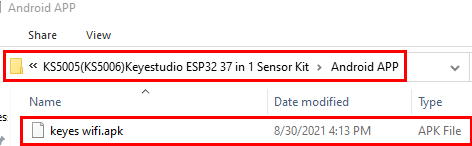


IOS (mobile phone /iPad)

Open App Store . 

Enter keyes link in the search box and click search, the download interface appears. Click "" to download and install the APP of the keyes link. The following operations are similar to those of Android system. You can refer to the steps of Android system.

**Test Code ：**

```c
//**********************************************************************************
/*  
 * Filename    : WiFi Smart Home.
 * Description : WiFi APP controls Multiple sensors/modules work to achieve the effect of WiFi smart home.
 * Auther      : http//www.Keyestudio.com
*/
#include <Arduino.h>
#include <WiFi.h>
#include <ESPmDNS.h>
#include <WiFiClient.h>

#include "xht11.h"
//gpio27
xht11 xht(27);
unsigned char dht[4] = {0, 0, 0, 0};

#include <ESP32Servo.h>
Servo myservo;
int servoPin = 21;
#define Relay  4
#define IN1 2  //IN1 corresponds to IN+
#define IN2 15 //IN2 corresponds to IN-
#define trigPin  12
#define echoPin  13

int distance1;
String dis_str;
int ip_flag = 1;
int ultra_state = 1;
int temp_state = 1;
int humidity_state = 1;

String item = "0";
const char* ssid = "ChinaNet-2.4G-0DF0"; //the name of user's wifi
const char* password = "ChinaNet@233";   //the password of user's wifi
WiFiServer server(80);
String unoData = "";

void setup() {
  Serial.begin(115200);
  pinMode(Relay, OUTPUT);
  myservo.setPeriodHertz(50);   
  myservo.attach(servoPin, 500, 2500);
  pinMode(IN1, OUTPUT);
  pinMode(IN2, OUTPUT);
  
  WiFi.begin(ssid, password);
  while (WiFi.status() != WL_CONNECTED) {
    delay(500);
    Serial.print(".");
  }
  Serial.println("");
  Serial.print("Connected to ");
  Serial.println(ssid);
  Serial.print("IP address: ");
  Serial.println(WiFi.localIP());
  server.begin();
  Serial.println("TCP server started");
  MDNS.addService("http", "tcp", 80);

  digitalWrite(IN1, LOW);
  digitalWrite(IN2, LOW);
  digitalWrite(Relay, LOW);
  pinMode(trigPin, OUTPUT);
  pinMode(echoPin, INPUT);
}

void loop() {
  WiFiClient client = server.available();
  if (!client) {
      return;
  }
  while(client.connected() && !client.available()){
      delay(1);
  }
  String req = client.readStringUntil('\r');
  int addr_start = req.indexOf(' ');
  int addr_end = req.indexOf(' ', addr_start + 1);
  if (addr_start == -1 || addr_end == -1) {
      Serial.print("Invalid request: ");
      Serial.println(req);
      return;
  }
  req = req.substring(addr_start + 1, addr_end);
  item=req;
  Serial.println(item);
  String s;
  if (req == "/")
  {
      IPAddress ip = WiFi.localIP();
      String ipStr = String(ip[0]) + '.' + String(ip[1]) + '.' + String(ip[2]) + '.' + String(ip[3]);
      s = "HTTP/1.1 200 OK\r\nContent-Type: text/html\r\n\r\n<!DOCTYPE HTML>\r\n<html>Hello from ESP32 at ";
      s += ipStr;
      s += "</html>\r\n\r\n";
      Serial.println("Sending 200");
      client.println(s);
  }
  else if(req == "/btn/0")
  {
    Serial.write('a');
    client.println(F("turn on the relay"));
    digitalWrite(Relay, HIGH);
  }
  else if(req == "/btn/1")
  {
    Serial.write('b');
    client.println(F("turn off the relay"));
    digitalWrite(Relay, LOW);
  }
  else if(req == "/btn/2")
  {
    Serial.write('c');
    client.println("Bring the steering gear over 180 degrees");
    myservo.write(180); 
    delay(200);
  }
  else if(req == "/btn/3")
  {
    Serial.write('d');
    client.println("Bring the steering gear over 0 degrees");
    myservo.write(0); 
    delay(200);
  }
  else if(req == "/btn/4")
  {
    Serial.write('e');
    client.println("esp32 already turn on the fans");
    digitalWrite(IN1, LOW); 
    digitalWrite(IN2, HIGH);
  }
  else if(req == "/btn/5")
  {
    Serial.write('f');
    client.println("esp32 already turn off the fans");
    digitalWrite(IN1, LOW); 
    digitalWrite(IN2, LOW);
  }
  else if(req == "/btn/6")
  {
    Serial.write('g');
    while(Serial.available() > 0)
    {
      unoData = Serial.readStringUntil('#');
      client.println("Data");
    }
    while(ultra_state>0)
       {
          Serial.print("Distance = "); 
          Serial.print(checkdistance());
          Serial.println("#");
          Serial1.print("Distance = "); 
          Serial1.print(checkdistance());
          Serial1.println("#");  
          int t_val1 = checkdistance();
          client.print("Distance(cm) = ");
          client.println(t_val1); 
          ultra_state = 0;
        }
  }
  else if(req == "/btn/7")
  {
    Serial.write('h');
    client.println("turn off the ultrasonic");
    ultra_state = 1;
  }
  else if(req == "/btn/8")
  {
    Serial.write('i');
    while(Serial.available() > 0)
     {
      unoData = Serial.readStringUntil('#');
      client.println(unoData);
     }
    while(temp_state>0)
      {
        if (xht.receive(dht)) {
          Serial.print("Temperature = "); 
          Serial.print(dht[2],1);
          Serial.println("#");
          Serial1.print("Temperature = "); 
          Serial1.print(dht[2],1);
          Serial1.println("#");
          int t_val2 = dht[2];
          client.print("Temperature(℃) = ");
          client.println(t_val2);
        }
        temp_state = 0;
      }
  }
  else if(req == "/btn/9")
  {
    Serial.write('j');
    client.println("turn off the temperature");
    temp_state = 1;
  }
  else if(req == "/btn/10")
  {
    Serial.write('k');
    while(Serial.available() > 0)
     {
       unoData = Serial.readStringUntil('#');
       client.println(unoData);
     }
    while(humidity_state > 0)
      {
        if (xht.receive(dht)) {
          Serial.print("Humidity = "); 
          Serial.print(dht[0],1);
          Serial.println("#");
          Serial1.print("Humidity = "); 
          Serial1.print(dht[0],1);
          Serial1.println("#");
          int t_val3 = dht[0];
          client.print("Humidity(%) = ");
          client.println(t_val3);
        }
        humidity_state = 0;
      }
  }
  else if(req == "/btn/11")
  {
    Serial.write('l');
    client.println("turn off the humidity");
    humidity_state = 1;
    }
  //client.print(s);
  client.stop();
}

int checkdistance() {
  digitalWrite(12, LOW);
  delayMicroseconds(2);
  digitalWrite(12, HIGH);
  delayMicroseconds(10);
  digitalWrite(12, LOW);
  int distance = pulseIn(13, HIGH) / 58;
  
  delay(10);
  return distance;
}
//**********************************************************************************
```

Note: You need to change the Wifi name and default Wifi password of the experimental code to your own Wifi name and Wifi password. 

**Test Result**

After the code has been modified correctly, connect the external power supply and power on. Turn the DIP switch ON the ESP32 expansion board to the ON end, compile and upload the code to the ESP32 mainboard.（If uploading the code is not successful，hold down the Boot button, release it when the upload progress percentage appears.)

Open the monitor and set baud rate to 115200. Then the monitor can print the WiFi IP address.

If no information is displayed, you can press the RESET button.

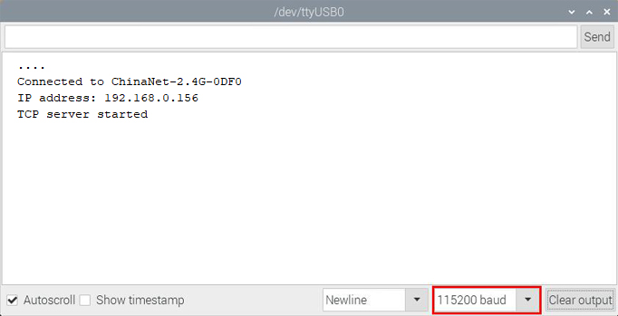

Open WiFi APP, enter the detected WIFI IP address in the text box in front of the WIFI button (for example, the IP address detected by the serial monitor above is 192.168.0.156). Next, click the WIFI button to connect to WIFI, at the same time, the corresponding WiFi IP address will be displayed in the text box :“Hello from ESP32 at 192.168.0.156”, then the APP has connected to WiFi.(WiFi IP address sometimes changes, if the original IP address can not use, you need to re-check it.)  

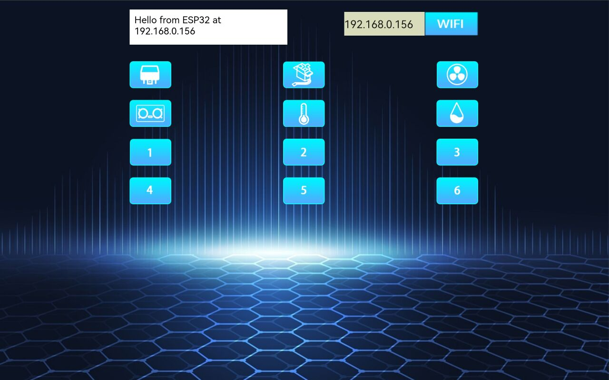

After the APP is connected to WiFi, the following operations are performed:

1)  Clickbutton, the relay will be opened, the APP will display，and the indicator lights up
on the module. Clickagain, the relay will be closed , the APP will display ，and the
indicator on the module is off.
2)  Clickbutton，the servo rotates 180°，the APP will displayagain，the APP will display ，the servo rotates 0°.
3)  Clickbutton，the motor（with small fan blades）rotates，the APP will display
again，close the motor，the APP will display ；
4)  Clickbutton，the ultrasonic sensor detects the distance, put an object in front of the ultrasonic sensor, the
    APP will display, the distance between the object and the ultrasonic sensor is 14cm；click  again, turn off the sensor, the APP will display button，the temperature and humidity sensor measures the temperature in the environment, the APP will display ，the ambient temperature is 28 ° C., click again, turn off the sensor，the APP will display .
6)  Click  button，the temperature and humidity sensor measures the humidity in the environment,，the APP will
display , the ambient humidity is 52%；clickagain，turn off the sensor, the APP will display .


# Resources

[https://fs.Keyestudio.com/KS5005-5006](https://fs.Keyestudio.com/KS5005-5006)

